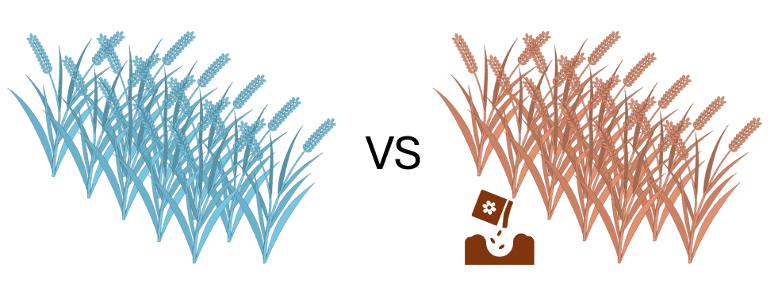
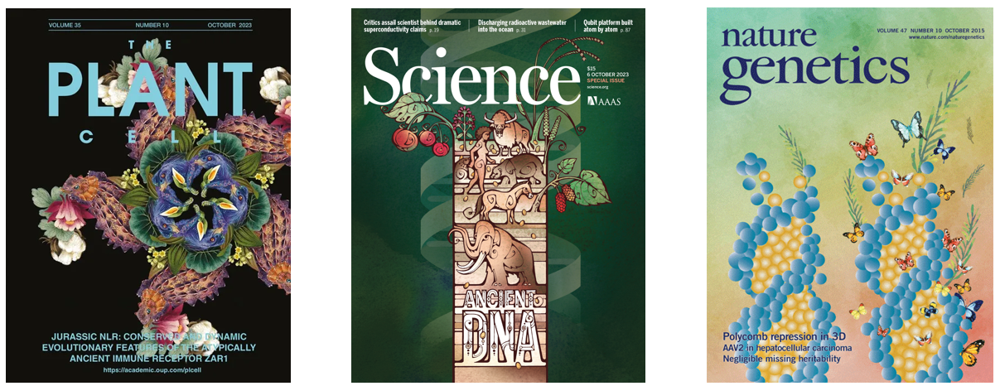
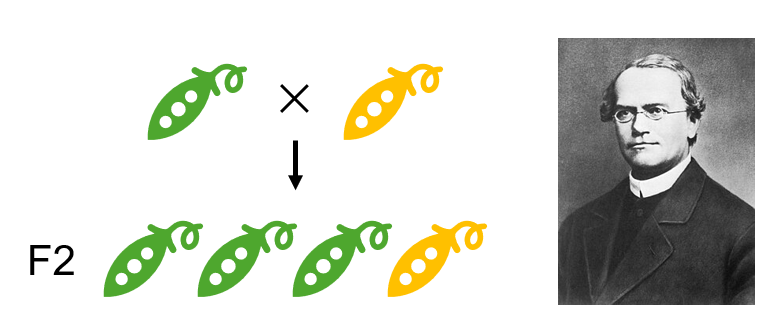

第1回 イントロダクション
========================

統計学とは？
------------

まず“統計学”の定義については偉い人たちの本等を参照していただくのが良いかと思います。(色々と議論のある所です。)

統計学は科学の文法(“The grammer of science”)である by カール・ピアソン
等、色々とおしゃれな言い回しが見つかると思います。

大まかにいうと、データをどのように扱い、どのように分析し、どのように判断するかを論ずる学問になりますが、

農学や生物学といった私たちの学問分野においては、観察や計測、実験、調査などを通じて得られたデータを用いて、興味のある対象について法則性を見つけようとする際に必要となる学問です。

例えば、肥料の効果を知るために、ある作物に肥料を与えた場合と与えなかった場合の草丈を10個体ずつ測定したとします。このシンプルな実験であっても、

-  そもそも草丈は同じ条件下でどれだけばらつくのか？
-  肥料の効果は一定とみなしてもよいのか？
-  得られた草丈の差の数値から、肥料の効果についてどれだけのことが言えるのか？
-  10個体という数は十分なサンプル数なのか？
-  個体間で土壌条件や気象条件等の影響をどのように省くのか？
-  …etc

と、データの特徴を様々な角度から把握したうえで議論をする必要があります。

このような数字データを扱うためには、統計学を用いてデータを分析し、結果を正しく理解していく必要があります。

今回は1例として作物を例に挙げましたが、海洋系や動物系、昆虫や菌類など扱う対象に関わらず、また、実験系や解析系など、どの様な技術を扱っていてもいずれ必要となってくる知識になります。

そして、各学問によって必要となる統計学の知識は異なってきますが、生物学に限らず、経済学や情報学は勿論のこと、教育心理学等でも必須の知識になります。

統計学の必要性
--------------

とりわけ自然科学を扱う私達にとって重要な仕事の１つが、研究成果を論文として執筆し、様々な学術誌に投稿し公開することです。

公開されるためには、“査読”という他の研究者達によって、論文の内容が学術誌の基準に達しているかどうかの確認が行われます。

その際にも当然、データの処理に正しく統計学が用いられているかは重要な確認ポイントの一つになります。

例えば下図は“*The Plant
Cell*”という学術誌の投稿前の確認ポイントですが、正しく統計的な処理を行い、その結果をきちんと掲載することが要求されています。

.. image:: _static/images/chapter1/the_plant_cell_checklist.png?raw=true
   :height: 750px
   :align: center

学術誌にも様々なものがありますが、きちんと査読される学術誌は間違いなく正しい統計的なデータ処理が要求されます。

皆さんは自然科学の研究を今後進めていくことになるので、そういった意味で統計学の扱い方は、

(残念ながら)合う合わない・向き不向き・得意不得意に関係なく習得する必要があるというのが事実です。

統計学の体系化の歴史
--------------------

統計理論の起源については膨大な話になってしまうので触れないですが、

(興味がある人は数理統計学史などを読んでください)

現代統計学の体系化には生物学者が大きく関わっています。本講義で扱う手法・概念を例にすると…

相関や回帰の概念の発展
~~~~~~~~~~~~~~~~~~~~~~

.. image:: _static/images/chapter1/Francis_Galton_1850s.png
   :height: 200px
   :align: center

例えば、フランシス・ゴルトン(チャールズ・ダーウィンの従弟)は相関や回帰といった概念を\ **遺伝学の研究**\ を行う中で適用し発展させました。

(ゴルトンは数学が苦手だったらしく、後にカール・ピアソンという後継者が相関係数などの数学的側面を確立し、汎用的な方法としてまとめた。)

実験計画法や分散分析の開発
~~~~~~~~~~~~~~~~~~~~~~~~~~

.. image:: _static/images/chapter1/Youngronaldfisher2.png
   :height: 200px
   :align: center

集団遺伝学の創始者の一人であるロナルド・フィッシャーは\ **遺伝学や進化生物学の研究者**\ ですが、実験計画法の原理を開発し、また、分散分析に代表される今では誰もが扱う可能性のある統計手法の体系的なアプローチを開発しました。

これらの概念に限らず、多くの統計的な手法が生物学的な課題を解決するために開発され、彼らの開発・体系化した統計学の概念は、昨今生物学に留まらず、あらゆる分野で用いられています。

出来すぎなメンデルの実験データ
~~~~~~~~~~~~~~~~~~~~~~~~~~~~~~

また、問題解決だけでなく、これまで正しいとされてきたことを検証するためにも統計手法は使用されてきました。

例えば、前述したフィッシャーはメンデルの遺伝法則における実験データの統計的分析(:math:`\chi^2`\ 検定)を行って検証した結果、メンデルの実験結果が理論値に近すぎる(このような実験結果が偶然得られる確率は3万分の1以下)と計算し、不明確な個体を期待に沿うように分類したのでは？等と推測しています。

こういった歴史から見ても、統計学の知識が生物学においていかに重要かということ、また多くの統計的手法が生物学の課題から生まれてきたことが分かるかと思います。

(画像はwikipediaより引用)

統計学の応用分野について
------------------------

上述したように、統計学の多くの概念が生物学の課題解決のために開発されてきました。

本講義では扱いませんが、統計学は更に様々な分野に応用され、各分野により特化した手法がたくさん開発されています。

遺伝学(統計遺伝学や集団遺伝学)、生態学、疫学などの分野は特に、それぞれの分野で得られるデータに特異的な統計的手法が多々あり、自分の研究テーマに応じて統計手法を学んでいく必要があります。

ただ、いずれの手法も基本的な手法や概念を拡張させたものが殆どなので、基礎的な統計学をきちんと学んでおくと、よりスムーズに学ぶことができるかと思います。

機械学習・AIなど
~~~~~~~~~~~~~~~~

また、近年目覚ましい進歩を見せる機械学習や人工知能の分野とも統計学は強い関わりがあります。

機械学習については終盤の方の講義で触れる予定ですが、これらの分野に用いられる統計的学習の技術の理解にも基本的な統計学の知識は大きな手助けになってくれると思います。

講義の概要・講義スケジュールについて
------------------------------------

講義の概要
~~~~~~~~~~

※シラバスより

(授業の概要)
様々な要因が背景に絡む生物学の問いを解明するためには、実験データ・観察データ・ゲノム情報等、多岐に渡るデータに潜んでいる特徴を定量的に探し出す統計解析が必須である。本講義では有用な統計解析手法の基礎を理解し、それらの具体的な適用方法を学習する。

(到達目標)
基本的な統計解析の考え方や各種解析手法の理論を理解した上で、様々な生物学データについてRで解析できるようになる。

ということで、私達の扱う分野で用いられる基本的な統計解析の手法について一通り説明・実習を行う予定です。

また実習では、講義で学んだ手法等をRで使用する方法を扱います。

講義スケジュール
~~~~~~~~~~~~~~~~

概ね以下の順に従って講義を進めていきますが、各回内容量が大きく異なるので、第X回というのはあくまでも参考程度にしてください。

また、内容の都合上前後する箇所もいくつかあります。

-  第１回: イントロダクション … 統計学の考え方
-  第２回: R言語の基礎 … 講義で使用するRの基本的な使い方
-  第３回: 記述統計学 … 統計量、分布など
-  第４回: データの可視化 … ggplot等を用いた各種グラフ作成・可視化
-  第５回: 推定と検定① … 母集団の推定、統計的仮説検定など
-  第６回: 推定と検定② …
   統計的仮説検定続き、検出力と実験計画、検定の注意点など
-  第７回: 推定と検定③ … 多重比較、偽陽性、ANOVAなど
-  第８回: 回帰と相関① … 単回帰分析、相関の評価・注意点
-  第９回: 回帰と相関② … 重回帰分析、多重共線性、一般線形モデルの限界
-  第１０回: 線形モデル① …
   一般化線形モデル（ロジスティック回帰など）、モデル選択（AICなど）
-  第１１回: 線形モデル② … 変量/固定効果、一般化線形混合モデル
-  第１２回: 分類 … 主成分分析、教師なし学習など
-  第１３回: ベイズ統計 … ベイズ統計の考え方、ベイズモデリング、MCMCなど
-  第１４回: まとめ・期末レポート課題の説明など
-  第１５回: フィードバック

講義の進め方・成績評価方法
--------------------------

講義の進め方
~~~~~~~~~~~~

基本的に進めるところまで進め、進んだ所に応じて課題を出す予定です。

講義資料はWeb上で作成してあるものを主に使用し、適宜プログラミング言語\ **R**\ による計算なども挟んでいく予定なので、\ **ノートPCを必ず持参してください。**

Googleアカウントも必要です。

成績評価について
~~~~~~~~~~~~~~~~

課題の提出状況・および１４回目の期末レポート課題によって成績は評価します。

その他
------

統計を勉強するモチベーションとして、\ `統計検定 <https://www.toukei-kentei.jp/>`__\ という試験があります。

統計検定1級のみ決められた日にペーパーテスト、

準1級まではCBT形式で会場さえ空いていればいつでも受けられる試験になっています。

11月26日に1級の試験あり。申し込み締め切りは10月3日。1級は普通に難しいです。

知識としては準1級くらいあれば十分なので、受験料はそこそこかかりますが目標にして勉強してみるのは良いかもしれないです。

