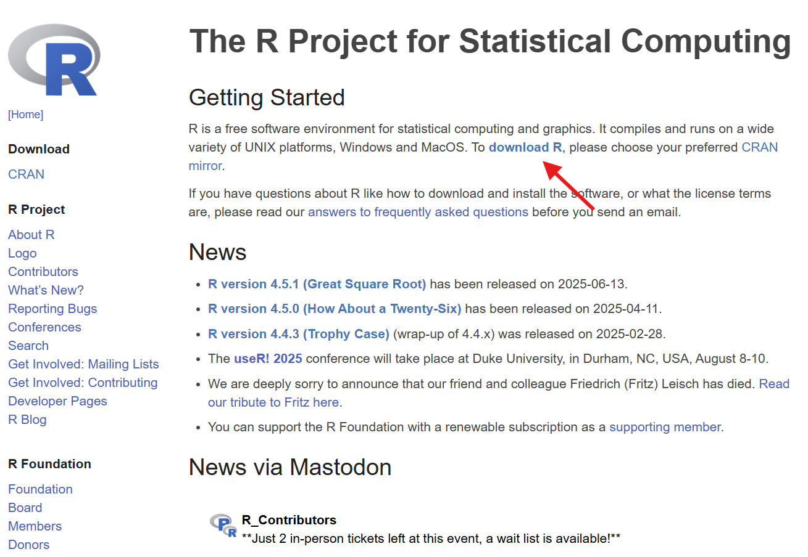
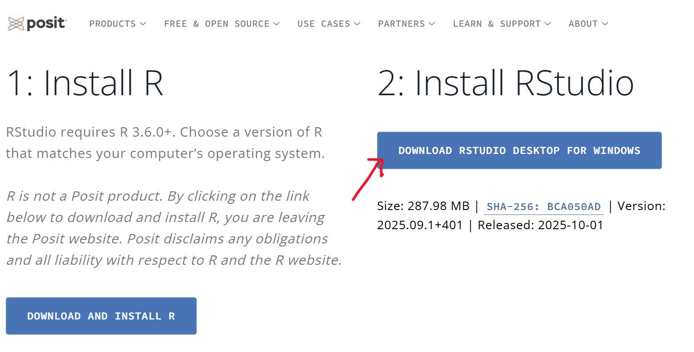
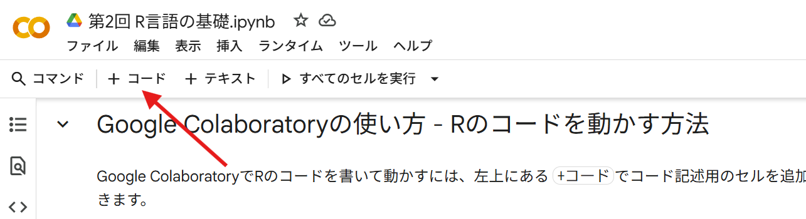
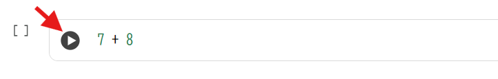
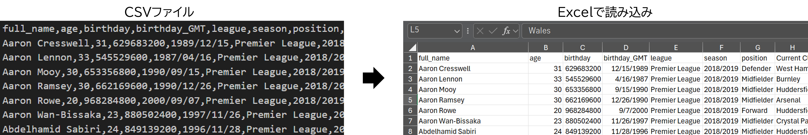
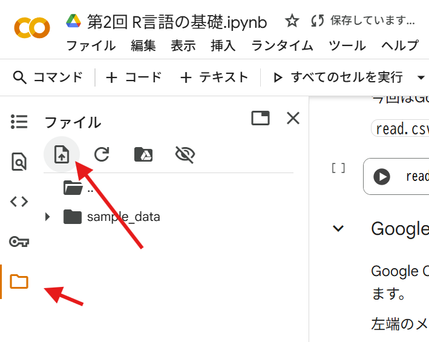
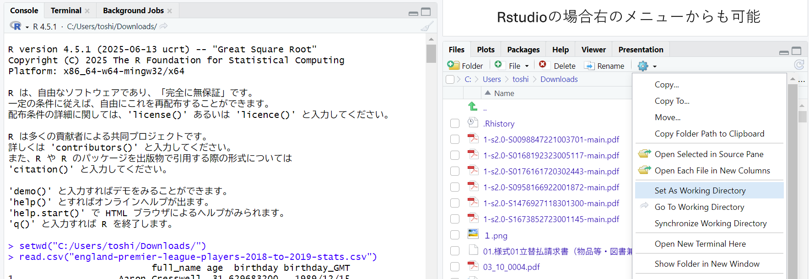
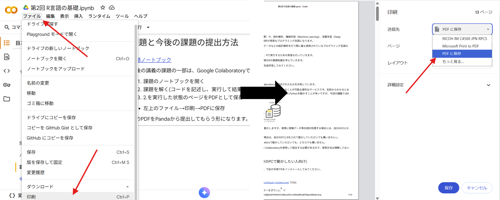

第2回 R言語の基礎
=================

はじめに
========

R は、数値計算（ベクトルや行列の計算）や、統計解析、機械学習（Machine
Learning）、深層学習（Deep
Learning）、グラフ描画など、データ解析が得意なプログラミング言語になります。

データ解析の研究者でなくても、実験データなどの統計解析を行う際に最も使用されているプログラミング言語の１つです。

そこで、本講義では学んだ統計処理を、Rで実行するための実習も行っていきます。

このテキストでは、実習に必要な最低限のRの基礎知識を学んでいきます。

より高度な使い方等を知りたい方は、別途学習してみてください。

実習に入る前に
==============

本講義では講義資料としてGoogle
Colaboratoryで記述されたものを共有しています。

Google
Colaboratoryは、web上でプログラミングをおこなことが可能な便利なサービスです。名称からわかるとおり、Google社が提供しているサービスになります。
基本的にPythonを動かすことが多いですが、今回の講義ではRを動かすのに使用しています。

.. figure:: _static/images/chapter2/colab.png
   :height: 150px

本講義ではGoogle
ColaboratoryでRを動かしますが、実際に実験データ等を統計処理する場合には、自分のPCにRを入れて動かすことが多いです。

より実際に近い状況で実習を行いたい場合は、自分のPCにRを入れて動かしていただいても構いませんし、

こちらが提供しているGoogle
Colaboratoryで動かしていただいても、どちらでも構いません。

ただし、今後出す予定の課題はGoogle
Colaboratoryを使用して提出する必要があるので、使用方法は理解しておいてください。

Rのインストール方法 (自分のPCで動かしたい人向け)
------------------------------------------------

Rを自分のPCに入れて動かしたい人は、下記の手順でRをインストールしてみてください。

1. `R のホームページ <https://www.r-project.org/>`__\ に行きます。
2. **download R**\ のページへ移動
3. 適当なミラーサイトを選択( https://cloud.r-project.org/ でOK)
4. 自分のOSのリンク先へ移動
5. **base**\ をクリックしてインストーラーをダウンロード
6. ダウンロードしたファイルを開いてあとは指示通りに

また、Rを使う際には、\ **Rstudio**\ という開発環境(Rを使いやすくするツール)を使用することが多いです。

もし、Rを自分のPCに入れて動かす予定の方はRstudioも一緒に入れて使う様にすると良いと思います。

Rstudioのインストールも同じように、

1. `Rstudioのホームページ <https://posit.co/download/rstudio-desktop/>`__\ に行きます。
2. 少し下の方にあるInstall Rstudioという所にある、\ **Download RStudio
   Desktop for
   XXX(自分のOS)**\ というボタンをクリックしてインストーラーをダウンロード
3. ダウンロードしたファイルを開いてあとは指示通りに

Google Colaboratoryの使い方 - Rのコードを動かす方法
---------------------------------------------------

Google ColaboratoryでRのコードを書いて動かすには、左上にある
``+コード``\ でコード記述用のセルを追加し、そこにRのコードを書いていきます。

コードセルは左側の三角ボタンを押すか、\ ``Shift+Enter``\ で選択中のセル内のコードを動かすことができます。

自分のPCでRを動かしている方はRを起動してコンソールにコードを打ち込み、\ ``Enter``\ をすればコードが動きます。

まずは適当な足し算(``7 + 8``\ 等)を書いてみて動かしてみましょう。

Google
Colaboratoryで最初にコードを動かす際には接続するために少し時間がかかります(以降はすぐ実行できます)。

.. code:: R

    7 + 8

.. raw:: html

    15

引き算(``7 - 3``)や掛け算(``2 * 5``)、割り算(``78 / 13``)なども可能です。

.. code:: R

    7 - 3

.. raw:: html

    4

.. code:: R

    2 * 5

.. raw:: html

    10

.. code:: R

    78 / 13

.. raw:: html

    6

累乗も計算できます。Rで累乗を計算するには\ ``^``\ を使います。

例えば2の10乗を計算する場合は\ ``2^10``\ になります。

.. code:: R

    2^10

.. raw:: html

    1024

関数
====

次にRで使用可能な\ **関数**\ を使用します。

関数というのは、与えた値に何らかの処理をして結果返してくれるものです。

まずは\ ``sqrt``\ という平方根を求めることが出来る関数を使ってみます。

例えば、\ ``sqrt(1024)``\ というコードを動かすと、与えられた値1024の平方根32を返す形になります。

.. code:: R

    sqrt(1024)

.. raw:: html

    32

Rには他にも様々な関数があります。

例えば\ ``log``\ という関数は何らかの値と対数の底の値を与えると、対数を計算してくれます。

``log(1024, 2)``\ というコードを動かすと、1024は2の10乗なので、10を返す形になります。

.. code:: R

    log(1024, 2)

.. raw:: html

    10

コードとコメント
----------------

Rではコードの途中で\ ``#``\ を使用することでコメントを記入出来ます。

``#``\ 以降に記入されたものはコメントとして扱われるため、実行されません。

.. code:: R

    4 + 12 # コメント
    # 21 + 24
    8 + 70

.. raw:: html

    16

.. raw:: html

    78

コードの途中で何かメモをしておいたり、コードの説明を記述する際には\ ``#``\ を上手く使ってください。

講義で提示するコードにも、\ ``#``\ で説明が加えられていることがありますが、コメントだと認識しておいてください。

複数の値をまとめて扱う・変数
============================

Rでは複数の値を1つのベクトルデータとして扱うことができます。

``c``\ という関数でデータをまとめることが出来ます。

``c(123, 23, 45, 221, 78)``

また、Rでは自分で名前を決めた\ **変数**\ にデータを格納しておくことが可能です。

``変数名 <- データ``\ という形でデータを格納できます。

例えば、上の5つの値を\ ``x``\ という変数に格納するには、\ ``x <- c(123, 23, 45, 221, 78)``\ となります。

.. code:: R

    x <- c(123, 23, 45, 221, 78)

xに値を一度格納すると、以降はxの中身が格納した値になります。

.. code:: R

    x

.. raw:: html

    
    <ol class=list-inline><li>123</li><li>23</li><li>45</li><li>221</li><li>78</li></ol>

複数の値に対して適用することが出来る関数があり、

平均値を計算する\ ``mean``\ 関数、合計値を計算する\ ``sum``\ 関数などがあります。

.. code:: R

    x <- c(123, 23, 45, 221, 78)
    mean(x)

.. raw:: html

    98

.. code:: R

    sum(x)

.. raw:: html

    490

``summary``\ という関数はデータの平均値や最大値などの基本的な統計量を計算してくれます。

.. code:: R

    x <- c(12, 23, 32, 18, 19, 20)
    summary(x)

.. parsed-literal::

       Min. 1st Qu.  Median    Mean 3rd Qu.    Max. 
      12.00   18.25   19.50   20.67   22.25   32.00 

Rにはデータの要約や検定など、統計的な処理を行ってくれる関数が充実しているので、

難しい計算を自分でやらなくても手軽にデータの統計処理が出来る様になります。

ベクトルに対する計算・ベクトル同士の計算
----------------------------------------

ベクトルのすべての要素に対して、ある値を引いたり、かける事が出来ます。

.. code:: R

    x <- c(12, 23, 32, 18, 19, 20)
    
    x - 10

.. raw:: html

    
    <ol class=list-inline><li>2</li><li>13</li><li>22</li><li>8</li><li>9</li><li>10</li></ol>

.. code:: R

    x * 10

.. raw:: html

    
    <ol class=list-inline><li>120</li><li>230</li><li>320</li><li>180</li><li>190</li><li>200</li></ol>

また、ベクトル同士で計算を行うと、

1番目の要素同士、2番目の要素同士、3番目の要素同士…と、各要素ごとに計算が行われます。

.. code:: R

    x <- c(12, 23, 32, 18, 19, 20)
    y <- c(10, 20, 30, 40, 50, 60)
    
    x + y

.. raw:: html

    
    <ol class=list-inline><li>22</li><li>43</li><li>62</li><li>58</li><li>69</li><li>80</li></ol>

ベクトルを\ ``^2``\ で2乗すると、各要素ごとに2乗されることになります。

.. code:: R

    x <- c(12, 23, 32, 18, 19, 20)
    x^2

.. raw:: html

    
    <ol class=list-inline><li>144</li><li>529</li><li>1024</li><li>324</li><li>361</li><li>400</li></ol>

一見、で？となる様な特徴ですが、このベクトル計算が統計手法に登場する計算で役に立ちます。

例えば実験をして10個の観測値\ :math:`X_1, X_2, X_3, ... X_{10}`\ が得られたとき、その平均値を\ :math:`\bar{X}`\ とすると、

:math:`\sum_{i=1}^{10}(X_i - \bar{X})^2`

みたいな値を今後計算することになります。

実際に\ :math:`X_1, X_2, X_3, ... X_{10}`\ が\ :math:`12, 23, 32, 18, 19, 20,37,28,10,24`\ だった場合、

``mean``\ 関数や\ ``sum関数``\ 、\ ``x^2``\ でxの二乗が計算できることを利用して計算してみると…

.. code:: R

    data <- c(12,23,32,18,19,20,37,28,10,24)
    
    # コード書いて計算してみましょう
    data_diff <- data - mean(data)
    sum(data_diff^2)
    
    # sum((data - mean(data))^2) でも可

.. raw:: html

    638.1

また2種類の観測データ\ :math:`X_1, X_2, ..., X_{10}`\ と\ :math:`Y_1, Y_2,... Y_{10}`\ が得られたとき、

それぞれの平均値\ :math:`\bar{X}, \bar{Y}`\ とすると

:math:`\sum_{i=1}^{10}(X_i - \bar{X})(Y_i - \bar{Y})`

みたいな計算も必要になります。

:math:`X_1, X_2, X_3, ... X_{10}`\ が\ :math:`12, 23, 32, 18, 19, 20, 37,28,10,24`

:math:`Y_1, Y_2, Y_3, ... Y_{10}`\ が\ :math:`102, 240, 289, 156, 188, 201, 222, 278, 98, 232`\ だった場合、

.. code:: R

    x <- c(12,23,32,18,19,20,37,28,10,24)
    y <- c(102,240,289,156,188,201,222,278,98,232)
    
    # コード書いて計算してみましょう
    x_diff <- x - mean(x)
    y_diff <- y - mean(y)
    
    sum(x_diff * y_diff)

.. raw:: html

    4204.2

この様な形で、統計手法の計算ではそれぞれの観測値ごとに何らかの計算をする場面が多く出てきます。

その際にRのベクトルの各要素ごとに計算する仕組みが役立ちます。

CSVファイル等の外部データを読み込む
===================================

ここまでは数値データ等を自分で打ち込んできましたが、既存のファイル等からデータを読み込むことも可能です。

ここではデータを保存しておく形式として最もポピュラーなものの１つのCSV形式のファイルを読み込みます。

CSVファイルは、CSV(Comma-Separated
Values)の通り、カンマ(,)でデータを区切って保存したファイルです。Excelでも読み込むことが出来るのでよく用いられています。

CSVファイルを読み込むための関数\ ``read.csv``\ という関数があります。

今回はGoogle
Colaboratoryにもともと置いてあるサンプルファイルを読み込んでみます。

``read.csv("CSVファイルの名前/URL等")``

.. code:: R

    read.csv("sample_data/california_housing_test.csv")

.. raw:: html

    <table class="dataframe">
    <caption>A data.frame: 3000 × 9</caption>
    <thead>
    	<tr><th scope=col>longitude</th><th scope=col>latitude</th><th scope=col>housing_median_age</th><th scope=col>total_rooms</th><th scope=col>total_bedrooms</th><th scope=col>population</th><th scope=col>households</th><th scope=col>median_income</th><th scope=col>median_house_value</th></tr>
    	<tr><th scope=col>&lt;dbl&gt;</th><th scope=col>&lt;dbl&gt;</th><th scope=col>&lt;dbl&gt;</th><th scope=col>&lt;dbl&gt;</th><th scope=col>&lt;dbl&gt;</th><th scope=col>&lt;dbl&gt;</th><th scope=col>&lt;dbl&gt;</th><th scope=col>&lt;dbl&gt;</th><th scope=col>&lt;dbl&gt;</th></tr>
    </thead>
    <tbody>
    	<tr><td>-122.05</td><td>37.37</td><td>27</td><td>3885</td><td> 661</td><td>1537</td><td> 606</td><td>6.6085</td><td>344700</td></tr>
    	<tr><td>-118.30</td><td>34.26</td><td>43</td><td>1510</td><td> 310</td><td> 809</td><td> 277</td><td>3.5990</td><td>176500</td></tr>
    	<tr><td>-117.81</td><td>33.78</td><td>27</td><td>3589</td><td> 507</td><td>1484</td><td> 495</td><td>5.7934</td><td>270500</td></tr>
    	<tr><td>-118.36</td><td>33.82</td><td>28</td><td>  67</td><td>  15</td><td>  49</td><td>  11</td><td>6.1359</td><td>330000</td></tr>
    	<tr><td>-119.67</td><td>36.33</td><td>19</td><td>1241</td><td> 244</td><td> 850</td><td> 237</td><td>2.9375</td><td> 81700</td></tr>
    	<tr><td>-119.56</td><td>36.51</td><td>37</td><td>1018</td><td> 213</td><td> 663</td><td> 204</td><td>1.6635</td><td> 67000</td></tr>
    	<tr><td>-121.43</td><td>38.63</td><td>43</td><td>1009</td><td> 225</td><td> 604</td><td> 218</td><td>1.6641</td><td> 67000</td></tr>
    	<tr><td>-120.65</td><td>35.48</td><td>19</td><td>2310</td><td> 471</td><td>1341</td><td> 441</td><td>3.2250</td><td>166900</td></tr>
    	<tr><td>-122.84</td><td>38.40</td><td>15</td><td>3080</td><td> 617</td><td>1446</td><td> 599</td><td>3.6696</td><td>194400</td></tr>
    	<tr><td>-118.02</td><td>34.08</td><td>31</td><td>2402</td><td> 632</td><td>2830</td><td> 603</td><td>2.3333</td><td>164200</td></tr>
    	<tr><td>-118.24</td><td>33.98</td><td>45</td><td> 972</td><td> 249</td><td>1288</td><td> 261</td><td>2.2054</td><td>125000</td></tr>
    	<tr><td>-119.12</td><td>35.85</td><td>37</td><td> 736</td><td> 166</td><td> 564</td><td> 138</td><td>2.4167</td><td> 58300</td></tr>
    	<tr><td>-121.93</td><td>37.25</td><td>36</td><td>1089</td><td> 182</td><td> 535</td><td> 170</td><td>4.6900</td><td>252600</td></tr>
    	<tr><td>-117.03</td><td>32.97</td><td>16</td><td>3936</td><td> 694</td><td>1935</td><td> 659</td><td>4.5625</td><td>231200</td></tr>
    	<tr><td>-117.97</td><td>33.73</td><td>27</td><td>2097</td><td> 325</td><td>1217</td><td> 331</td><td>5.7121</td><td>222500</td></tr>
    	<tr><td>-117.99</td><td>33.81</td><td>42</td><td> 161</td><td>  40</td><td> 157</td><td>  50</td><td>2.2000</td><td>153100</td></tr>
    	<tr><td>-120.81</td><td>37.53</td><td>15</td><td> 570</td><td> 123</td><td> 189</td><td> 107</td><td>1.8750</td><td>181300</td></tr>
    	<tr><td>-121.20</td><td>38.69</td><td>26</td><td>3077</td><td> 607</td><td>1603</td><td> 595</td><td>2.7174</td><td>137500</td></tr>
    	<tr><td>-118.88</td><td>34.21</td><td>26</td><td>1590</td><td> 196</td><td> 654</td><td> 199</td><td>6.5851</td><td>300000</td></tr>
    	<tr><td>-122.59</td><td>38.01</td><td>35</td><td>8814</td><td>1307</td><td>3450</td><td>1258</td><td>6.1724</td><td>414300</td></tr>
    	<tr><td>-122.15</td><td>37.75</td><td>40</td><td>1445</td><td> 256</td><td> 849</td><td> 255</td><td>3.8913</td><td>126300</td></tr>
    	<tr><td>-121.37</td><td>38.68</td><td>36</td><td>1775</td><td> 296</td><td> 937</td><td> 305</td><td>3.1786</td><td> 83400</td></tr>
    	<tr><td>-118.16</td><td>34.07</td><td>47</td><td>2994</td><td> 543</td><td>1651</td><td> 561</td><td>3.8644</td><td>241500</td></tr>
    	<tr><td>-122.20</td><td>37.79</td><td>45</td><td>2021</td><td> 528</td><td>1410</td><td> 480</td><td>2.7788</td><td>115400</td></tr>
    	<tr><td>-117.28</td><td>33.28</td><td>13</td><td>6131</td><td>1040</td><td>4049</td><td> 940</td><td>3.8156</td><td>150700</td></tr>
    	<tr><td>-118.03</td><td>34.16</td><td>36</td><td>1401</td><td> 218</td><td> 667</td><td> 225</td><td>7.1615</td><td>484700</td></tr>
    	<tr><td>-122.42</td><td>37.76</td><td>52</td><td>3587</td><td>1030</td><td>2259</td><td> 979</td><td>2.5403</td><td>250000</td></tr>
    	<tr><td>-118.39</td><td>33.99</td><td>32</td><td>2612</td><td> 418</td><td>1030</td><td> 402</td><td>6.6030</td><td>369200</td></tr>
    	<tr><td>-118.45</td><td>34.07</td><td>19</td><td>4845</td><td>1609</td><td>3751</td><td>1539</td><td>1.5830</td><td>350000</td></tr>
    	<tr><td>-118.48</td><td>34.01</td><td>30</td><td>3078</td><td> 954</td><td>1561</td><td> 901</td><td>3.4852</td><td>425000</td></tr>
    	<tr><td>⋮</td><td>⋮</td><td>⋮</td><td>⋮</td><td>⋮</td><td>⋮</td><td>⋮</td><td>⋮</td><td>⋮</td></tr>
    	<tr><td>-122.47</td><td>37.77</td><td>52</td><td>2241</td><td> 443</td><td>1042</td><td> 377</td><td>4.1635</td><td>398400</td></tr>
    	<tr><td>-120.93</td><td>35.76</td><td>11</td><td>8997</td><td>1698</td><td>1825</td><td> 756</td><td>3.2300</td><td>154300</td></tr>
    	<tr><td>-118.14</td><td>34.17</td><td>52</td><td>2667</td><td> 486</td><td>1681</td><td> 504</td><td>4.0524</td><td>173100</td></tr>
    	<tr><td>-122.73</td><td>38.46</td><td>14</td><td>4042</td><td>1298</td><td>2323</td><td>1158</td><td>2.0651</td><td>135400</td></tr>
    	<tr><td>-117.06</td><td>32.76</td><td>37</td><td>2356</td><td> 476</td><td>1231</td><td> 499</td><td>2.9650</td><td>155700</td></tr>
    	<tr><td>-120.71</td><td>35.50</td><td>12</td><td>3098</td><td> 453</td><td>1433</td><td> 434</td><td>5.2508</td><td>292900</td></tr>
    	<tr><td>-118.31</td><td>34.05</td><td>35</td><td>1692</td><td> 423</td><td>1578</td><td> 406</td><td>2.5313</td><td>305800</td></tr>
    	<tr><td>-119.70</td><td>36.75</td><td>11</td><td>3626</td><td> 779</td><td>1819</td><td> 731</td><td>2.4956</td><td> 87500</td></tr>
    	<tr><td>-121.34</td><td>38.64</td><td>17</td><td>2761</td><td> 501</td><td>1128</td><td> 482</td><td>3.7562</td><td>139700</td></tr>
    	<tr><td>-117.91</td><td>34.09</td><td>20</td><td>4327</td><td>1037</td><td>2296</td><td> 963</td><td>3.0441</td><td>185400</td></tr>
    	<tr><td>-119.76</td><td>36.79</td><td>32</td><td>2463</td><td> 468</td><td>1261</td><td> 486</td><td>3.3281</td><td> 75100</td></tr>
    	<tr><td>-120.66</td><td>35.49</td><td>17</td><td>4422</td><td> 945</td><td>2307</td><td> 885</td><td>2.8285</td><td>171300</td></tr>
    	<tr><td>-118.28</td><td>34.08</td><td>42</td><td>1618</td><td> 522</td><td>1454</td><td> 440</td><td>3.1607</td><td>182000</td></tr>
    	<tr><td>-122.54</td><td>37.90</td><td>48</td><td>2491</td><td> 460</td><td> 937</td><td> 455</td><td>4.4375</td><td>370000</td></tr>
    	<tr><td>-117.59</td><td>33.88</td><td>13</td><td>3239</td><td> 849</td><td>2751</td><td> 813</td><td>2.6111</td><td>107000</td></tr>
    	<tr><td>-120.47</td><td>34.94</td><td>17</td><td>1368</td><td> 308</td><td> 642</td><td> 303</td><td>1.8633</td><td>109400</td></tr>
    	<tr><td>-118.25</td><td>33.93</td><td>42</td><td> 819</td><td> 233</td><td> 899</td><td> 228</td><td>1.1346</td><td> 85400</td></tr>
    	<tr><td>-121.97</td><td>37.29</td><td>25</td><td>4096</td><td> 743</td><td>2027</td><td> 741</td><td>5.3294</td><td>300300</td></tr>
    	<tr><td>-122.01</td><td>36.97</td><td>43</td><td>2162</td><td> 509</td><td>1208</td><td> 464</td><td>2.5417</td><td>260900</td></tr>
    	<tr><td>-122.02</td><td>37.60</td><td>32</td><td>1295</td><td> 295</td><td>1097</td><td> 328</td><td>3.2386</td><td>149600</td></tr>
    	<tr><td>-118.23</td><td>34.09</td><td>49</td><td>1638</td><td> 456</td><td>1500</td><td> 430</td><td>2.6923</td><td>150000</td></tr>
    	<tr><td>-117.17</td><td>34.28</td><td>13</td><td>4867</td><td> 718</td><td> 780</td><td> 250</td><td>7.1997</td><td>253800</td></tr>
    	<tr><td>-122.33</td><td>37.39</td><td>52</td><td> 573</td><td> 102</td><td> 232</td><td>  92</td><td>6.2263</td><td>500001</td></tr>
    	<tr><td>-117.91</td><td>33.60</td><td>37</td><td>2088</td><td> 510</td><td> 673</td><td> 390</td><td>5.1048</td><td>500001</td></tr>
    	<tr><td>-117.93</td><td>33.86</td><td>35</td><td> 931</td><td> 181</td><td> 516</td><td> 174</td><td>5.5867</td><td>182500</td></tr>
    	<tr><td>-119.86</td><td>34.42</td><td>23</td><td>1450</td><td> 642</td><td>1258</td><td> 607</td><td>1.1790</td><td>225000</td></tr>
    	<tr><td>-118.14</td><td>34.06</td><td>27</td><td>5257</td><td>1082</td><td>3496</td><td>1036</td><td>3.3906</td><td>237200</td></tr>
    	<tr><td>-119.70</td><td>36.30</td><td>10</td><td> 956</td><td> 201</td><td> 693</td><td> 220</td><td>2.2895</td><td> 62000</td></tr>
    	<tr><td>-117.12</td><td>34.10</td><td>40</td><td>  96</td><td>  14</td><td>  46</td><td>  14</td><td>3.2708</td><td>162500</td></tr>
    	<tr><td>-119.63</td><td>34.42</td><td>42</td><td>1765</td><td> 263</td><td> 753</td><td> 260</td><td>8.5608</td><td>500001</td></tr>
    </tbody>
    </table>

Google Colaboratoryで使用できるファイルについて
~~~~~~~~~~~~~~~~~~~~~~~~~~~~~~~~~~~~~~~~~~~~~~~

Google Colaboratoryで自分のデータを扱いたい場合、Google
Colaboratoryにファイルをアップロードする必要があります。

左端のメニューからフォルダマークを選び、アップロードボタンからファイルをアップロードします。

ドラッグ&ドロップでもアップロード可能です。

ここから使用したいファイルをアップロードすることで、Google
Colaboratory上で扱うことが出来る様になります。

下記リンク先を右クリックから名前を付けて保存し、左端のメニューからアップロードしてください。

(※右クリックで名前を付けてリンク先を保存しようとすると、

ファイル名がengland-premier-league-players-2018-to-2019-stats.\ **txt**\ になる場合があります)

`england-premier-league-players-2018-to-2019-stats.csv <https://raw.githubusercontent.com/slt666666/basic_fri_2024/refs/heads/master/source/_static/data/england-premier-league-players-2018-to-2019-stats.csv>`__

アップロードした後、\ ``read.csv``\ 関数で読み込んでみてください。

.. code:: R

    read.csv("england-premier-league-players-2018-to-2019-stats.csv")

.. raw:: html

    <table class="dataframe">
    <caption>A data.frame: 572 × 47</caption>
    <thead>
    	<tr><th scope=col>full_name</th><th scope=col>age</th><th scope=col>birthday</th><th scope=col>birthday_GMT</th><th scope=col>league</th><th scope=col>season</th><th scope=col>position</th><th scope=col>Current.Club</th><th scope=col>minutes_played_overall</th><th scope=col>minutes_played_home</th><th scope=col>⋯</th><th scope=col>conceded_per_90_overall</th><th scope=col>min_per_conceded_overall</th><th scope=col>min_per_match</th><th scope=col>min_per_card_overall</th><th scope=col>min_per_assist_overall</th><th scope=col>cards_per_90_overall</th><th scope=col>rank_in_league_top_attackers</th><th scope=col>rank_in_league_top_midfielders</th><th scope=col>rank_in_league_top_defenders</th><th scope=col>rank_in_club_top_scorer</th></tr>
    	<tr><th scope=col>&lt;chr&gt;</th><th scope=col>&lt;int&gt;</th><th scope=col>&lt;int&gt;</th><th scope=col>&lt;chr&gt;</th><th scope=col>&lt;chr&gt;</th><th scope=col>&lt;chr&gt;</th><th scope=col>&lt;chr&gt;</th><th scope=col>&lt;chr&gt;</th><th scope=col>&lt;int&gt;</th><th scope=col>&lt;int&gt;</th><th scope=col>⋯</th><th scope=col>&lt;dbl&gt;</th><th scope=col>&lt;int&gt;</th><th scope=col>&lt;int&gt;</th><th scope=col>&lt;int&gt;</th><th scope=col>&lt;int&gt;</th><th scope=col>&lt;dbl&gt;</th><th scope=col>&lt;int&gt;</th><th scope=col>&lt;int&gt;</th><th scope=col>&lt;int&gt;</th><th scope=col>&lt;int&gt;</th></tr>
    </thead>
    <tbody>
    	<tr><td>Aaron Cresswell                 </td><td>31</td><td>629683200</td><td>1989/12/15</td><td>Premier League</td><td>2018/2019</td><td>Defender  </td><td>West Ham United        </td><td>1589</td><td> 888</td><td>⋯</td><td>1.25</td><td> 72</td><td>79</td><td>1589</td><td>1589</td><td>0.06</td><td>290</td><td>191</td><td> 80</td><td>20</td></tr>
    	<tr><td>Aaron Lennon                    </td><td>33</td><td>545529600</td><td>1987/04/16</td><td>Premier League</td><td>2018/2019</td><td>Midfielder</td><td>Burnley                </td><td>1217</td><td> 487</td><td>⋯</td><td>1.48</td><td> 61</td><td>76</td><td>1217</td><td>1217</td><td>0.07</td><td>196</td><td>187</td><td> -1</td><td>10</td></tr>
    	<tr><td>Aaron Mooy                      </td><td>30</td><td>653356800</td><td>1990/09/15</td><td>Premier League</td><td>2018/2019</td><td>Midfielder</td><td>Huddersfield Town      </td><td>2327</td><td>1190</td><td>⋯</td><td>1.78</td><td> 51</td><td>80</td><td> 582</td><td>2327</td><td>0.15</td><td>144</td><td>233</td><td> -1</td><td> 3</td></tr>
    	<tr><td>Aaron Ramsey                    </td><td>30</td><td>662169600</td><td>1990/12/26</td><td>Premier League</td><td>2018/2019</td><td>Midfielder</td><td>Arsenal                </td><td>1327</td><td> 689</td><td>⋯</td><td>0.81</td><td>111</td><td>47</td><td>   0</td><td> 221</td><td>0.00</td><td> 69</td><td>  8</td><td> -1</td><td> 5</td></tr>
    	<tr><td>Aaron Rowe                      </td><td>20</td><td>968284800</td><td>2000/09/07</td><td>Premier League</td><td>2018/2019</td><td>Forward   </td><td>Huddersfield Town      </td><td>  69</td><td>  14</td><td>⋯</td><td>1.30</td><td> 69</td><td>35</td><td>   0</td><td>   0</td><td>0.00</td><td> -1</td><td> -1</td><td> -1</td><td>31</td></tr>
    	<tr><td>Aaron Wan-Bissaka               </td><td>23</td><td>880502400</td><td>1997/11/26</td><td>Premier League</td><td>2018/2019</td><td>Midfielder</td><td>Crystal Palace         </td><td>3135</td><td>1605</td><td>⋯</td><td>1.18</td><td> 76</td><td>90</td><td> 523</td><td>1045</td><td>0.17</td><td>312</td><td>160</td><td> -1</td><td>22</td></tr>
    	<tr><td>Abdelhamid Sabiri               </td><td>24</td><td>849139200</td><td>1996/11/28</td><td>Premier League</td><td>2018/2019</td><td>Midfielder</td><td>Huddersfield Town      </td><td>  49</td><td>   0</td><td>⋯</td><td>5.51</td><td> 16</td><td>25</td><td>   0</td><td>   0</td><td>0.00</td><td> -1</td><td> -1</td><td> -1</td><td>22</td></tr>
    	<tr><td>Abdoulaye Doucouré              </td><td>28</td><td>725846400</td><td>1993/01/01</td><td>Premier League</td><td>2018/2019</td><td>Midfielder</td><td>Watford                </td><td>3062</td><td>1566</td><td>⋯</td><td>1.59</td><td> 57</td><td>87</td><td> 437</td><td> 510</td><td>0.21</td><td>124</td><td> 80</td><td> -1</td><td> 5</td></tr>
    	<tr><td>Aboubakar Kamara                </td><td>26</td><td>794534400</td><td>1995/03/07</td><td>Premier League</td><td>2018/2019</td><td>Forward   </td><td>Fulham                 </td><td> 687</td><td> 468</td><td>⋯</td><td>2.10</td><td> 43</td><td>53</td><td> 344</td><td>   0</td><td>0.26</td><td> 38</td><td>412</td><td> -1</td><td> 4</td></tr>
    	<tr><td>Adalberto Peñaranda Maestre     </td><td>23</td><td>865036800</td><td>1997/05/31</td><td>Premier League</td><td>2018/2019</td><td>Forward   </td><td>Watford                </td><td>   0</td><td>   0</td><td>⋯</td><td>0.00</td><td>  0</td><td> 0</td><td>   0</td><td>   0</td><td>0.00</td><td> -1</td><td> -1</td><td> -1</td><td>-1</td></tr>
    	<tr><td>Adam David Lallana              </td><td>32</td><td>579225600</td><td>1988/05/10</td><td>Premier League</td><td>2018/2019</td><td>Midfielder</td><td>Liverpool              </td><td> 465</td><td> 189</td><td>⋯</td><td>0.39</td><td>233</td><td>36</td><td> 465</td><td>   0</td><td>0.19</td><td>379</td><td>344</td><td> -1</td><td>18</td></tr>
    	<tr><td>Adam Masina                     </td><td>27</td><td>757468800</td><td>1994/01/02</td><td>Premier League</td><td>2018/2019</td><td>Defender  </td><td>Watford                </td><td>1003</td><td> 463</td><td>⋯</td><td>1.70</td><td> 53</td><td>72</td><td> 201</td><td>1003</td><td>0.45</td><td>397</td><td>155</td><td>144</td><td>20</td></tr>
    	<tr><td>Adam Smith                      </td><td>29</td><td>672883200</td><td>1991/04/29</td><td>Premier League</td><td>2018/2019</td><td>Defender  </td><td>AFC Bournemouth        </td><td>2073</td><td>1051</td><td>⋯</td><td>1.30</td><td> 69</td><td>83</td><td> 296</td><td>2073</td><td>0.30</td><td>227</td><td>228</td><td> 85</td><td>10</td></tr>
    	<tr><td>Adama Diakhaby                  </td><td>24</td><td>836524800</td><td>1996/07/05</td><td>Premier League</td><td>2018/2019</td><td>Forward   </td><td>Huddersfield Town      </td><td> 551</td><td> 345</td><td>⋯</td><td>2.61</td><td> 34</td><td>46</td><td> 551</td><td>   0</td><td>0.16</td><td>332</td><td>359</td><td> -1</td><td>26</td></tr>
    	<tr><td>Adama Traoré Diarra             </td><td>25</td><td>822528000</td><td>1996/01/25</td><td>Premier League</td><td>2018/2019</td><td>Midfielder</td><td>Wolverhampton Wanderers</td><td> 890</td><td> 315</td><td>⋯</td><td>1.11</td><td> 81</td><td>31</td><td> 890</td><td> 890</td><td>0.10</td><td>160</td><td>152</td><td> -1</td><td>13</td></tr>
    	<tr><td>Ademola Lookman                 </td><td>23</td><td>877305600</td><td>1997/10/20</td><td>Premier League</td><td>2018/2019</td><td>Forward   </td><td>Everton                </td><td> 601</td><td> 334</td><td>⋯</td><td>1.05</td><td> 86</td><td>29</td><td>   0</td><td> 301</td><td>0.00</td><td>292</td><td> 20</td><td> -1</td><td>17</td></tr>
    	<tr><td>Adrian Mariappa                 </td><td>34</td><td>528681600</td><td>1986/10/03</td><td>Premier League</td><td>2018/2019</td><td>Defender  </td><td>Watford                </td><td>1921</td><td> 841</td><td>⋯</td><td>1.36</td><td> 66</td><td>74</td><td> 640</td><td>   0</td><td>0.14</td><td>396</td><td>414</td><td> 94</td><td>21</td></tr>
    	<tr><td>Adrián San Miguel del Castillo  </td><td>34</td><td>536630400</td><td>1987/01/03</td><td>Premier League</td><td>2018/2019</td><td>Goalkeeper</td><td>West Ham United        </td><td>   0</td><td>   0</td><td>⋯</td><td>0.00</td><td>  0</td><td> 0</td><td>   0</td><td>   0</td><td>0.00</td><td> -1</td><td> -1</td><td> -1</td><td>-1</td></tr>
    	<tr><td>Adrien Sebastian Perruchet Silva</td><td>32</td><td>605923200</td><td>1989/03/15</td><td>Premier League</td><td>2018/2019</td><td>Midfielder</td><td>Leicester City         </td><td>  88</td><td>   8</td><td>⋯</td><td>1.02</td><td> 88</td><td>44</td><td>   0</td><td>   0</td><td>0.00</td><td> -1</td><td> -1</td><td> -1</td><td>15</td></tr>
    	<tr><td>Ainsley Maitland-Niles          </td><td>23</td><td>872812800</td><td>1997/08/29</td><td>Premier League</td><td>2018/2019</td><td>Midfielder</td><td>Arsenal                </td><td> 985</td><td> 462</td><td>⋯</td><td>1.46</td><td> 62</td><td>62</td><td> 328</td><td> 985</td><td>0.27</td><td>174</td><td>167</td><td> -1</td><td>15</td></tr>
    	<tr><td>Alberto Moreno                  </td><td>28</td><td>710294400</td><td>1992/07/05</td><td>Premier League</td><td>2018/2019</td><td>Defender  </td><td>Liverpool              </td><td> 155</td><td>  90</td><td>⋯</td><td>1.16</td><td> 78</td><td>78</td><td>   0</td><td>   0</td><td>0.00</td><td> -1</td><td> -1</td><td> -1</td><td>17</td></tr>
    	<tr><td>Aleksandar Mitrović             </td><td>26</td><td>779673600</td><td>1994/09/16</td><td>Premier League</td><td>2018/2019</td><td>Forward   </td><td>Fulham                 </td><td>3282</td><td>1616</td><td>⋯</td><td>2.03</td><td> 44</td><td>89</td><td> 469</td><td>1094</td><td>0.19</td><td> 62</td><td>176</td><td> -1</td><td> 1</td></tr>
    	<tr><td>Alex Iwobi                      </td><td>24</td><td>831081600</td><td>1996/05/03</td><td>Premier League</td><td>2018/2019</td><td>Forward   </td><td>Arsenal                </td><td>1972</td><td> 742</td><td>⋯</td><td>1.41</td><td> 64</td><td>56</td><td>   0</td><td> 329</td><td>0.00</td><td>128</td><td> 31</td><td> -1</td><td> 8</td></tr>
    	<tr><td>Alex McCarthy                   </td><td>31</td><td>628646400</td><td>1989/12/03</td><td>Premier League</td><td>2018/2019</td><td>Goalkeeper</td><td>Southampton            </td><td>2250</td><td>1170</td><td>⋯</td><td>1.48</td><td> 61</td><td>90</td><td>2250</td><td>   0</td><td>0.04</td><td>372</td><td>365</td><td>114</td><td>21</td></tr>
    	<tr><td>Alex Oxlade-Chamberlain         </td><td>27</td><td>745372800</td><td>1993/08/15</td><td>Premier League</td><td>2018/2019</td><td>Midfielder</td><td>Liverpool              </td><td>  19</td><td>  19</td><td>⋯</td><td>0.00</td><td>  0</td><td>10</td><td>   0</td><td>   0</td><td>0.00</td><td> -1</td><td> -1</td><td> -1</td><td>21</td></tr>
    	<tr><td>Alex Pritchard                  </td><td>27</td><td>736387200</td><td>1993/05/03</td><td>Premier League</td><td>2018/2019</td><td>Midfielder</td><td>Huddersfield Town      </td><td>2092</td><td> 992</td><td>⋯</td><td>1.68</td><td> 54</td><td>70</td><td>1046</td><td>   0</td><td>0.09</td><td>171</td><td>373</td><td> -1</td><td> 5</td></tr>
    	<tr><td>Alex Smithies                   </td><td>31</td><td>636595200</td><td>1990/03/05</td><td>Premier League</td><td>2018/2019</td><td>Goalkeeper</td><td>Cardiff City           </td><td>   0</td><td>   0</td><td>⋯</td><td>0.00</td><td>  0</td><td> 0</td><td>   0</td><td>   0</td><td>0.00</td><td> -1</td><td> -1</td><td> -1</td><td>-1</td></tr>
    	<tr><td>Alexander Sørloth               </td><td>25</td><td>818121600</td><td>1995/12/05</td><td>Premier League</td><td>2018/2019</td><td>Forward   </td><td>Crystal Palace         </td><td> 173</td><td> 121</td><td>⋯</td><td>0.52</td><td>173</td><td>14</td><td>   0</td><td>   0</td><td>0.00</td><td> -1</td><td> -1</td><td> -1</td><td>17</td></tr>
    	<tr><td>Alexandre Lacazette             </td><td>29</td><td>675388800</td><td>1991/05/28</td><td>Premier League</td><td>2018/2019</td><td>Forward   </td><td>Arsenal                </td><td>2503</td><td>1403</td><td>⋯</td><td>1.01</td><td> 89</td><td>72</td><td>1252</td><td> 313</td><td>0.07</td><td> 21</td><td> 25</td><td> -1</td><td> 2</td></tr>
    	<tr><td>Alexandre Nascimento Costa Silva</td><td>24</td><td>858470400</td><td>1997/03/16</td><td>Premier League</td><td>2018/2019</td><td>Forward   </td><td>West Ham United        </td><td>  17</td><td>   0</td><td>⋯</td><td>0.00</td><td>  0</td><td>17</td><td>   0</td><td>   0</td><td>0.00</td><td> -1</td><td> -1</td><td> -1</td><td>16</td></tr>
    	<tr><td>⋮</td><td>⋮</td><td>⋮</td><td>⋮</td><td>⋮</td><td>⋮</td><td>⋮</td><td>⋮</td><td>⋮</td><td>⋮</td><td>⋱</td><td>⋮</td><td>⋮</td><td>⋮</td><td>⋮</td><td>⋮</td><td>⋮</td><td>⋮</td><td>⋮</td><td>⋮</td><td>⋮</td></tr>
    	<tr><td>Tyreke Johnson              </td><td>22</td><td>910051200</td><td>1998/11/03</td><td>Premier League</td><td>2018/2019</td><td>Defender  </td><td>Southampton            </td><td>   0</td><td>   0</td><td>⋯</td><td>0.00</td><td>  0</td><td> 0</td><td>   0</td><td>   0</td><td>0.00</td><td> -1</td><td> -1</td><td> -1</td><td>-1</td></tr>
    	<tr><td>Tyrone Mings                </td><td>28</td><td>731980800</td><td>1993/03/13</td><td>Premier League</td><td>2018/2019</td><td>Defender  </td><td>AFC Bournemouth        </td><td> 141</td><td>   7</td><td>⋯</td><td>2.55</td><td> 35</td><td>28</td><td>   0</td><td>   0</td><td>0.00</td><td> -1</td><td> -1</td><td> -1</td><td>23</td></tr>
    	<tr><td>Vicente Guaita              </td><td>34</td><td>537235200</td><td>1987/01/10</td><td>Premier League</td><td>2018/2019</td><td>Goalkeeper</td><td>Crystal Palace         </td><td>1755</td><td>1035</td><td>⋯</td><td>1.08</td><td> 84</td><td>88</td><td> 878</td><td>   0</td><td>0.10</td><td>325</td><td>352</td><td> 45</td><td>19</td></tr>
    	<tr><td>Vicente Iborra De La Fuente </td><td>33</td><td>569289600</td><td>1988/01/16</td><td>Premier League</td><td>2018/2019</td><td>Midfielder</td><td>Leicester City         </td><td> 226</td><td> 152</td><td>⋯</td><td>1.59</td><td> 57</td><td>28</td><td>   0</td><td>   0</td><td>0.00</td><td> -1</td><td> -1</td><td> -1</td><td>14</td></tr>
    	<tr><td>Víctor Camarasa             </td><td>26</td><td>770083200</td><td>1994/05/28</td><td>Premier League</td><td>2018/2019</td><td>Midfielder</td><td>Cardiff City           </td><td>2579</td><td>1267</td><td>⋯</td><td>1.68</td><td> 54</td><td>81</td><td> 430</td><td> 645</td><td>0.21</td><td>111</td><td>106</td><td> -1</td><td> 1</td></tr>
    	<tr><td>Victor Moses                </td><td>30</td><td>660960000</td><td>1990/12/12</td><td>Premier League</td><td>2018/2019</td><td>Midfielder</td><td>Chelsea                </td><td>  26</td><td>  17</td><td>⋯</td><td>3.46</td><td> 26</td><td>13</td><td>   0</td><td>   0</td><td>0.00</td><td> -1</td><td> -1</td><td> -1</td><td>23</td></tr>
    	<tr><td>Victor Nilsson Lindelöf     </td><td>26</td><td>774403200</td><td>1994/07/17</td><td>Premier League</td><td>2018/2019</td><td>Defender  </td><td>Manchester United      </td><td>2602</td><td>1112</td><td>⋯</td><td>1.31</td><td> 68</td><td>87</td><td>2602</td><td>2602</td><td>0.03</td><td>263</td><td>246</td><td> 88</td><td>14</td></tr>
    	<tr><td>Victor Wanyama              </td><td>29</td><td>677808000</td><td>1991/06/25</td><td>Premier League</td><td>2018/2019</td><td>Midfielder</td><td>Tottenham Hotspur      </td><td> 509</td><td> 302</td><td>⋯</td><td>0.53</td><td>170</td><td>39</td><td> 255</td><td>   0</td><td>0.35</td><td>106</td><td>266</td><td> -1</td><td>11</td></tr>
    	<tr><td>Viktor Gyökeres             </td><td>22</td><td>896918400</td><td>1998/06/04</td><td>Premier League</td><td>2018/2019</td><td>Forward   </td><td>Brighton &amp; Hove Albion </td><td>   0</td><td>   0</td><td>⋯</td><td>0.00</td><td>  0</td><td> 0</td><td>   0</td><td>   0</td><td>0.00</td><td> -1</td><td> -1</td><td> -1</td><td>-1</td></tr>
    	<tr><td>Vincent Janssen             </td><td>26</td><td>771638400</td><td>1994/06/15</td><td>Premier League</td><td>2018/2019</td><td>Forward   </td><td>Tottenham Hotspur      </td><td>  36</td><td>  36</td><td>⋯</td><td>0.00</td><td>  0</td><td>12</td><td>   0</td><td>   0</td><td>0.00</td><td> -1</td><td> -1</td><td> -1</td><td>28</td></tr>
    	<tr><td>Vincent Kompany             </td><td>34</td><td>513475200</td><td>1986/04/10</td><td>Premier League</td><td>2018/2019</td><td>Defender  </td><td>Manchester City        </td><td>1223</td><td> 561</td><td>⋯</td><td>0.52</td><td>175</td><td>72</td><td> 204</td><td>   0</td><td>0.44</td><td>194</td><td>384</td><td>  7</td><td>12</td></tr>
    	<tr><td>Virgil van Dijk             </td><td>29</td><td>678931200</td><td>1991/07/08</td><td>Premier League</td><td>2018/2019</td><td>Defender  </td><td>Liverpool              </td><td>3385</td><td>1675</td><td>⋯</td><td>0.51</td><td>178</td><td>89</td><td>3385</td><td>1693</td><td>0.03</td><td>152</td><td>201</td><td>  5</td><td> 6</td></tr>
    	<tr><td>Wayne Hennessey             </td><td>34</td><td>538444800</td><td>1987/01/24</td><td>Premier League</td><td>2018/2019</td><td>Goalkeeper</td><td>Crystal Palace         </td><td>1575</td><td> 675</td><td>⋯</td><td>1.31</td><td> 68</td><td>88</td><td>   0</td><td>   0</td><td>0.00</td><td>321</td><td>404</td><td> 87</td><td>13</td></tr>
    	<tr><td>Wes Morgan                  </td><td>37</td><td>443491200</td><td>1984/01/21</td><td>Premier League</td><td>2018/2019</td><td>Defender  </td><td>Leicester City         </td><td>1926</td><td> 783</td><td>⋯</td><td>1.12</td><td> 80</td><td>88</td><td> 385</td><td>   0</td><td>0.23</td><td>125</td><td>300</td><td> 48</td><td> 6</td></tr>
    	<tr><td>Wesley Hoedt                </td><td>27</td><td>762912000</td><td>1994/03/06</td><td>Premier League</td><td>2018/2019</td><td>Defender  </td><td>Southampton            </td><td>1170</td><td> 540</td><td>⋯</td><td>1.54</td><td> 59</td><td>90</td><td> 585</td><td>   0</td><td>0.15</td><td>374</td><td>370</td><td>123</td><td>27</td></tr>
    	<tr><td>Wilfredo Daniel Caballero   </td><td>39</td><td>370483200</td><td>1981/09/28</td><td>Premier League</td><td>2018/2019</td><td>Goalkeeper</td><td>Chelsea                </td><td> 180</td><td>  90</td><td>⋯</td><td>0.00</td><td>  0</td><td>90</td><td>   0</td><td>   0</td><td>0.00</td><td> -1</td><td> -1</td><td> -1</td><td>19</td></tr>
    	<tr><td>Wilfried Zaha               </td><td>28</td><td>721353600</td><td>1992/11/10</td><td>Premier League</td><td>2018/2019</td><td>Midfielder</td><td>Crystal Palace         </td><td>3041</td><td>1347</td><td>⋯</td><td>1.33</td><td> 68</td><td>89</td><td> 304</td><td> 608</td><td>0.30</td><td> 63</td><td> 92</td><td> -1</td><td> 2</td></tr>
    	<tr><td>Will Hughes                 </td><td>25</td><td>798076800</td><td>1995/04/17</td><td>Premier League</td><td>2018/2019</td><td>Midfielder</td><td>Watford                </td><td>2436</td><td>1251</td><td>⋯</td><td>1.44</td><td> 62</td><td>76</td><td> 487</td><td> 609</td><td>0.18</td><td>199</td><td> 91</td><td> -1</td><td> 8</td></tr>
    	<tr><td>Will Norris                 </td><td>27</td><td>745113600</td><td>1993/08/12</td><td>Premier League</td><td>2018/2019</td><td>Goalkeeper</td><td>Wolverhampton Wanderers</td><td>   0</td><td>   0</td><td>⋯</td><td>0.00</td><td>  0</td><td> 0</td><td>   0</td><td>   0</td><td>0.00</td><td> -1</td><td> -1</td><td> -1</td><td>-1</td></tr>
    	<tr><td>Willian                     </td><td>32</td><td>587088000</td><td>1988/08/09</td><td>Premier League</td><td>2018/2019</td><td>Forward   </td><td>Chelsea                </td><td>2108</td><td> 833</td><td>⋯</td><td>0.98</td><td> 92</td><td>66</td><td>1054</td><td> 351</td><td>0.09</td><td>132</td><td> 36</td><td> -1</td><td> 8</td></tr>
    	<tr><td>Willy Boly                  </td><td>30</td><td>665539200</td><td>1991/02/03</td><td>Premier League</td><td>2018/2019</td><td>Defender  </td><td>Wolverhampton Wanderers</td><td>3169</td><td>1530</td><td>⋯</td><td>1.08</td><td> 83</td><td>88</td><td> 792</td><td>   0</td><td>0.11</td><td>148</td><td>312</td><td> 43</td><td> 4</td></tr>
    	<tr><td>Xherdan Shaqiri             </td><td>29</td><td>687052800</td><td>1991/10/10</td><td>Premier League</td><td>2018/2019</td><td>Midfielder</td><td>Liverpool              </td><td>1058</td><td> 538</td><td>⋯</td><td>0.43</td><td>212</td><td>44</td><td> 529</td><td> 353</td><td>0.17</td><td> 15</td><td> 39</td><td> -1</td><td> 4</td></tr>
    	<tr><td>Yann Valery                 </td><td>22</td><td>919641600</td><td>1999/02/22</td><td>Premier League</td><td>2018/2019</td><td>Defender  </td><td>Southampton            </td><td>1715</td><td>1070</td><td>⋯</td><td>1.36</td><td> 66</td><td>75</td><td> 343</td><td>1715</td><td>0.26</td><td>162</td><td>214</td><td> 95</td><td> 7</td></tr>
    	<tr><td>Yerry Fernando Mina González</td><td>26</td><td>780278400</td><td>1994/09/23</td><td>Premier League</td><td>2018/2019</td><td>Defender  </td><td>Everton                </td><td> 890</td><td> 360</td><td>⋯</td><td>1.21</td><td> 74</td><td>68</td><td> 297</td><td>   0</td><td>0.30</td><td>161</td><td>329</td><td> 67</td><td> 9</td></tr>
    	<tr><td>Yoshinori Muto              </td><td>28</td><td>711158400</td><td>1992/07/15</td><td>Premier League</td><td>2018/2019</td><td>Forward   </td><td>Newcastle United       </td><td> 516</td><td> 180</td><td>⋯</td><td>1.74</td><td> 52</td><td>30</td><td> 516</td><td>   0</td><td>0.17</td><td>113</td><td>290</td><td> -1</td><td> 8</td></tr>
    	<tr><td>Youri Tielemans             </td><td>23</td><td>862963200</td><td>1997/05/07</td><td>Premier League</td><td>2018/2019</td><td>Midfielder</td><td>Leicester City         </td><td>1092</td><td> 575</td><td>⋯</td><td>1.07</td><td> 84</td><td>84</td><td> 546</td><td> 273</td><td>0.16</td><td> 80</td><td> 13</td><td> -1</td><td> 4</td></tr>
    	<tr><td>Yves Bissouma               </td><td>24</td><td>841363200</td><td>1996/08/30</td><td>Premier League</td><td>2018/2019</td><td>Midfielder</td><td>Brighton &amp; Hove Albion </td><td>1769</td><td> 747</td><td>⋯</td><td>1.53</td><td> 59</td><td>63</td><td> 354</td><td>   0</td><td>0.25</td><td>402</td><td>293</td><td> -1</td><td>17</td></tr>
    	<tr><td>Zechariah Medley            </td><td>20</td><td>962928000</td><td>2000/07/07</td><td>Premier League</td><td>2018/2019</td><td>Defender  </td><td>Arsenal                </td><td>   0</td><td>   0</td><td>⋯</td><td>0.00</td><td>  0</td><td> 0</td><td>   0</td><td>   0</td><td>0.00</td><td> -1</td><td> -1</td><td> -1</td><td>-1</td></tr>
    	<tr><td>Zeze Steven Sessegnon       </td><td>20</td><td>958608000</td><td>2000/05/18</td><td>Premier League</td><td>2018/2019</td><td>Defender  </td><td>Fulham                 </td><td>   0</td><td>   0</td><td>⋯</td><td>0.00</td><td>  0</td><td> 0</td><td>   0</td><td>   0</td><td>0.00</td><td> -1</td><td> -1</td><td> -1</td><td>-1</td></tr>
    	<tr><td>Łukasz Fabiański            </td><td>35</td><td>482630400</td><td>1985/04/18</td><td>Premier League</td><td>2018/2019</td><td>Goalkeeper</td><td>West Ham United        </td><td>3420</td><td>1710</td><td>⋯</td><td>1.26</td><td> 71</td><td>90</td><td>   0</td><td>   0</td><td>0.00</td><td>391</td><td>343</td><td> 81</td><td>19</td></tr>
    </tbody>
    </table>

Web上でアクセス出来るCSVファイルであれば、ダウンロードせずに直接URLから読み込むこともできます。

.. code:: R

    read.csv("https://raw.githubusercontent.com/slt666666/basic_fri_2024/refs/heads/master/source/_static/data/england-premier-league-players-2018-to-2019-stats.csv")

.. raw:: html

    <table class="dataframe">
    <caption>A data.frame: 572 × 47</caption>
    <thead>
    	<tr><th scope=col>full_name</th><th scope=col>age</th><th scope=col>birthday</th><th scope=col>birthday_GMT</th><th scope=col>league</th><th scope=col>season</th><th scope=col>position</th><th scope=col>Current.Club</th><th scope=col>minutes_played_overall</th><th scope=col>minutes_played_home</th><th scope=col>⋯</th><th scope=col>conceded_per_90_overall</th><th scope=col>min_per_conceded_overall</th><th scope=col>min_per_match</th><th scope=col>min_per_card_overall</th><th scope=col>min_per_assist_overall</th><th scope=col>cards_per_90_overall</th><th scope=col>rank_in_league_top_attackers</th><th scope=col>rank_in_league_top_midfielders</th><th scope=col>rank_in_league_top_defenders</th><th scope=col>rank_in_club_top_scorer</th></tr>
    	<tr><th scope=col>&lt;chr&gt;</th><th scope=col>&lt;int&gt;</th><th scope=col>&lt;int&gt;</th><th scope=col>&lt;chr&gt;</th><th scope=col>&lt;chr&gt;</th><th scope=col>&lt;chr&gt;</th><th scope=col>&lt;chr&gt;</th><th scope=col>&lt;chr&gt;</th><th scope=col>&lt;int&gt;</th><th scope=col>&lt;int&gt;</th><th scope=col>⋯</th><th scope=col>&lt;dbl&gt;</th><th scope=col>&lt;int&gt;</th><th scope=col>&lt;int&gt;</th><th scope=col>&lt;int&gt;</th><th scope=col>&lt;int&gt;</th><th scope=col>&lt;dbl&gt;</th><th scope=col>&lt;int&gt;</th><th scope=col>&lt;int&gt;</th><th scope=col>&lt;int&gt;</th><th scope=col>&lt;int&gt;</th></tr>
    </thead>
    <tbody>
    	<tr><td>Aaron Cresswell                 </td><td>31</td><td>629683200</td><td>1989/12/15</td><td>Premier League</td><td>2018/2019</td><td>Defender  </td><td>West Ham United        </td><td>1589</td><td> 888</td><td>⋯</td><td>1.25</td><td> 72</td><td>79</td><td>1589</td><td>1589</td><td>0.06</td><td>290</td><td>191</td><td> 80</td><td>20</td></tr>
    	<tr><td>Aaron Lennon                    </td><td>33</td><td>545529600</td><td>1987/04/16</td><td>Premier League</td><td>2018/2019</td><td>Midfielder</td><td>Burnley                </td><td>1217</td><td> 487</td><td>⋯</td><td>1.48</td><td> 61</td><td>76</td><td>1217</td><td>1217</td><td>0.07</td><td>196</td><td>187</td><td> -1</td><td>10</td></tr>
    	<tr><td>Aaron Mooy                      </td><td>30</td><td>653356800</td><td>1990/09/15</td><td>Premier League</td><td>2018/2019</td><td>Midfielder</td><td>Huddersfield Town      </td><td>2327</td><td>1190</td><td>⋯</td><td>1.78</td><td> 51</td><td>80</td><td> 582</td><td>2327</td><td>0.15</td><td>144</td><td>233</td><td> -1</td><td> 3</td></tr>
    	<tr><td>Aaron Ramsey                    </td><td>30</td><td>662169600</td><td>1990/12/26</td><td>Premier League</td><td>2018/2019</td><td>Midfielder</td><td>Arsenal                </td><td>1327</td><td> 689</td><td>⋯</td><td>0.81</td><td>111</td><td>47</td><td>   0</td><td> 221</td><td>0.00</td><td> 69</td><td>  8</td><td> -1</td><td> 5</td></tr>
    	<tr><td>Aaron Rowe                      </td><td>20</td><td>968284800</td><td>2000/09/07</td><td>Premier League</td><td>2018/2019</td><td>Forward   </td><td>Huddersfield Town      </td><td>  69</td><td>  14</td><td>⋯</td><td>1.30</td><td> 69</td><td>35</td><td>   0</td><td>   0</td><td>0.00</td><td> -1</td><td> -1</td><td> -1</td><td>31</td></tr>
    	<tr><td>Aaron Wan-Bissaka               </td><td>23</td><td>880502400</td><td>1997/11/26</td><td>Premier League</td><td>2018/2019</td><td>Midfielder</td><td>Crystal Palace         </td><td>3135</td><td>1605</td><td>⋯</td><td>1.18</td><td> 76</td><td>90</td><td> 523</td><td>1045</td><td>0.17</td><td>312</td><td>160</td><td> -1</td><td>22</td></tr>
    	<tr><td>Abdelhamid Sabiri               </td><td>24</td><td>849139200</td><td>1996/11/28</td><td>Premier League</td><td>2018/2019</td><td>Midfielder</td><td>Huddersfield Town      </td><td>  49</td><td>   0</td><td>⋯</td><td>5.51</td><td> 16</td><td>25</td><td>   0</td><td>   0</td><td>0.00</td><td> -1</td><td> -1</td><td> -1</td><td>22</td></tr>
    	<tr><td>Abdoulaye Doucouré              </td><td>28</td><td>725846400</td><td>1993/01/01</td><td>Premier League</td><td>2018/2019</td><td>Midfielder</td><td>Watford                </td><td>3062</td><td>1566</td><td>⋯</td><td>1.59</td><td> 57</td><td>87</td><td> 437</td><td> 510</td><td>0.21</td><td>124</td><td> 80</td><td> -1</td><td> 5</td></tr>
    	<tr><td>Aboubakar Kamara                </td><td>26</td><td>794534400</td><td>1995/03/07</td><td>Premier League</td><td>2018/2019</td><td>Forward   </td><td>Fulham                 </td><td> 687</td><td> 468</td><td>⋯</td><td>2.10</td><td> 43</td><td>53</td><td> 344</td><td>   0</td><td>0.26</td><td> 38</td><td>412</td><td> -1</td><td> 4</td></tr>
    	<tr><td>Adalberto Peñaranda Maestre     </td><td>23</td><td>865036800</td><td>1997/05/31</td><td>Premier League</td><td>2018/2019</td><td>Forward   </td><td>Watford                </td><td>   0</td><td>   0</td><td>⋯</td><td>0.00</td><td>  0</td><td> 0</td><td>   0</td><td>   0</td><td>0.00</td><td> -1</td><td> -1</td><td> -1</td><td>-1</td></tr>
    	<tr><td>Adam David Lallana              </td><td>32</td><td>579225600</td><td>1988/05/10</td><td>Premier League</td><td>2018/2019</td><td>Midfielder</td><td>Liverpool              </td><td> 465</td><td> 189</td><td>⋯</td><td>0.39</td><td>233</td><td>36</td><td> 465</td><td>   0</td><td>0.19</td><td>379</td><td>344</td><td> -1</td><td>18</td></tr>
    	<tr><td>Adam Masina                     </td><td>27</td><td>757468800</td><td>1994/01/02</td><td>Premier League</td><td>2018/2019</td><td>Defender  </td><td>Watford                </td><td>1003</td><td> 463</td><td>⋯</td><td>1.70</td><td> 53</td><td>72</td><td> 201</td><td>1003</td><td>0.45</td><td>397</td><td>155</td><td>144</td><td>20</td></tr>
    	<tr><td>Adam Smith                      </td><td>29</td><td>672883200</td><td>1991/04/29</td><td>Premier League</td><td>2018/2019</td><td>Defender  </td><td>AFC Bournemouth        </td><td>2073</td><td>1051</td><td>⋯</td><td>1.30</td><td> 69</td><td>83</td><td> 296</td><td>2073</td><td>0.30</td><td>227</td><td>228</td><td> 85</td><td>10</td></tr>
    	<tr><td>Adama Diakhaby                  </td><td>24</td><td>836524800</td><td>1996/07/05</td><td>Premier League</td><td>2018/2019</td><td>Forward   </td><td>Huddersfield Town      </td><td> 551</td><td> 345</td><td>⋯</td><td>2.61</td><td> 34</td><td>46</td><td> 551</td><td>   0</td><td>0.16</td><td>332</td><td>359</td><td> -1</td><td>26</td></tr>
    	<tr><td>Adama Traoré Diarra             </td><td>25</td><td>822528000</td><td>1996/01/25</td><td>Premier League</td><td>2018/2019</td><td>Midfielder</td><td>Wolverhampton Wanderers</td><td> 890</td><td> 315</td><td>⋯</td><td>1.11</td><td> 81</td><td>31</td><td> 890</td><td> 890</td><td>0.10</td><td>160</td><td>152</td><td> -1</td><td>13</td></tr>
    	<tr><td>Ademola Lookman                 </td><td>23</td><td>877305600</td><td>1997/10/20</td><td>Premier League</td><td>2018/2019</td><td>Forward   </td><td>Everton                </td><td> 601</td><td> 334</td><td>⋯</td><td>1.05</td><td> 86</td><td>29</td><td>   0</td><td> 301</td><td>0.00</td><td>292</td><td> 20</td><td> -1</td><td>17</td></tr>
    	<tr><td>Adrian Mariappa                 </td><td>34</td><td>528681600</td><td>1986/10/03</td><td>Premier League</td><td>2018/2019</td><td>Defender  </td><td>Watford                </td><td>1921</td><td> 841</td><td>⋯</td><td>1.36</td><td> 66</td><td>74</td><td> 640</td><td>   0</td><td>0.14</td><td>396</td><td>414</td><td> 94</td><td>21</td></tr>
    	<tr><td>Adrián San Miguel del Castillo  </td><td>34</td><td>536630400</td><td>1987/01/03</td><td>Premier League</td><td>2018/2019</td><td>Goalkeeper</td><td>West Ham United        </td><td>   0</td><td>   0</td><td>⋯</td><td>0.00</td><td>  0</td><td> 0</td><td>   0</td><td>   0</td><td>0.00</td><td> -1</td><td> -1</td><td> -1</td><td>-1</td></tr>
    	<tr><td>Adrien Sebastian Perruchet Silva</td><td>32</td><td>605923200</td><td>1989/03/15</td><td>Premier League</td><td>2018/2019</td><td>Midfielder</td><td>Leicester City         </td><td>  88</td><td>   8</td><td>⋯</td><td>1.02</td><td> 88</td><td>44</td><td>   0</td><td>   0</td><td>0.00</td><td> -1</td><td> -1</td><td> -1</td><td>15</td></tr>
    	<tr><td>Ainsley Maitland-Niles          </td><td>23</td><td>872812800</td><td>1997/08/29</td><td>Premier League</td><td>2018/2019</td><td>Midfielder</td><td>Arsenal                </td><td> 985</td><td> 462</td><td>⋯</td><td>1.46</td><td> 62</td><td>62</td><td> 328</td><td> 985</td><td>0.27</td><td>174</td><td>167</td><td> -1</td><td>15</td></tr>
    	<tr><td>Alberto Moreno                  </td><td>28</td><td>710294400</td><td>1992/07/05</td><td>Premier League</td><td>2018/2019</td><td>Defender  </td><td>Liverpool              </td><td> 155</td><td>  90</td><td>⋯</td><td>1.16</td><td> 78</td><td>78</td><td>   0</td><td>   0</td><td>0.00</td><td> -1</td><td> -1</td><td> -1</td><td>17</td></tr>
    	<tr><td>Aleksandar Mitrović             </td><td>26</td><td>779673600</td><td>1994/09/16</td><td>Premier League</td><td>2018/2019</td><td>Forward   </td><td>Fulham                 </td><td>3282</td><td>1616</td><td>⋯</td><td>2.03</td><td> 44</td><td>89</td><td> 469</td><td>1094</td><td>0.19</td><td> 62</td><td>176</td><td> -1</td><td> 1</td></tr>
    	<tr><td>Alex Iwobi                      </td><td>24</td><td>831081600</td><td>1996/05/03</td><td>Premier League</td><td>2018/2019</td><td>Forward   </td><td>Arsenal                </td><td>1972</td><td> 742</td><td>⋯</td><td>1.41</td><td> 64</td><td>56</td><td>   0</td><td> 329</td><td>0.00</td><td>128</td><td> 31</td><td> -1</td><td> 8</td></tr>
    	<tr><td>Alex McCarthy                   </td><td>31</td><td>628646400</td><td>1989/12/03</td><td>Premier League</td><td>2018/2019</td><td>Goalkeeper</td><td>Southampton            </td><td>2250</td><td>1170</td><td>⋯</td><td>1.48</td><td> 61</td><td>90</td><td>2250</td><td>   0</td><td>0.04</td><td>372</td><td>365</td><td>114</td><td>21</td></tr>
    	<tr><td>Alex Oxlade-Chamberlain         </td><td>27</td><td>745372800</td><td>1993/08/15</td><td>Premier League</td><td>2018/2019</td><td>Midfielder</td><td>Liverpool              </td><td>  19</td><td>  19</td><td>⋯</td><td>0.00</td><td>  0</td><td>10</td><td>   0</td><td>   0</td><td>0.00</td><td> -1</td><td> -1</td><td> -1</td><td>21</td></tr>
    	<tr><td>Alex Pritchard                  </td><td>27</td><td>736387200</td><td>1993/05/03</td><td>Premier League</td><td>2018/2019</td><td>Midfielder</td><td>Huddersfield Town      </td><td>2092</td><td> 992</td><td>⋯</td><td>1.68</td><td> 54</td><td>70</td><td>1046</td><td>   0</td><td>0.09</td><td>171</td><td>373</td><td> -1</td><td> 5</td></tr>
    	<tr><td>Alex Smithies                   </td><td>31</td><td>636595200</td><td>1990/03/05</td><td>Premier League</td><td>2018/2019</td><td>Goalkeeper</td><td>Cardiff City           </td><td>   0</td><td>   0</td><td>⋯</td><td>0.00</td><td>  0</td><td> 0</td><td>   0</td><td>   0</td><td>0.00</td><td> -1</td><td> -1</td><td> -1</td><td>-1</td></tr>
    	<tr><td>Alexander Sørloth               </td><td>25</td><td>818121600</td><td>1995/12/05</td><td>Premier League</td><td>2018/2019</td><td>Forward   </td><td>Crystal Palace         </td><td> 173</td><td> 121</td><td>⋯</td><td>0.52</td><td>173</td><td>14</td><td>   0</td><td>   0</td><td>0.00</td><td> -1</td><td> -1</td><td> -1</td><td>17</td></tr>
    	<tr><td>Alexandre Lacazette             </td><td>29</td><td>675388800</td><td>1991/05/28</td><td>Premier League</td><td>2018/2019</td><td>Forward   </td><td>Arsenal                </td><td>2503</td><td>1403</td><td>⋯</td><td>1.01</td><td> 89</td><td>72</td><td>1252</td><td> 313</td><td>0.07</td><td> 21</td><td> 25</td><td> -1</td><td> 2</td></tr>
    	<tr><td>Alexandre Nascimento Costa Silva</td><td>24</td><td>858470400</td><td>1997/03/16</td><td>Premier League</td><td>2018/2019</td><td>Forward   </td><td>West Ham United        </td><td>  17</td><td>   0</td><td>⋯</td><td>0.00</td><td>  0</td><td>17</td><td>   0</td><td>   0</td><td>0.00</td><td> -1</td><td> -1</td><td> -1</td><td>16</td></tr>
    	<tr><td>⋮</td><td>⋮</td><td>⋮</td><td>⋮</td><td>⋮</td><td>⋮</td><td>⋮</td><td>⋮</td><td>⋮</td><td>⋮</td><td>⋱</td><td>⋮</td><td>⋮</td><td>⋮</td><td>⋮</td><td>⋮</td><td>⋮</td><td>⋮</td><td>⋮</td><td>⋮</td><td>⋮</td></tr>
    	<tr><td>Tyreke Johnson              </td><td>22</td><td>910051200</td><td>1998/11/03</td><td>Premier League</td><td>2018/2019</td><td>Defender  </td><td>Southampton            </td><td>   0</td><td>   0</td><td>⋯</td><td>0.00</td><td>  0</td><td> 0</td><td>   0</td><td>   0</td><td>0.00</td><td> -1</td><td> -1</td><td> -1</td><td>-1</td></tr>
    	<tr><td>Tyrone Mings                </td><td>28</td><td>731980800</td><td>1993/03/13</td><td>Premier League</td><td>2018/2019</td><td>Defender  </td><td>AFC Bournemouth        </td><td> 141</td><td>   7</td><td>⋯</td><td>2.55</td><td> 35</td><td>28</td><td>   0</td><td>   0</td><td>0.00</td><td> -1</td><td> -1</td><td> -1</td><td>23</td></tr>
    	<tr><td>Vicente Guaita              </td><td>34</td><td>537235200</td><td>1987/01/10</td><td>Premier League</td><td>2018/2019</td><td>Goalkeeper</td><td>Crystal Palace         </td><td>1755</td><td>1035</td><td>⋯</td><td>1.08</td><td> 84</td><td>88</td><td> 878</td><td>   0</td><td>0.10</td><td>325</td><td>352</td><td> 45</td><td>19</td></tr>
    	<tr><td>Vicente Iborra De La Fuente </td><td>33</td><td>569289600</td><td>1988/01/16</td><td>Premier League</td><td>2018/2019</td><td>Midfielder</td><td>Leicester City         </td><td> 226</td><td> 152</td><td>⋯</td><td>1.59</td><td> 57</td><td>28</td><td>   0</td><td>   0</td><td>0.00</td><td> -1</td><td> -1</td><td> -1</td><td>14</td></tr>
    	<tr><td>Víctor Camarasa             </td><td>26</td><td>770083200</td><td>1994/05/28</td><td>Premier League</td><td>2018/2019</td><td>Midfielder</td><td>Cardiff City           </td><td>2579</td><td>1267</td><td>⋯</td><td>1.68</td><td> 54</td><td>81</td><td> 430</td><td> 645</td><td>0.21</td><td>111</td><td>106</td><td> -1</td><td> 1</td></tr>
    	<tr><td>Victor Moses                </td><td>30</td><td>660960000</td><td>1990/12/12</td><td>Premier League</td><td>2018/2019</td><td>Midfielder</td><td>Chelsea                </td><td>  26</td><td>  17</td><td>⋯</td><td>3.46</td><td> 26</td><td>13</td><td>   0</td><td>   0</td><td>0.00</td><td> -1</td><td> -1</td><td> -1</td><td>23</td></tr>
    	<tr><td>Victor Nilsson Lindelöf     </td><td>26</td><td>774403200</td><td>1994/07/17</td><td>Premier League</td><td>2018/2019</td><td>Defender  </td><td>Manchester United      </td><td>2602</td><td>1112</td><td>⋯</td><td>1.31</td><td> 68</td><td>87</td><td>2602</td><td>2602</td><td>0.03</td><td>263</td><td>246</td><td> 88</td><td>14</td></tr>
    	<tr><td>Victor Wanyama              </td><td>29</td><td>677808000</td><td>1991/06/25</td><td>Premier League</td><td>2018/2019</td><td>Midfielder</td><td>Tottenham Hotspur      </td><td> 509</td><td> 302</td><td>⋯</td><td>0.53</td><td>170</td><td>39</td><td> 255</td><td>   0</td><td>0.35</td><td>106</td><td>266</td><td> -1</td><td>11</td></tr>
    	<tr><td>Viktor Gyökeres             </td><td>22</td><td>896918400</td><td>1998/06/04</td><td>Premier League</td><td>2018/2019</td><td>Forward   </td><td>Brighton &amp; Hove Albion </td><td>   0</td><td>   0</td><td>⋯</td><td>0.00</td><td>  0</td><td> 0</td><td>   0</td><td>   0</td><td>0.00</td><td> -1</td><td> -1</td><td> -1</td><td>-1</td></tr>
    	<tr><td>Vincent Janssen             </td><td>26</td><td>771638400</td><td>1994/06/15</td><td>Premier League</td><td>2018/2019</td><td>Forward   </td><td>Tottenham Hotspur      </td><td>  36</td><td>  36</td><td>⋯</td><td>0.00</td><td>  0</td><td>12</td><td>   0</td><td>   0</td><td>0.00</td><td> -1</td><td> -1</td><td> -1</td><td>28</td></tr>
    	<tr><td>Vincent Kompany             </td><td>34</td><td>513475200</td><td>1986/04/10</td><td>Premier League</td><td>2018/2019</td><td>Defender  </td><td>Manchester City        </td><td>1223</td><td> 561</td><td>⋯</td><td>0.52</td><td>175</td><td>72</td><td> 204</td><td>   0</td><td>0.44</td><td>194</td><td>384</td><td>  7</td><td>12</td></tr>
    	<tr><td>Virgil van Dijk             </td><td>29</td><td>678931200</td><td>1991/07/08</td><td>Premier League</td><td>2018/2019</td><td>Defender  </td><td>Liverpool              </td><td>3385</td><td>1675</td><td>⋯</td><td>0.51</td><td>178</td><td>89</td><td>3385</td><td>1693</td><td>0.03</td><td>152</td><td>201</td><td>  5</td><td> 6</td></tr>
    	<tr><td>Wayne Hennessey             </td><td>34</td><td>538444800</td><td>1987/01/24</td><td>Premier League</td><td>2018/2019</td><td>Goalkeeper</td><td>Crystal Palace         </td><td>1575</td><td> 675</td><td>⋯</td><td>1.31</td><td> 68</td><td>88</td><td>   0</td><td>   0</td><td>0.00</td><td>321</td><td>404</td><td> 87</td><td>13</td></tr>
    	<tr><td>Wes Morgan                  </td><td>37</td><td>443491200</td><td>1984/01/21</td><td>Premier League</td><td>2018/2019</td><td>Defender  </td><td>Leicester City         </td><td>1926</td><td> 783</td><td>⋯</td><td>1.12</td><td> 80</td><td>88</td><td> 385</td><td>   0</td><td>0.23</td><td>125</td><td>300</td><td> 48</td><td> 6</td></tr>
    	<tr><td>Wesley Hoedt                </td><td>27</td><td>762912000</td><td>1994/03/06</td><td>Premier League</td><td>2018/2019</td><td>Defender  </td><td>Southampton            </td><td>1170</td><td> 540</td><td>⋯</td><td>1.54</td><td> 59</td><td>90</td><td> 585</td><td>   0</td><td>0.15</td><td>374</td><td>370</td><td>123</td><td>27</td></tr>
    	<tr><td>Wilfredo Daniel Caballero   </td><td>39</td><td>370483200</td><td>1981/09/28</td><td>Premier League</td><td>2018/2019</td><td>Goalkeeper</td><td>Chelsea                </td><td> 180</td><td>  90</td><td>⋯</td><td>0.00</td><td>  0</td><td>90</td><td>   0</td><td>   0</td><td>0.00</td><td> -1</td><td> -1</td><td> -1</td><td>19</td></tr>
    	<tr><td>Wilfried Zaha               </td><td>28</td><td>721353600</td><td>1992/11/10</td><td>Premier League</td><td>2018/2019</td><td>Midfielder</td><td>Crystal Palace         </td><td>3041</td><td>1347</td><td>⋯</td><td>1.33</td><td> 68</td><td>89</td><td> 304</td><td> 608</td><td>0.30</td><td> 63</td><td> 92</td><td> -1</td><td> 2</td></tr>
    	<tr><td>Will Hughes                 </td><td>25</td><td>798076800</td><td>1995/04/17</td><td>Premier League</td><td>2018/2019</td><td>Midfielder</td><td>Watford                </td><td>2436</td><td>1251</td><td>⋯</td><td>1.44</td><td> 62</td><td>76</td><td> 487</td><td> 609</td><td>0.18</td><td>199</td><td> 91</td><td> -1</td><td> 8</td></tr>
    	<tr><td>Will Norris                 </td><td>27</td><td>745113600</td><td>1993/08/12</td><td>Premier League</td><td>2018/2019</td><td>Goalkeeper</td><td>Wolverhampton Wanderers</td><td>   0</td><td>   0</td><td>⋯</td><td>0.00</td><td>  0</td><td> 0</td><td>   0</td><td>   0</td><td>0.00</td><td> -1</td><td> -1</td><td> -1</td><td>-1</td></tr>
    	<tr><td>Willian                     </td><td>32</td><td>587088000</td><td>1988/08/09</td><td>Premier League</td><td>2018/2019</td><td>Forward   </td><td>Chelsea                </td><td>2108</td><td> 833</td><td>⋯</td><td>0.98</td><td> 92</td><td>66</td><td>1054</td><td> 351</td><td>0.09</td><td>132</td><td> 36</td><td> -1</td><td> 8</td></tr>
    	<tr><td>Willy Boly                  </td><td>30</td><td>665539200</td><td>1991/02/03</td><td>Premier League</td><td>2018/2019</td><td>Defender  </td><td>Wolverhampton Wanderers</td><td>3169</td><td>1530</td><td>⋯</td><td>1.08</td><td> 83</td><td>88</td><td> 792</td><td>   0</td><td>0.11</td><td>148</td><td>312</td><td> 43</td><td> 4</td></tr>
    	<tr><td>Xherdan Shaqiri             </td><td>29</td><td>687052800</td><td>1991/10/10</td><td>Premier League</td><td>2018/2019</td><td>Midfielder</td><td>Liverpool              </td><td>1058</td><td> 538</td><td>⋯</td><td>0.43</td><td>212</td><td>44</td><td> 529</td><td> 353</td><td>0.17</td><td> 15</td><td> 39</td><td> -1</td><td> 4</td></tr>
    	<tr><td>Yann Valery                 </td><td>22</td><td>919641600</td><td>1999/02/22</td><td>Premier League</td><td>2018/2019</td><td>Defender  </td><td>Southampton            </td><td>1715</td><td>1070</td><td>⋯</td><td>1.36</td><td> 66</td><td>75</td><td> 343</td><td>1715</td><td>0.26</td><td>162</td><td>214</td><td> 95</td><td> 7</td></tr>
    	<tr><td>Yerry Fernando Mina González</td><td>26</td><td>780278400</td><td>1994/09/23</td><td>Premier League</td><td>2018/2019</td><td>Defender  </td><td>Everton                </td><td> 890</td><td> 360</td><td>⋯</td><td>1.21</td><td> 74</td><td>68</td><td> 297</td><td>   0</td><td>0.30</td><td>161</td><td>329</td><td> 67</td><td> 9</td></tr>
    	<tr><td>Yoshinori Muto              </td><td>28</td><td>711158400</td><td>1992/07/15</td><td>Premier League</td><td>2018/2019</td><td>Forward   </td><td>Newcastle United       </td><td> 516</td><td> 180</td><td>⋯</td><td>1.74</td><td> 52</td><td>30</td><td> 516</td><td>   0</td><td>0.17</td><td>113</td><td>290</td><td> -1</td><td> 8</td></tr>
    	<tr><td>Youri Tielemans             </td><td>23</td><td>862963200</td><td>1997/05/07</td><td>Premier League</td><td>2018/2019</td><td>Midfielder</td><td>Leicester City         </td><td>1092</td><td> 575</td><td>⋯</td><td>1.07</td><td> 84</td><td>84</td><td> 546</td><td> 273</td><td>0.16</td><td> 80</td><td> 13</td><td> -1</td><td> 4</td></tr>
    	<tr><td>Yves Bissouma               </td><td>24</td><td>841363200</td><td>1996/08/30</td><td>Premier League</td><td>2018/2019</td><td>Midfielder</td><td>Brighton &amp; Hove Albion </td><td>1769</td><td> 747</td><td>⋯</td><td>1.53</td><td> 59</td><td>63</td><td> 354</td><td>   0</td><td>0.25</td><td>402</td><td>293</td><td> -1</td><td>17</td></tr>
    	<tr><td>Zechariah Medley            </td><td>20</td><td>962928000</td><td>2000/07/07</td><td>Premier League</td><td>2018/2019</td><td>Defender  </td><td>Arsenal                </td><td>   0</td><td>   0</td><td>⋯</td><td>0.00</td><td>  0</td><td> 0</td><td>   0</td><td>   0</td><td>0.00</td><td> -1</td><td> -1</td><td> -1</td><td>-1</td></tr>
    	<tr><td>Zeze Steven Sessegnon       </td><td>20</td><td>958608000</td><td>2000/05/18</td><td>Premier League</td><td>2018/2019</td><td>Defender  </td><td>Fulham                 </td><td>   0</td><td>   0</td><td>⋯</td><td>0.00</td><td>  0</td><td> 0</td><td>   0</td><td>   0</td><td>0.00</td><td> -1</td><td> -1</td><td> -1</td><td>-1</td></tr>
    	<tr><td>Łukasz Fabiański            </td><td>35</td><td>482630400</td><td>1985/04/18</td><td>Premier League</td><td>2018/2019</td><td>Goalkeeper</td><td>West Ham United        </td><td>3420</td><td>1710</td><td>⋯</td><td>1.26</td><td> 71</td><td>90</td><td>   0</td><td>   0</td><td>0.00</td><td>391</td><td>343</td><td> 81</td><td>19</td></tr>
    </tbody>
    </table>

自分のPCでRを動かしている場合のファイル読み込み
~~~~~~~~~~~~~~~~~~~~~~~~~~~~~~~~~~~~~~~~~~~~~~~

自分のPCでRを動かしている場合、あるファイルを読み込みたいときには、2つの方法があります。

-  ファイルの相対パスを入力して読み込む …

``read.csv("C:/Users/xxx/Desktop/sample_data/sample.csv")``

-  ``setwd()``\ でファイルのある場所まで移動して読み込む …

``setwd("C:/Users/xxx/Desktop/sample_data")`` →
``read.csv("sample.csv")``

``setwd()``\ はどの場所(フォルダ)でRを動かすかを設定する関数です。

データフレーム
==============

read.csv関数でCSV形式のファイルを読み込むと、綺麗に整えられたテーブル上のフォーマットとして扱われます。

この形式をデータフレームと呼び、Rで利用されるデータの保存形式になります。

数値や文字などの異なるデータを行列の様にまとめて扱うことができ、

グラフを描く関数や統計処理を行う関数を使用するためには、データフレームとしてデータを変数に格納しておく必要があります。

データフレームの作成
--------------------

基本的にはCSVファイル等でデータはまとめておき、\ ``read.csv``\ で読み込む場合が多いですが、

以下の様な書き方でデータフレームを0から作成することもできます。

.. code:: r

   data.frame(列名=データ, 列名=データ, ... 列名=データ)

.. code:: R

    x <- c("red", "yellow", "blue", "red", "yellow", "blue")
    y <- c(21, 20, 19, 19, 22, 20)
    z <- c(89, 67, 95, 58, 78, 75)
    
    data.frame("flower"=x, "leaf_length"=y, "plant_height"=z)

.. raw:: html

    <table class="dataframe">
    <caption>A data.frame: 6 × 3</caption>
    <thead>
    	<tr><th scope=col>flower</th><th scope=col>leaf_length</th><th scope=col>plant_height</th></tr>
    	<tr><th scope=col>&lt;chr&gt;</th><th scope=col>&lt;dbl&gt;</th><th scope=col>&lt;dbl&gt;</th></tr>
    </thead>
    <tbody>
    	<tr><td>red   </td><td>21</td><td>89</td></tr>
    	<tr><td>yellow</td><td>20</td><td>67</td></tr>
    	<tr><td>blue  </td><td>19</td><td>95</td></tr>
    	<tr><td>red   </td><td>19</td><td>58</td></tr>
    	<tr><td>yellow</td><td>22</td><td>78</td></tr>
    	<tr><td>blue  </td><td>20</td><td>75</td></tr>
    </tbody>
    </table>

データフレームから要素の抽出
----------------------------

CSV形式のファイルを読み込む\ ``read.csv``\ 関数は、自動的にデータフレームとしてCSVファイルをRに読み込みます。

先ほどアップロードしたデータをデータフレームとして\ ``df``\ という変数に格納しておきます。

.. code:: R

    df <- read.csv("england-premier-league-players-2018-to-2019-stats.csv")

.. code:: R

    df

.. raw:: html

    <table class="dataframe">
    <caption>A data.frame: 572 × 47</caption>
    <thead>
    	<tr><th scope=col>full_name</th><th scope=col>age</th><th scope=col>birthday</th><th scope=col>birthday_GMT</th><th scope=col>league</th><th scope=col>season</th><th scope=col>position</th><th scope=col>Current.Club</th><th scope=col>minutes_played_overall</th><th scope=col>minutes_played_home</th><th scope=col>⋯</th><th scope=col>conceded_per_90_overall</th><th scope=col>min_per_conceded_overall</th><th scope=col>min_per_match</th><th scope=col>min_per_card_overall</th><th scope=col>min_per_assist_overall</th><th scope=col>cards_per_90_overall</th><th scope=col>rank_in_league_top_attackers</th><th scope=col>rank_in_league_top_midfielders</th><th scope=col>rank_in_league_top_defenders</th><th scope=col>rank_in_club_top_scorer</th></tr>
    	<tr><th scope=col>&lt;chr&gt;</th><th scope=col>&lt;int&gt;</th><th scope=col>&lt;int&gt;</th><th scope=col>&lt;chr&gt;</th><th scope=col>&lt;chr&gt;</th><th scope=col>&lt;chr&gt;</th><th scope=col>&lt;chr&gt;</th><th scope=col>&lt;chr&gt;</th><th scope=col>&lt;int&gt;</th><th scope=col>&lt;int&gt;</th><th scope=col>⋯</th><th scope=col>&lt;dbl&gt;</th><th scope=col>&lt;int&gt;</th><th scope=col>&lt;int&gt;</th><th scope=col>&lt;int&gt;</th><th scope=col>&lt;int&gt;</th><th scope=col>&lt;dbl&gt;</th><th scope=col>&lt;int&gt;</th><th scope=col>&lt;int&gt;</th><th scope=col>&lt;int&gt;</th><th scope=col>&lt;int&gt;</th></tr>
    </thead>
    <tbody>
    	<tr><td>Aaron Cresswell                 </td><td>31</td><td>629683200</td><td>1989/12/15</td><td>Premier League</td><td>2018/2019</td><td>Defender  </td><td>West Ham United        </td><td>1589</td><td> 888</td><td>⋯</td><td>1.25</td><td> 72</td><td>79</td><td>1589</td><td>1589</td><td>0.06</td><td>290</td><td>191</td><td> 80</td><td>20</td></tr>
    	<tr><td>Aaron Lennon                    </td><td>33</td><td>545529600</td><td>1987/04/16</td><td>Premier League</td><td>2018/2019</td><td>Midfielder</td><td>Burnley                </td><td>1217</td><td> 487</td><td>⋯</td><td>1.48</td><td> 61</td><td>76</td><td>1217</td><td>1217</td><td>0.07</td><td>196</td><td>187</td><td> -1</td><td>10</td></tr>
    	<tr><td>Aaron Mooy                      </td><td>30</td><td>653356800</td><td>1990/09/15</td><td>Premier League</td><td>2018/2019</td><td>Midfielder</td><td>Huddersfield Town      </td><td>2327</td><td>1190</td><td>⋯</td><td>1.78</td><td> 51</td><td>80</td><td> 582</td><td>2327</td><td>0.15</td><td>144</td><td>233</td><td> -1</td><td> 3</td></tr>
    	<tr><td>Aaron Ramsey                    </td><td>30</td><td>662169600</td><td>1990/12/26</td><td>Premier League</td><td>2018/2019</td><td>Midfielder</td><td>Arsenal                </td><td>1327</td><td> 689</td><td>⋯</td><td>0.81</td><td>111</td><td>47</td><td>   0</td><td> 221</td><td>0.00</td><td> 69</td><td>  8</td><td> -1</td><td> 5</td></tr>
    	<tr><td>Aaron Rowe                      </td><td>20</td><td>968284800</td><td>2000/09/07</td><td>Premier League</td><td>2018/2019</td><td>Forward   </td><td>Huddersfield Town      </td><td>  69</td><td>  14</td><td>⋯</td><td>1.30</td><td> 69</td><td>35</td><td>   0</td><td>   0</td><td>0.00</td><td> -1</td><td> -1</td><td> -1</td><td>31</td></tr>
    	<tr><td>Aaron Wan-Bissaka               </td><td>23</td><td>880502400</td><td>1997/11/26</td><td>Premier League</td><td>2018/2019</td><td>Midfielder</td><td>Crystal Palace         </td><td>3135</td><td>1605</td><td>⋯</td><td>1.18</td><td> 76</td><td>90</td><td> 523</td><td>1045</td><td>0.17</td><td>312</td><td>160</td><td> -1</td><td>22</td></tr>
    	<tr><td>Abdelhamid Sabiri               </td><td>24</td><td>849139200</td><td>1996/11/28</td><td>Premier League</td><td>2018/2019</td><td>Midfielder</td><td>Huddersfield Town      </td><td>  49</td><td>   0</td><td>⋯</td><td>5.51</td><td> 16</td><td>25</td><td>   0</td><td>   0</td><td>0.00</td><td> -1</td><td> -1</td><td> -1</td><td>22</td></tr>
    	<tr><td>Abdoulaye Doucouré              </td><td>28</td><td>725846400</td><td>1993/01/01</td><td>Premier League</td><td>2018/2019</td><td>Midfielder</td><td>Watford                </td><td>3062</td><td>1566</td><td>⋯</td><td>1.59</td><td> 57</td><td>87</td><td> 437</td><td> 510</td><td>0.21</td><td>124</td><td> 80</td><td> -1</td><td> 5</td></tr>
    	<tr><td>Aboubakar Kamara                </td><td>26</td><td>794534400</td><td>1995/03/07</td><td>Premier League</td><td>2018/2019</td><td>Forward   </td><td>Fulham                 </td><td> 687</td><td> 468</td><td>⋯</td><td>2.10</td><td> 43</td><td>53</td><td> 344</td><td>   0</td><td>0.26</td><td> 38</td><td>412</td><td> -1</td><td> 4</td></tr>
    	<tr><td>Adalberto Peñaranda Maestre     </td><td>23</td><td>865036800</td><td>1997/05/31</td><td>Premier League</td><td>2018/2019</td><td>Forward   </td><td>Watford                </td><td>   0</td><td>   0</td><td>⋯</td><td>0.00</td><td>  0</td><td> 0</td><td>   0</td><td>   0</td><td>0.00</td><td> -1</td><td> -1</td><td> -1</td><td>-1</td></tr>
    	<tr><td>Adam David Lallana              </td><td>32</td><td>579225600</td><td>1988/05/10</td><td>Premier League</td><td>2018/2019</td><td>Midfielder</td><td>Liverpool              </td><td> 465</td><td> 189</td><td>⋯</td><td>0.39</td><td>233</td><td>36</td><td> 465</td><td>   0</td><td>0.19</td><td>379</td><td>344</td><td> -1</td><td>18</td></tr>
    	<tr><td>Adam Masina                     </td><td>27</td><td>757468800</td><td>1994/01/02</td><td>Premier League</td><td>2018/2019</td><td>Defender  </td><td>Watford                </td><td>1003</td><td> 463</td><td>⋯</td><td>1.70</td><td> 53</td><td>72</td><td> 201</td><td>1003</td><td>0.45</td><td>397</td><td>155</td><td>144</td><td>20</td></tr>
    	<tr><td>Adam Smith                      </td><td>29</td><td>672883200</td><td>1991/04/29</td><td>Premier League</td><td>2018/2019</td><td>Defender  </td><td>AFC Bournemouth        </td><td>2073</td><td>1051</td><td>⋯</td><td>1.30</td><td> 69</td><td>83</td><td> 296</td><td>2073</td><td>0.30</td><td>227</td><td>228</td><td> 85</td><td>10</td></tr>
    	<tr><td>Adama Diakhaby                  </td><td>24</td><td>836524800</td><td>1996/07/05</td><td>Premier League</td><td>2018/2019</td><td>Forward   </td><td>Huddersfield Town      </td><td> 551</td><td> 345</td><td>⋯</td><td>2.61</td><td> 34</td><td>46</td><td> 551</td><td>   0</td><td>0.16</td><td>332</td><td>359</td><td> -1</td><td>26</td></tr>
    	<tr><td>Adama Traoré Diarra             </td><td>25</td><td>822528000</td><td>1996/01/25</td><td>Premier League</td><td>2018/2019</td><td>Midfielder</td><td>Wolverhampton Wanderers</td><td> 890</td><td> 315</td><td>⋯</td><td>1.11</td><td> 81</td><td>31</td><td> 890</td><td> 890</td><td>0.10</td><td>160</td><td>152</td><td> -1</td><td>13</td></tr>
    	<tr><td>Ademola Lookman                 </td><td>23</td><td>877305600</td><td>1997/10/20</td><td>Premier League</td><td>2018/2019</td><td>Forward   </td><td>Everton                </td><td> 601</td><td> 334</td><td>⋯</td><td>1.05</td><td> 86</td><td>29</td><td>   0</td><td> 301</td><td>0.00</td><td>292</td><td> 20</td><td> -1</td><td>17</td></tr>
    	<tr><td>Adrian Mariappa                 </td><td>34</td><td>528681600</td><td>1986/10/03</td><td>Premier League</td><td>2018/2019</td><td>Defender  </td><td>Watford                </td><td>1921</td><td> 841</td><td>⋯</td><td>1.36</td><td> 66</td><td>74</td><td> 640</td><td>   0</td><td>0.14</td><td>396</td><td>414</td><td> 94</td><td>21</td></tr>
    	<tr><td>Adrián San Miguel del Castillo  </td><td>34</td><td>536630400</td><td>1987/01/03</td><td>Premier League</td><td>2018/2019</td><td>Goalkeeper</td><td>West Ham United        </td><td>   0</td><td>   0</td><td>⋯</td><td>0.00</td><td>  0</td><td> 0</td><td>   0</td><td>   0</td><td>0.00</td><td> -1</td><td> -1</td><td> -1</td><td>-1</td></tr>
    	<tr><td>Adrien Sebastian Perruchet Silva</td><td>32</td><td>605923200</td><td>1989/03/15</td><td>Premier League</td><td>2018/2019</td><td>Midfielder</td><td>Leicester City         </td><td>  88</td><td>   8</td><td>⋯</td><td>1.02</td><td> 88</td><td>44</td><td>   0</td><td>   0</td><td>0.00</td><td> -1</td><td> -1</td><td> -1</td><td>15</td></tr>
    	<tr><td>Ainsley Maitland-Niles          </td><td>23</td><td>872812800</td><td>1997/08/29</td><td>Premier League</td><td>2018/2019</td><td>Midfielder</td><td>Arsenal                </td><td> 985</td><td> 462</td><td>⋯</td><td>1.46</td><td> 62</td><td>62</td><td> 328</td><td> 985</td><td>0.27</td><td>174</td><td>167</td><td> -1</td><td>15</td></tr>
    	<tr><td>Alberto Moreno                  </td><td>28</td><td>710294400</td><td>1992/07/05</td><td>Premier League</td><td>2018/2019</td><td>Defender  </td><td>Liverpool              </td><td> 155</td><td>  90</td><td>⋯</td><td>1.16</td><td> 78</td><td>78</td><td>   0</td><td>   0</td><td>0.00</td><td> -1</td><td> -1</td><td> -1</td><td>17</td></tr>
    	<tr><td>Aleksandar Mitrović             </td><td>26</td><td>779673600</td><td>1994/09/16</td><td>Premier League</td><td>2018/2019</td><td>Forward   </td><td>Fulham                 </td><td>3282</td><td>1616</td><td>⋯</td><td>2.03</td><td> 44</td><td>89</td><td> 469</td><td>1094</td><td>0.19</td><td> 62</td><td>176</td><td> -1</td><td> 1</td></tr>
    	<tr><td>Alex Iwobi                      </td><td>24</td><td>831081600</td><td>1996/05/03</td><td>Premier League</td><td>2018/2019</td><td>Forward   </td><td>Arsenal                </td><td>1972</td><td> 742</td><td>⋯</td><td>1.41</td><td> 64</td><td>56</td><td>   0</td><td> 329</td><td>0.00</td><td>128</td><td> 31</td><td> -1</td><td> 8</td></tr>
    	<tr><td>Alex McCarthy                   </td><td>31</td><td>628646400</td><td>1989/12/03</td><td>Premier League</td><td>2018/2019</td><td>Goalkeeper</td><td>Southampton            </td><td>2250</td><td>1170</td><td>⋯</td><td>1.48</td><td> 61</td><td>90</td><td>2250</td><td>   0</td><td>0.04</td><td>372</td><td>365</td><td>114</td><td>21</td></tr>
    	<tr><td>Alex Oxlade-Chamberlain         </td><td>27</td><td>745372800</td><td>1993/08/15</td><td>Premier League</td><td>2018/2019</td><td>Midfielder</td><td>Liverpool              </td><td>  19</td><td>  19</td><td>⋯</td><td>0.00</td><td>  0</td><td>10</td><td>   0</td><td>   0</td><td>0.00</td><td> -1</td><td> -1</td><td> -1</td><td>21</td></tr>
    	<tr><td>Alex Pritchard                  </td><td>27</td><td>736387200</td><td>1993/05/03</td><td>Premier League</td><td>2018/2019</td><td>Midfielder</td><td>Huddersfield Town      </td><td>2092</td><td> 992</td><td>⋯</td><td>1.68</td><td> 54</td><td>70</td><td>1046</td><td>   0</td><td>0.09</td><td>171</td><td>373</td><td> -1</td><td> 5</td></tr>
    	<tr><td>Alex Smithies                   </td><td>31</td><td>636595200</td><td>1990/03/05</td><td>Premier League</td><td>2018/2019</td><td>Goalkeeper</td><td>Cardiff City           </td><td>   0</td><td>   0</td><td>⋯</td><td>0.00</td><td>  0</td><td> 0</td><td>   0</td><td>   0</td><td>0.00</td><td> -1</td><td> -1</td><td> -1</td><td>-1</td></tr>
    	<tr><td>Alexander Sørloth               </td><td>25</td><td>818121600</td><td>1995/12/05</td><td>Premier League</td><td>2018/2019</td><td>Forward   </td><td>Crystal Palace         </td><td> 173</td><td> 121</td><td>⋯</td><td>0.52</td><td>173</td><td>14</td><td>   0</td><td>   0</td><td>0.00</td><td> -1</td><td> -1</td><td> -1</td><td>17</td></tr>
    	<tr><td>Alexandre Lacazette             </td><td>29</td><td>675388800</td><td>1991/05/28</td><td>Premier League</td><td>2018/2019</td><td>Forward   </td><td>Arsenal                </td><td>2503</td><td>1403</td><td>⋯</td><td>1.01</td><td> 89</td><td>72</td><td>1252</td><td> 313</td><td>0.07</td><td> 21</td><td> 25</td><td> -1</td><td> 2</td></tr>
    	<tr><td>Alexandre Nascimento Costa Silva</td><td>24</td><td>858470400</td><td>1997/03/16</td><td>Premier League</td><td>2018/2019</td><td>Forward   </td><td>West Ham United        </td><td>  17</td><td>   0</td><td>⋯</td><td>0.00</td><td>  0</td><td>17</td><td>   0</td><td>   0</td><td>0.00</td><td> -1</td><td> -1</td><td> -1</td><td>16</td></tr>
    	<tr><td>⋮</td><td>⋮</td><td>⋮</td><td>⋮</td><td>⋮</td><td>⋮</td><td>⋮</td><td>⋮</td><td>⋮</td><td>⋮</td><td>⋱</td><td>⋮</td><td>⋮</td><td>⋮</td><td>⋮</td><td>⋮</td><td>⋮</td><td>⋮</td><td>⋮</td><td>⋮</td><td>⋮</td></tr>
    	<tr><td>Tyreke Johnson              </td><td>22</td><td>910051200</td><td>1998/11/03</td><td>Premier League</td><td>2018/2019</td><td>Defender  </td><td>Southampton            </td><td>   0</td><td>   0</td><td>⋯</td><td>0.00</td><td>  0</td><td> 0</td><td>   0</td><td>   0</td><td>0.00</td><td> -1</td><td> -1</td><td> -1</td><td>-1</td></tr>
    	<tr><td>Tyrone Mings                </td><td>28</td><td>731980800</td><td>1993/03/13</td><td>Premier League</td><td>2018/2019</td><td>Defender  </td><td>AFC Bournemouth        </td><td> 141</td><td>   7</td><td>⋯</td><td>2.55</td><td> 35</td><td>28</td><td>   0</td><td>   0</td><td>0.00</td><td> -1</td><td> -1</td><td> -1</td><td>23</td></tr>
    	<tr><td>Vicente Guaita              </td><td>34</td><td>537235200</td><td>1987/01/10</td><td>Premier League</td><td>2018/2019</td><td>Goalkeeper</td><td>Crystal Palace         </td><td>1755</td><td>1035</td><td>⋯</td><td>1.08</td><td> 84</td><td>88</td><td> 878</td><td>   0</td><td>0.10</td><td>325</td><td>352</td><td> 45</td><td>19</td></tr>
    	<tr><td>Vicente Iborra De La Fuente </td><td>33</td><td>569289600</td><td>1988/01/16</td><td>Premier League</td><td>2018/2019</td><td>Midfielder</td><td>Leicester City         </td><td> 226</td><td> 152</td><td>⋯</td><td>1.59</td><td> 57</td><td>28</td><td>   0</td><td>   0</td><td>0.00</td><td> -1</td><td> -1</td><td> -1</td><td>14</td></tr>
    	<tr><td>Víctor Camarasa             </td><td>26</td><td>770083200</td><td>1994/05/28</td><td>Premier League</td><td>2018/2019</td><td>Midfielder</td><td>Cardiff City           </td><td>2579</td><td>1267</td><td>⋯</td><td>1.68</td><td> 54</td><td>81</td><td> 430</td><td> 645</td><td>0.21</td><td>111</td><td>106</td><td> -1</td><td> 1</td></tr>
    	<tr><td>Victor Moses                </td><td>30</td><td>660960000</td><td>1990/12/12</td><td>Premier League</td><td>2018/2019</td><td>Midfielder</td><td>Chelsea                </td><td>  26</td><td>  17</td><td>⋯</td><td>3.46</td><td> 26</td><td>13</td><td>   0</td><td>   0</td><td>0.00</td><td> -1</td><td> -1</td><td> -1</td><td>23</td></tr>
    	<tr><td>Victor Nilsson Lindelöf     </td><td>26</td><td>774403200</td><td>1994/07/17</td><td>Premier League</td><td>2018/2019</td><td>Defender  </td><td>Manchester United      </td><td>2602</td><td>1112</td><td>⋯</td><td>1.31</td><td> 68</td><td>87</td><td>2602</td><td>2602</td><td>0.03</td><td>263</td><td>246</td><td> 88</td><td>14</td></tr>
    	<tr><td>Victor Wanyama              </td><td>29</td><td>677808000</td><td>1991/06/25</td><td>Premier League</td><td>2018/2019</td><td>Midfielder</td><td>Tottenham Hotspur      </td><td> 509</td><td> 302</td><td>⋯</td><td>0.53</td><td>170</td><td>39</td><td> 255</td><td>   0</td><td>0.35</td><td>106</td><td>266</td><td> -1</td><td>11</td></tr>
    	<tr><td>Viktor Gyökeres             </td><td>22</td><td>896918400</td><td>1998/06/04</td><td>Premier League</td><td>2018/2019</td><td>Forward   </td><td>Brighton &amp; Hove Albion </td><td>   0</td><td>   0</td><td>⋯</td><td>0.00</td><td>  0</td><td> 0</td><td>   0</td><td>   0</td><td>0.00</td><td> -1</td><td> -1</td><td> -1</td><td>-1</td></tr>
    	<tr><td>Vincent Janssen             </td><td>26</td><td>771638400</td><td>1994/06/15</td><td>Premier League</td><td>2018/2019</td><td>Forward   </td><td>Tottenham Hotspur      </td><td>  36</td><td>  36</td><td>⋯</td><td>0.00</td><td>  0</td><td>12</td><td>   0</td><td>   0</td><td>0.00</td><td> -1</td><td> -1</td><td> -1</td><td>28</td></tr>
    	<tr><td>Vincent Kompany             </td><td>34</td><td>513475200</td><td>1986/04/10</td><td>Premier League</td><td>2018/2019</td><td>Defender  </td><td>Manchester City        </td><td>1223</td><td> 561</td><td>⋯</td><td>0.52</td><td>175</td><td>72</td><td> 204</td><td>   0</td><td>0.44</td><td>194</td><td>384</td><td>  7</td><td>12</td></tr>
    	<tr><td>Virgil van Dijk             </td><td>29</td><td>678931200</td><td>1991/07/08</td><td>Premier League</td><td>2018/2019</td><td>Defender  </td><td>Liverpool              </td><td>3385</td><td>1675</td><td>⋯</td><td>0.51</td><td>178</td><td>89</td><td>3385</td><td>1693</td><td>0.03</td><td>152</td><td>201</td><td>  5</td><td> 6</td></tr>
    	<tr><td>Wayne Hennessey             </td><td>34</td><td>538444800</td><td>1987/01/24</td><td>Premier League</td><td>2018/2019</td><td>Goalkeeper</td><td>Crystal Palace         </td><td>1575</td><td> 675</td><td>⋯</td><td>1.31</td><td> 68</td><td>88</td><td>   0</td><td>   0</td><td>0.00</td><td>321</td><td>404</td><td> 87</td><td>13</td></tr>
    	<tr><td>Wes Morgan                  </td><td>37</td><td>443491200</td><td>1984/01/21</td><td>Premier League</td><td>2018/2019</td><td>Defender  </td><td>Leicester City         </td><td>1926</td><td> 783</td><td>⋯</td><td>1.12</td><td> 80</td><td>88</td><td> 385</td><td>   0</td><td>0.23</td><td>125</td><td>300</td><td> 48</td><td> 6</td></tr>
    	<tr><td>Wesley Hoedt                </td><td>27</td><td>762912000</td><td>1994/03/06</td><td>Premier League</td><td>2018/2019</td><td>Defender  </td><td>Southampton            </td><td>1170</td><td> 540</td><td>⋯</td><td>1.54</td><td> 59</td><td>90</td><td> 585</td><td>   0</td><td>0.15</td><td>374</td><td>370</td><td>123</td><td>27</td></tr>
    	<tr><td>Wilfredo Daniel Caballero   </td><td>39</td><td>370483200</td><td>1981/09/28</td><td>Premier League</td><td>2018/2019</td><td>Goalkeeper</td><td>Chelsea                </td><td> 180</td><td>  90</td><td>⋯</td><td>0.00</td><td>  0</td><td>90</td><td>   0</td><td>   0</td><td>0.00</td><td> -1</td><td> -1</td><td> -1</td><td>19</td></tr>
    	<tr><td>Wilfried Zaha               </td><td>28</td><td>721353600</td><td>1992/11/10</td><td>Premier League</td><td>2018/2019</td><td>Midfielder</td><td>Crystal Palace         </td><td>3041</td><td>1347</td><td>⋯</td><td>1.33</td><td> 68</td><td>89</td><td> 304</td><td> 608</td><td>0.30</td><td> 63</td><td> 92</td><td> -1</td><td> 2</td></tr>
    	<tr><td>Will Hughes                 </td><td>25</td><td>798076800</td><td>1995/04/17</td><td>Premier League</td><td>2018/2019</td><td>Midfielder</td><td>Watford                </td><td>2436</td><td>1251</td><td>⋯</td><td>1.44</td><td> 62</td><td>76</td><td> 487</td><td> 609</td><td>0.18</td><td>199</td><td> 91</td><td> -1</td><td> 8</td></tr>
    	<tr><td>Will Norris                 </td><td>27</td><td>745113600</td><td>1993/08/12</td><td>Premier League</td><td>2018/2019</td><td>Goalkeeper</td><td>Wolverhampton Wanderers</td><td>   0</td><td>   0</td><td>⋯</td><td>0.00</td><td>  0</td><td> 0</td><td>   0</td><td>   0</td><td>0.00</td><td> -1</td><td> -1</td><td> -1</td><td>-1</td></tr>
    	<tr><td>Willian                     </td><td>32</td><td>587088000</td><td>1988/08/09</td><td>Premier League</td><td>2018/2019</td><td>Forward   </td><td>Chelsea                </td><td>2108</td><td> 833</td><td>⋯</td><td>0.98</td><td> 92</td><td>66</td><td>1054</td><td> 351</td><td>0.09</td><td>132</td><td> 36</td><td> -1</td><td> 8</td></tr>
    	<tr><td>Willy Boly                  </td><td>30</td><td>665539200</td><td>1991/02/03</td><td>Premier League</td><td>2018/2019</td><td>Defender  </td><td>Wolverhampton Wanderers</td><td>3169</td><td>1530</td><td>⋯</td><td>1.08</td><td> 83</td><td>88</td><td> 792</td><td>   0</td><td>0.11</td><td>148</td><td>312</td><td> 43</td><td> 4</td></tr>
    	<tr><td>Xherdan Shaqiri             </td><td>29</td><td>687052800</td><td>1991/10/10</td><td>Premier League</td><td>2018/2019</td><td>Midfielder</td><td>Liverpool              </td><td>1058</td><td> 538</td><td>⋯</td><td>0.43</td><td>212</td><td>44</td><td> 529</td><td> 353</td><td>0.17</td><td> 15</td><td> 39</td><td> -1</td><td> 4</td></tr>
    	<tr><td>Yann Valery                 </td><td>22</td><td>919641600</td><td>1999/02/22</td><td>Premier League</td><td>2018/2019</td><td>Defender  </td><td>Southampton            </td><td>1715</td><td>1070</td><td>⋯</td><td>1.36</td><td> 66</td><td>75</td><td> 343</td><td>1715</td><td>0.26</td><td>162</td><td>214</td><td> 95</td><td> 7</td></tr>
    	<tr><td>Yerry Fernando Mina González</td><td>26</td><td>780278400</td><td>1994/09/23</td><td>Premier League</td><td>2018/2019</td><td>Defender  </td><td>Everton                </td><td> 890</td><td> 360</td><td>⋯</td><td>1.21</td><td> 74</td><td>68</td><td> 297</td><td>   0</td><td>0.30</td><td>161</td><td>329</td><td> 67</td><td> 9</td></tr>
    	<tr><td>Yoshinori Muto              </td><td>28</td><td>711158400</td><td>1992/07/15</td><td>Premier League</td><td>2018/2019</td><td>Forward   </td><td>Newcastle United       </td><td> 516</td><td> 180</td><td>⋯</td><td>1.74</td><td> 52</td><td>30</td><td> 516</td><td>   0</td><td>0.17</td><td>113</td><td>290</td><td> -1</td><td> 8</td></tr>
    	<tr><td>Youri Tielemans             </td><td>23</td><td>862963200</td><td>1997/05/07</td><td>Premier League</td><td>2018/2019</td><td>Midfielder</td><td>Leicester City         </td><td>1092</td><td> 575</td><td>⋯</td><td>1.07</td><td> 84</td><td>84</td><td> 546</td><td> 273</td><td>0.16</td><td> 80</td><td> 13</td><td> -1</td><td> 4</td></tr>
    	<tr><td>Yves Bissouma               </td><td>24</td><td>841363200</td><td>1996/08/30</td><td>Premier League</td><td>2018/2019</td><td>Midfielder</td><td>Brighton &amp; Hove Albion </td><td>1769</td><td> 747</td><td>⋯</td><td>1.53</td><td> 59</td><td>63</td><td> 354</td><td>   0</td><td>0.25</td><td>402</td><td>293</td><td> -1</td><td>17</td></tr>
    	<tr><td>Zechariah Medley            </td><td>20</td><td>962928000</td><td>2000/07/07</td><td>Premier League</td><td>2018/2019</td><td>Defender  </td><td>Arsenal                </td><td>   0</td><td>   0</td><td>⋯</td><td>0.00</td><td>  0</td><td> 0</td><td>   0</td><td>   0</td><td>0.00</td><td> -1</td><td> -1</td><td> -1</td><td>-1</td></tr>
    	<tr><td>Zeze Steven Sessegnon       </td><td>20</td><td>958608000</td><td>2000/05/18</td><td>Premier League</td><td>2018/2019</td><td>Defender  </td><td>Fulham                 </td><td>   0</td><td>   0</td><td>⋯</td><td>0.00</td><td>  0</td><td> 0</td><td>   0</td><td>   0</td><td>0.00</td><td> -1</td><td> -1</td><td> -1</td><td>-1</td></tr>
    	<tr><td>Łukasz Fabiański            </td><td>35</td><td>482630400</td><td>1985/04/18</td><td>Premier League</td><td>2018/2019</td><td>Goalkeeper</td><td>West Ham United        </td><td>3420</td><td>1710</td><td>⋯</td><td>1.26</td><td> 71</td><td>90</td><td>   0</td><td>   0</td><td>0.00</td><td>391</td><td>343</td><td> 81</td><td>19</td></tr>
    </tbody>
    </table>

データフレームとしてデータを読み込んでおくと、一部のデータを抽出すること等が容易になります。

データフレームの特定の列の値を取り出すには\ ``データフレームの変数名$列名``\ という形で取り出せます。

例えば先ほど\ ``df``\ という変数に読み込んだデータの\ ``age``\ という列を取り出すには\ ``df$age``\ という形で取り出せま
す。

.. code:: R

    df$age

.. raw:: html

    
    <ol class=list-inline><li>31</li><li>33</li><li>30</li><li>30</li><li>20</li><li>23</li><li>24</li><li>28</li><li>26</li><li>23</li><li>32</li><li>27</li><li>29</li><li>24</li><li>25</li><li>23</li><li>34</li><li>34</li><li>32</li><li>23</li><li>28</li><li>26</li><li>24</li><li>31</li><li>27</li><li>27</li><li>31</li><li>25</li><li>29</li><li>24</li><li>32</li><li>23</li><li>27</li><li>22</li><li>20</li><li>27</li><li>28</li><li>28</li><li>31</li><li>27</li><li>29</li><li>30</li><li>25</li><li>24</li><li>25</li><li>27</li><li>34</li><li>31</li><li>29</li><li>32</li><li>20</li><li>32</li><li>25</li><li>21</li><li>29</li><li>25</li><li>26</li><li>28</li><li>35</li><li>22</li><li>31</li><li>27</li><li>41</li><li>31</li><li>31</li><li>35</li><li>33</li><li>26</li><li>27</li><li>32</li><li>0</li><li>24</li><li>27</li><li>37</li><li>28</li><li>33</li><li>31</li><li>23</li><li>21</li><li>21</li><li>26</li><li>32</li><li>28</li><li>25</li><li>26</li><li>29</li><li>28</li><li>37</li><li>23</li><li>32</li><li>40</li><li>24</li><li>20</li><li>26</li><li>23</li><li>22</li><li>29</li><li>26</li><li>21</li><li>29</li><li>35</li><li>29</li><li>29</li><li>31</li><li>33</li><li>31</li><li>34</li><li>27</li><li>31</li><li>31</li><li>23</li><li>31</li><li>29</li><li>29</li><li>30</li><li>29</li><li>34</li><li>30</li><li>30</li><li>31</li><li>37</li><li>29</li><li>28</li><li>28</li><li>21</li><li>32</li><li>20</li><li>28</li><li>31</li><li>28</li><li>28</li><li>31</li><li>26</li><li>31</li><li>28</li><li>32</li><li>29</li><li>31</li><li>30</li><li>34</li><li>27</li><li>30</li><li>30</li><li>31</li><li>23</li><li>32</li><li>30</li><li>30</li><li>33</li><li>35</li><li>28</li><li>24</li><li>29</li><li>27</li><li>22</li><li>31</li><li>24</li><li>24</li><li>22</li><li>32</li><li>27</li><li>28</li><li>24</li><li>25</li><li>21</li><li>24</li><li>23</li><li>21</li><li>30</li><li>27</li><li>21</li><li>28</li><li>25</li><li>26</li><li>20</li><li>26</li><li>27</li><li>28</li><li>29</li><li>20</li><li>32</li><li>29</li><li>31</li><li>29</li><li>27</li><li>33</li><li>31</li><li>32</li><li>27</li><li>36</li><li>35</li><li>26</li><li>29</li><li>27</li><li>32</li><li>25</li><li>30</li><li>33</li><li>24</li><li>28</li><li>⋯</li><li>33</li><li>21</li><li>31</li><li>33</li><li>33</li><li>32</li><li>30</li><li>29</li><li>19</li><li>24</li><li>28</li><li>26</li><li>28</li><li>30</li><li>23</li><li>29</li><li>31</li><li>25</li><li>31</li><li>21</li><li>33</li><li>31</li><li>20</li><li>22</li><li>23</li><li>25</li><li>31</li><li>32</li><li>32</li><li>28</li><li>20</li><li>31</li><li>37</li><li>27</li><li>27</li><li>35</li><li>33</li><li>28</li><li>26</li><li>28</li><li>21</li><li>31</li><li>33</li><li>31</li><li>30</li><li>26</li><li>35</li><li>28</li><li>26</li><li>22</li><li>27</li><li>26</li><li>30</li><li>28</li><li>29</li><li>31</li><li>32</li><li>33</li><li>22</li><li>21</li><li>24</li><li>20</li><li>34</li><li>24</li><li>29</li><li>30</li><li>36</li><li>30</li><li>29</li><li>30</li><li>29</li><li>28</li><li>29</li><li>29</li><li>33</li><li>40</li><li>38</li><li>35</li><li>38</li><li>29</li><li>24</li><li>20</li><li>24</li><li>31</li><li>25</li><li>28</li><li>20</li><li>26</li><li>29</li><li>24</li><li>29</li><li>26</li><li>27</li><li>23</li><li>30</li><li>25</li><li>29</li><li>25</li><li>33</li><li>29</li><li>30</li><li>31</li><li>27</li><li>31</li><li>27</li><li>24</li><li>22</li><li>25</li><li>33</li><li>31</li><li>31</li><li>27</li><li>28</li><li>21</li><li>34</li><li>21</li><li>20</li><li>28</li><li>25</li><li>22</li><li>31</li><li>22</li><li>33</li><li>25</li><li>34</li><li>24</li><li>27</li><li>32</li><li>23</li><li>30</li><li>33</li><li>28</li><li>32</li><li>34</li><li>27</li><li>29</li><li>34</li><li>34</li><li>28</li><li>36</li><li>33</li><li>32</li><li>26</li><li>36</li><li>30</li><li>31</li><li>37</li><li>35</li><li>29</li><li>26</li><li>36</li><li>32</li><li>29</li><li>25</li><li>32</li><li>21</li><li>27</li><li>32</li><li>33</li><li>21</li><li>23</li><li>32</li><li>30</li><li>31</li><li>22</li><li>34</li><li>28</li><li>22</li><li>32</li><li>26</li><li>22</li><li>28</li><li>34</li><li>33</li><li>26</li><li>30</li><li>26</li><li>29</li><li>22</li><li>26</li><li>34</li><li>29</li><li>34</li><li>37</li><li>27</li><li>39</li><li>28</li><li>25</li><li>27</li><li>32</li><li>30</li><li>29</li><li>22</li><li>26</li><li>28</li><li>23</li><li>24</li><li>20</li><li>20</li><li>35</li></ol>

列名だけではなく、列番号でも指定できます。\ ``データフレームの変数名[,列番号]``\ という形です。

例えば7列目のデータを取り出すには\ ``df$[,7]``\ となります。

.. code:: R

    df[,7]

.. raw:: html

    
    <ol class=list-inline><li>'Defender'</li><li>'Midfielder'</li><li>'Midfielder'</li><li>'Midfielder'</li><li>'Forward'</li><li>'Midfielder'</li><li>'Midfielder'</li><li>'Midfielder'</li><li>'Forward'</li><li>'Forward'</li><li>'Midfielder'</li><li>'Defender'</li><li>'Defender'</li><li>'Forward'</li><li>'Midfielder'</li><li>'Forward'</li><li>'Defender'</li><li>'Goalkeeper'</li><li>'Midfielder'</li><li>'Midfielder'</li><li>'Defender'</li><li>'Forward'</li><li>'Forward'</li><li>'Goalkeeper'</li><li>'Midfielder'</li><li>'Midfielder'</li><li>'Goalkeeper'</li><li>'Forward'</li><li>'Forward'</li><li>'Forward'</li><li>'Forward'</li><li>'Defender'</li><li>'Defender'</li><li>'Goalkeeper'</li><li>'Defender'</li><li>'Forward'</li><li>'Goalkeeper'</li><li>'Forward'</li><li>'Midfielder'</li><li>'Midfielder'</li><li>'Forward'</li><li>'Midfielder'</li><li>'Midfielder'</li><li>'Defender'</li><li>'Midfielder'</li><li>'Defender'</li><li>'Midfielder'</li><li>'Forward'</li><li>'Midfielder'</li><li>'Forward'</li><li>'Midfielder'</li><li>'Defender'</li><li>'Goalkeeper'</li><li>'Defender'</li><li>'Midfielder'</li><li>'Forward'</li><li>'Defender'</li><li>'Defender'</li><li>'Defender'</li><li>'Goalkeeper'</li><li>'Midfielder'</li><li>'Defender'</li><li>'Goalkeeper'</li><li>'Forward'</li><li>'Midfielder'</li><li>'Midfielder'</li><li>'Goalkeeper'</li><li>'Defender'</li><li>'Forward'</li><li>'Midfielder'</li><li>'Midfielder'</li><li>'Defender'</li><li>'Defender'</li><li>'Goalkeeper'</li><li>'Defender'</li><li>'Goalkeeper'</li><li>'Defender'</li><li>'Defender'</li><li>'Defender'</li><li>'Forward'</li><li>'Defender'</li><li>'Midfielder'</li><li>'Midfielder'</li><li>'Defender'</li><li>'Midfielder'</li><li>'Goalkeeper'</li><li>'Midfielder'</li><li>'Goalkeeper'</li><li>'Forward'</li><li>'Defender'</li><li>'Defender'</li><li>'Defender'</li><li>'Midfielder'</li><li>'Defender'</li><li>'Forward'</li><li>'Midfielder'</li><li>'Forward'</li><li>'Defender'</li><li>'Defender'</li><li>'Defender'</li><li>'Midfielder'</li><li>'Defender'</li><li>'Forward'</li><li>'Defender'</li><li>'Midfielder'</li><li>'Forward'</li><li>'Defender'</li><li>'Defender'</li><li>'Midfielder'</li><li>'Defender'</li><li>'Defender'</li><li>'Defender'</li><li>'Forward'</li><li>'Midfielder'</li><li>'Forward'</li><li>'Midfielder'</li><li>'Defender'</li><li>'Defender'</li><li>'Defender'</li><li>'Defender'</li><li>'Goalkeeper'</li><li>'Forward'</li><li>'Forward'</li><li>'Midfielder'</li><li>'Midfielder'</li><li>'Defender'</li><li>'Midfielder'</li><li>'Defender'</li><li>'Midfielder'</li><li>'Goalkeeper'</li><li>'Defender'</li><li>'Midfielder'</li><li>'Midfielder'</li><li>'Forward'</li><li>'Forward'</li><li>'Midfielder'</li><li>'Defender'</li><li>'Midfielder'</li><li>'Defender'</li><li>'Defender'</li><li>'Goalkeeper'</li><li>'Forward'</li><li>'Forward'</li><li>'Defender'</li><li>'Forward'</li><li>'Goalkeeper'</li><li>'Goalkeeper'</li><li>'Forward'</li><li>'Defender'</li><li>'Midfielder'</li><li>'Defender'</li><li>'Defender'</li><li>'Midfielder'</li><li>'Defender'</li><li>'Midfielder'</li><li>'Defender'</li><li>'Midfielder'</li><li>'Midfielder'</li><li>'Defender'</li><li>'Defender'</li><li>'Midfielder'</li><li>'Defender'</li><li>'Midfielder'</li><li>'Forward'</li><li>'Midfielder'</li><li>'Forward'</li><li>'Forward'</li><li>'Forward'</li><li>'Midfielder'</li><li>'Goalkeeper'</li><li>'Forward'</li><li>'Forward'</li><li>'Midfielder'</li><li>'Defender'</li><li>'Midfielder'</li><li>'Defender'</li><li>'Midfielder'</li><li>'Defender'</li><li>'Midfielder'</li><li>'Midfielder'</li><li>'Midfielder'</li><li>'Defender'</li><li>'Midfielder'</li><li>'Defender'</li><li>'Midfielder'</li><li>'Goalkeeper'</li><li>'Defender'</li><li>'Defender'</li><li>'Midfielder'</li><li>'Forward'</li><li>'Midfielder'</li><li>'Defender'</li><li>'Defender'</li><li>'Forward'</li><li>'Midfielder'</li><li>'Midfielder'</li><li>'Midfielder'</li><li>'Goalkeeper'</li><li>'Goalkeeper'</li><li>'Midfielder'</li><li>⋯</li><li>'Midfielder'</li><li>'Goalkeeper'</li><li>'Forward'</li><li>'Defender'</li><li>'Midfielder'</li><li>'Goalkeeper'</li><li>'Defender'</li><li>'Defender'</li><li>'Midfielder'</li><li>'Defender'</li><li>'Forward'</li><li>'Midfielder'</li><li>'Goalkeeper'</li><li>'Defender'</li><li>'Midfielder'</li><li>'Defender'</li><li>'Midfielder'</li><li>'Defender'</li><li>'Defender'</li><li>'Midfielder'</li><li>'Defender'</li><li>'Defender'</li><li>'Midfielder'</li><li>'Midfielder'</li><li>'Defender'</li><li>'Midfielder'</li><li>'Defender'</li><li>'Defender'</li><li>'Midfielder'</li><li>'Defender'</li><li>'Forward'</li><li>'Midfielder'</li><li>'Goalkeeper'</li><li>'Forward'</li><li>'Midfielder'</li><li>'Defender'</li><li>'Midfielder'</li><li>'Midfielder'</li><li>'Midfielder'</li><li>'Forward'</li><li>'Midfielder'</li><li>'Midfielder'</li><li>'Midfielder'</li><li>'Midfielder'</li><li>'Midfielder'</li><li>'Midfielder'</li><li>'Defender'</li><li>'Midfielder'</li><li>'Defender'</li><li>'Midfielder'</li><li>'Midfielder'</li><li>'Midfielder'</li><li>'Defender'</li><li>'Midfielder'</li><li>'Midfielder'</li><li>'Goalkeeper'</li><li>'Midfielder'</li><li>'Defender'</li><li>'Defender'</li><li>'Midfielder'</li><li>'Midfielder'</li><li>'Midfielder'</li><li>'Forward'</li><li>'Midfielder'</li><li>'Midfielder'</li><li>'Forward'</li><li>'Defender'</li><li>'Defender'</li><li>'Midfielder'</li><li>'Defender'</li><li>'Defender'</li><li>'Midfielder'</li><li>'Goalkeeper'</li><li>'Midfielder'</li><li>'Midfielder'</li><li>'Forward'</li><li>'Goalkeeper'</li><li>'Defender'</li><li>'Defender'</li><li>'Defender'</li><li>'Midfielder'</li><li>'Midfielder'</li><li>'Defender'</li><li>'Forward'</li><li>'Midfielder'</li><li>'Forward'</li><li>'Midfielder'</li><li>'Forward'</li><li>'Midfielder'</li><li>'Forward'</li><li>'Forward'</li><li>'Forward'</li><li>'Defender'</li><li>'Forward'</li><li>'Midfielder'</li><li>'Defender'</li><li>'Midfielder'</li><li>'Midfielder'</li><li>'Midfielder'</li><li>'Forward'</li><li>'Forward'</li><li>'Midfielder'</li><li>'Forward'</li><li>'Forward'</li><li>'Midfielder'</li><li>'Midfielder'</li><li>'Defender'</li><li>'Midfielder'</li><li>'Goalkeeper'</li><li>'Defender'</li><li>'Defender'</li><li>'Midfielder'</li><li>'Midfielder'</li><li>'Midfielder'</li><li>'Forward'</li><li>'Goalkeeper'</li><li>'Defender'</li><li>'Forward'</li><li>'Forward'</li><li>'Forward'</li><li>'Forward'</li><li>'Defender'</li><li>'Midfielder'</li><li>'Forward'</li><li>'Defender'</li><li>'Midfielder'</li><li>'Defender'</li><li>'Defender'</li><li>'Midfielder'</li><li>'Defender'</li><li>'Defender'</li><li>'Defender'</li><li>'Forward'</li><li>'Goalkeeper'</li><li>'Goalkeeper'</li><li>'Defender'</li><li>'Forward'</li><li>'Forward'</li><li>'Defender'</li><li>'Defender'</li><li>'Goalkeeper'</li><li>'Defender'</li><li>'Midfielder'</li><li>'Defender'</li><li>'Midfielder'</li><li>'Forward'</li><li>'Defender'</li><li>'Defender'</li><li>'Defender'</li><li>'Forward'</li><li>'Midfielder'</li><li>'Midfielder'</li><li>'Midfielder'</li><li>'Midfielder'</li><li>'Midfielder'</li><li>'Forward'</li><li>'Defender'</li><li>'Forward'</li><li>'Defender'</li><li>'Defender'</li><li>'Defender'</li><li>'Defender'</li><li>'Midfielder'</li><li>'Midfielder'</li><li>'Midfielder'</li><li>'Goalkeeper'</li><li>'Defender'</li><li>'Defender'</li><li>'Forward'</li><li>'Defender'</li><li>'Defender'</li><li>'Defender'</li><li>'Goalkeeper'</li><li>'Midfielder'</li><li>'Midfielder'</li><li>'Midfielder'</li><li>'Defender'</li><li>'Midfielder'</li><li>'Forward'</li><li>'Forward'</li><li>'Defender'</li><li>'Defender'</li><li>'Goalkeeper'</li><li>'Defender'</li><li>'Defender'</li><li>'Goalkeeper'</li><li>'Midfielder'</li><li>'Midfielder'</li><li>'Goalkeeper'</li><li>'Forward'</li><li>'Defender'</li><li>'Midfielder'</li><li>'Defender'</li><li>'Defender'</li><li>'Forward'</li><li>'Midfielder'</li><li>'Midfielder'</li><li>'Defender'</li><li>'Defender'</li><li>'Goalkeeper'</li></ol>

列番号の代わりに列名を使用することもできます。

この場合、列名は""で括る必要があります。

.. code:: R

    df[ ,"age"]

.. raw:: html

    
    <ol class=list-inline><li>31</li><li>33</li><li>30</li><li>30</li><li>20</li><li>23</li><li>24</li><li>28</li><li>26</li><li>23</li><li>32</li><li>27</li><li>29</li><li>24</li><li>25</li><li>23</li><li>34</li><li>34</li><li>32</li><li>23</li><li>28</li><li>26</li><li>24</li><li>31</li><li>27</li><li>27</li><li>31</li><li>25</li><li>29</li><li>24</li><li>32</li><li>23</li><li>27</li><li>22</li><li>20</li><li>27</li><li>28</li><li>28</li><li>31</li><li>27</li><li>29</li><li>30</li><li>25</li><li>24</li><li>25</li><li>27</li><li>34</li><li>31</li><li>29</li><li>32</li><li>20</li><li>32</li><li>25</li><li>21</li><li>29</li><li>25</li><li>26</li><li>28</li><li>35</li><li>22</li><li>31</li><li>27</li><li>41</li><li>31</li><li>31</li><li>35</li><li>33</li><li>26</li><li>27</li><li>32</li><li>0</li><li>24</li><li>27</li><li>37</li><li>28</li><li>33</li><li>31</li><li>23</li><li>21</li><li>21</li><li>26</li><li>32</li><li>28</li><li>25</li><li>26</li><li>29</li><li>28</li><li>37</li><li>23</li><li>32</li><li>40</li><li>24</li><li>20</li><li>26</li><li>23</li><li>22</li><li>29</li><li>26</li><li>21</li><li>29</li><li>35</li><li>29</li><li>29</li><li>31</li><li>33</li><li>31</li><li>34</li><li>27</li><li>31</li><li>31</li><li>23</li><li>31</li><li>29</li><li>29</li><li>30</li><li>29</li><li>34</li><li>30</li><li>30</li><li>31</li><li>37</li><li>29</li><li>28</li><li>28</li><li>21</li><li>32</li><li>20</li><li>28</li><li>31</li><li>28</li><li>28</li><li>31</li><li>26</li><li>31</li><li>28</li><li>32</li><li>29</li><li>31</li><li>30</li><li>34</li><li>27</li><li>30</li><li>30</li><li>31</li><li>23</li><li>32</li><li>30</li><li>30</li><li>33</li><li>35</li><li>28</li><li>24</li><li>29</li><li>27</li><li>22</li><li>31</li><li>24</li><li>24</li><li>22</li><li>32</li><li>27</li><li>28</li><li>24</li><li>25</li><li>21</li><li>24</li><li>23</li><li>21</li><li>30</li><li>27</li><li>21</li><li>28</li><li>25</li><li>26</li><li>20</li><li>26</li><li>27</li><li>28</li><li>29</li><li>20</li><li>32</li><li>29</li><li>31</li><li>29</li><li>27</li><li>33</li><li>31</li><li>32</li><li>27</li><li>36</li><li>35</li><li>26</li><li>29</li><li>27</li><li>32</li><li>25</li><li>30</li><li>33</li><li>24</li><li>28</li><li>⋯</li><li>33</li><li>21</li><li>31</li><li>33</li><li>33</li><li>32</li><li>30</li><li>29</li><li>19</li><li>24</li><li>28</li><li>26</li><li>28</li><li>30</li><li>23</li><li>29</li><li>31</li><li>25</li><li>31</li><li>21</li><li>33</li><li>31</li><li>20</li><li>22</li><li>23</li><li>25</li><li>31</li><li>32</li><li>32</li><li>28</li><li>20</li><li>31</li><li>37</li><li>27</li><li>27</li><li>35</li><li>33</li><li>28</li><li>26</li><li>28</li><li>21</li><li>31</li><li>33</li><li>31</li><li>30</li><li>26</li><li>35</li><li>28</li><li>26</li><li>22</li><li>27</li><li>26</li><li>30</li><li>28</li><li>29</li><li>31</li><li>32</li><li>33</li><li>22</li><li>21</li><li>24</li><li>20</li><li>34</li><li>24</li><li>29</li><li>30</li><li>36</li><li>30</li><li>29</li><li>30</li><li>29</li><li>28</li><li>29</li><li>29</li><li>33</li><li>40</li><li>38</li><li>35</li><li>38</li><li>29</li><li>24</li><li>20</li><li>24</li><li>31</li><li>25</li><li>28</li><li>20</li><li>26</li><li>29</li><li>24</li><li>29</li><li>26</li><li>27</li><li>23</li><li>30</li><li>25</li><li>29</li><li>25</li><li>33</li><li>29</li><li>30</li><li>31</li><li>27</li><li>31</li><li>27</li><li>24</li><li>22</li><li>25</li><li>33</li><li>31</li><li>31</li><li>27</li><li>28</li><li>21</li><li>34</li><li>21</li><li>20</li><li>28</li><li>25</li><li>22</li><li>31</li><li>22</li><li>33</li><li>25</li><li>34</li><li>24</li><li>27</li><li>32</li><li>23</li><li>30</li><li>33</li><li>28</li><li>32</li><li>34</li><li>27</li><li>29</li><li>34</li><li>34</li><li>28</li><li>36</li><li>33</li><li>32</li><li>26</li><li>36</li><li>30</li><li>31</li><li>37</li><li>35</li><li>29</li><li>26</li><li>36</li><li>32</li><li>29</li><li>25</li><li>32</li><li>21</li><li>27</li><li>32</li><li>33</li><li>21</li><li>23</li><li>32</li><li>30</li><li>31</li><li>22</li><li>34</li><li>28</li><li>22</li><li>32</li><li>26</li><li>22</li><li>28</li><li>34</li><li>33</li><li>26</li><li>30</li><li>26</li><li>29</li><li>22</li><li>26</li><li>34</li><li>29</li><li>34</li><li>37</li><li>27</li><li>39</li><li>28</li><li>25</li><li>27</li><li>32</li><li>30</li><li>29</li><li>22</li><li>26</li><li>28</li><li>23</li><li>24</li><li>20</li><li>20</li><li>35</li></ol>

当然、行番号でも指定可能です。\ ``データフレームの変数名[行番号,]``\ という形です。

例えば、3行目のデータを取り出すには\ ``df[3,]``\ となります。

.. code:: R

    df[3,]

.. raw:: html

    <table class="dataframe">
    <caption>A data.frame: 1 × 47</caption>
    <thead>
    	<tr><th></th><th scope=col>full_name</th><th scope=col>age</th><th scope=col>birthday</th><th scope=col>birthday_GMT</th><th scope=col>league</th><th scope=col>season</th><th scope=col>position</th><th scope=col>Current.Club</th><th scope=col>minutes_played_overall</th><th scope=col>minutes_played_home</th><th scope=col>⋯</th><th scope=col>conceded_per_90_overall</th><th scope=col>min_per_conceded_overall</th><th scope=col>min_per_match</th><th scope=col>min_per_card_overall</th><th scope=col>min_per_assist_overall</th><th scope=col>cards_per_90_overall</th><th scope=col>rank_in_league_top_attackers</th><th scope=col>rank_in_league_top_midfielders</th><th scope=col>rank_in_league_top_defenders</th><th scope=col>rank_in_club_top_scorer</th></tr>
    	<tr><th></th><th scope=col>&lt;chr&gt;</th><th scope=col>&lt;int&gt;</th><th scope=col>&lt;int&gt;</th><th scope=col>&lt;chr&gt;</th><th scope=col>&lt;chr&gt;</th><th scope=col>&lt;chr&gt;</th><th scope=col>&lt;chr&gt;</th><th scope=col>&lt;chr&gt;</th><th scope=col>&lt;int&gt;</th><th scope=col>&lt;int&gt;</th><th scope=col>⋯</th><th scope=col>&lt;dbl&gt;</th><th scope=col>&lt;int&gt;</th><th scope=col>&lt;int&gt;</th><th scope=col>&lt;int&gt;</th><th scope=col>&lt;int&gt;</th><th scope=col>&lt;dbl&gt;</th><th scope=col>&lt;int&gt;</th><th scope=col>&lt;int&gt;</th><th scope=col>&lt;int&gt;</th><th scope=col>&lt;int&gt;</th></tr>
    </thead>
    <tbody>
    	<tr><th scope=row>3</th><td>Aaron Mooy</td><td>30</td><td>653356800</td><td>1990/09/15</td><td>Premier League</td><td>2018/2019</td><td>Midfielder</td><td>Huddersfield Town</td><td>2327</td><td>1190</td><td>⋯</td><td>1.78</td><td>51</td><td>80</td><td>582</td><td>2327</td><td>0.15</td><td>144</td><td>233</td><td>-1</td><td>3</td></tr>
    </tbody>
    </table>

複数行を取り出すことも可能です。その場合、取り出したい行番号を\ ``c``\ 関数でまとめて指定します。

例えば3, 10,
50行目のデータが欲しい時は\ ``df[c(3,10,50), ]``\ となります。

.. code:: R

    df[c(3,10,50), ]

.. raw:: html

    <table class="dataframe">
    <caption>A data.frame: 3 × 47</caption>
    <thead>
    	<tr><th></th><th scope=col>full_name</th><th scope=col>age</th><th scope=col>birthday</th><th scope=col>birthday_GMT</th><th scope=col>league</th><th scope=col>season</th><th scope=col>position</th><th scope=col>Current.Club</th><th scope=col>minutes_played_overall</th><th scope=col>minutes_played_home</th><th scope=col>⋯</th><th scope=col>conceded_per_90_overall</th><th scope=col>min_per_conceded_overall</th><th scope=col>min_per_match</th><th scope=col>min_per_card_overall</th><th scope=col>min_per_assist_overall</th><th scope=col>cards_per_90_overall</th><th scope=col>rank_in_league_top_attackers</th><th scope=col>rank_in_league_top_midfielders</th><th scope=col>rank_in_league_top_defenders</th><th scope=col>rank_in_club_top_scorer</th></tr>
    	<tr><th></th><th scope=col>&lt;chr&gt;</th><th scope=col>&lt;int&gt;</th><th scope=col>&lt;int&gt;</th><th scope=col>&lt;chr&gt;</th><th scope=col>&lt;chr&gt;</th><th scope=col>&lt;chr&gt;</th><th scope=col>&lt;chr&gt;</th><th scope=col>&lt;chr&gt;</th><th scope=col>&lt;int&gt;</th><th scope=col>&lt;int&gt;</th><th scope=col>⋯</th><th scope=col>&lt;dbl&gt;</th><th scope=col>&lt;int&gt;</th><th scope=col>&lt;int&gt;</th><th scope=col>&lt;int&gt;</th><th scope=col>&lt;int&gt;</th><th scope=col>&lt;dbl&gt;</th><th scope=col>&lt;int&gt;</th><th scope=col>&lt;int&gt;</th><th scope=col>&lt;int&gt;</th><th scope=col>&lt;int&gt;</th></tr>
    </thead>
    <tbody>
    	<tr><th scope=row>3</th><td>Aaron Mooy                 </td><td>30</td><td>653356800</td><td>1990/09/15</td><td>Premier League</td><td>2018/2019</td><td>Midfielder</td><td>Huddersfield Town</td><td>2327</td><td>1190</td><td>⋯</td><td>1.78</td><td>51</td><td>80</td><td>582</td><td>2327</td><td>0.15</td><td>144</td><td>233</td><td>-1</td><td> 3</td></tr>
    	<tr><th scope=row>10</th><td>Adalberto Peñaranda Maestre</td><td>23</td><td>865036800</td><td>1997/05/31</td><td>Premier League</td><td>2018/2019</td><td>Forward   </td><td>Watford          </td><td>   0</td><td>   0</td><td>⋯</td><td>0.00</td><td> 0</td><td> 0</td><td>  0</td><td>   0</td><td>0.00</td><td> -1</td><td> -1</td><td>-1</td><td>-1</td></tr>
    	<tr><th scope=row>50</th><td>Andy Carroll               </td><td>32</td><td>600048000</td><td>1989/01/06</td><td>Premier League</td><td>2018/2019</td><td>Forward   </td><td>West Ham United  </td><td> 454</td><td> 180</td><td>⋯</td><td>1.19</td><td>76</td><td>38</td><td>227</td><td>   0</td><td>0.40</td><td>270</td><td>326</td><td>-1</td><td>17</td></tr>
    </tbody>
    </table>

行番号・列番号の両者を指定することも可能です。

3行目5列目の値を取り出すには\ ``df[3,7]``\ となります。

.. code:: R

    df[3,7]

.. raw:: html

    'Midfielder'

この様な操作で取り出してきた値に、別の関数を適用することも可能です。

例えば最初の方に扱った\ ``summary``\ 関数を2列目のデータ(ageの列)に適用する場合は

::

   df_2 <- df[,2]
   summary(df_2)

や、1行にまとめてしまって

::

   summary(df[,2])

という形で実行できます。

.. code:: R

    df_2 <- df[,2]
    summary(df_2)

.. parsed-literal::

       Min. 1st Qu.  Median    Mean 3rd Qu.    Max. 
        0.0    25.0    28.0    28.1    31.0    41.0 

同じような形で特定の列の平均値を\ ``mean``\ 関数で求めたり、合計値を\ ``sum``\ 関数で求めることも可能です。

条件に基づくデータ抽出
----------------------

もう少し複雑なデータの抽出方法として、条件に基づく方法があります。

例えば

-  ``"position"が"Defender"``\ のデータを取り出したい
-  ``"age"が20以下``\ のデータを取り出したい

等です。

この様な場合は、比較演算子\ ``==``\ や\ ``>=``\ などを活用します。

比較演算子
~~~~~~~~~~

Rでは\ ``==``\ や\ ``>=``\ (大なりイコール)等を使用して値を比較できます。

-  ``==`` : 値が同じかどうか調べる
-  ``>``, ``<``, ``>=``, ``<=`` : 大きさの比較

.. code:: R

    5 == 4

.. raw:: html

    FALSE

.. code:: R

    5 >= 2

.. raw:: html

    TRUE

これをデータフレームの特定の列に適用すると、すべての値に対して比較を行ってくれます。

例えば、\ ``age``\ の列を取り出して、20以下かどうかの比較を\ ``df$age <= 20``\ という形でしてみると

20以下かどうか\ ``TRUE, FALSE``\ で帰ってきます。

.. code:: R

    df$age <= 20

.. raw:: html

    
    <ol class=list-inline><li>FALSE</li><li>FALSE</li><li>FALSE</li><li>FALSE</li><li>TRUE</li><li>FALSE</li><li>FALSE</li><li>FALSE</li><li>FALSE</li><li>FALSE</li><li>FALSE</li><li>FALSE</li><li>FALSE</li><li>FALSE</li><li>FALSE</li><li>FALSE</li><li>FALSE</li><li>FALSE</li><li>FALSE</li><li>FALSE</li><li>FALSE</li><li>FALSE</li><li>FALSE</li><li>FALSE</li><li>FALSE</li><li>FALSE</li><li>FALSE</li><li>FALSE</li><li>FALSE</li><li>FALSE</li><li>FALSE</li><li>FALSE</li><li>FALSE</li><li>FALSE</li><li>TRUE</li><li>FALSE</li><li>FALSE</li><li>FALSE</li><li>FALSE</li><li>FALSE</li><li>FALSE</li><li>FALSE</li><li>FALSE</li><li>FALSE</li><li>FALSE</li><li>FALSE</li><li>FALSE</li><li>FALSE</li><li>FALSE</li><li>FALSE</li><li>TRUE</li><li>FALSE</li><li>FALSE</li><li>FALSE</li><li>FALSE</li><li>FALSE</li><li>FALSE</li><li>FALSE</li><li>FALSE</li><li>FALSE</li><li>FALSE</li><li>FALSE</li><li>FALSE</li><li>FALSE</li><li>FALSE</li><li>FALSE</li><li>FALSE</li><li>FALSE</li><li>FALSE</li><li>FALSE</li><li>TRUE</li><li>FALSE</li><li>FALSE</li><li>FALSE</li><li>FALSE</li><li>FALSE</li><li>FALSE</li><li>FALSE</li><li>FALSE</li><li>FALSE</li><li>FALSE</li><li>FALSE</li><li>FALSE</li><li>FALSE</li><li>FALSE</li><li>FALSE</li><li>FALSE</li><li>FALSE</li><li>FALSE</li><li>FALSE</li><li>FALSE</li><li>FALSE</li><li>TRUE</li><li>FALSE</li><li>FALSE</li><li>FALSE</li><li>FALSE</li><li>FALSE</li><li>FALSE</li><li>FALSE</li><li>FALSE</li><li>FALSE</li><li>FALSE</li><li>FALSE</li><li>FALSE</li><li>FALSE</li><li>FALSE</li><li>FALSE</li><li>FALSE</li><li>FALSE</li><li>FALSE</li><li>FALSE</li><li>FALSE</li><li>FALSE</li><li>FALSE</li><li>FALSE</li><li>FALSE</li><li>FALSE</li><li>FALSE</li><li>FALSE</li><li>FALSE</li><li>FALSE</li><li>FALSE</li><li>FALSE</li><li>FALSE</li><li>FALSE</li><li>TRUE</li><li>FALSE</li><li>FALSE</li><li>FALSE</li><li>FALSE</li><li>FALSE</li><li>FALSE</li><li>FALSE</li><li>FALSE</li><li>FALSE</li><li>FALSE</li><li>FALSE</li><li>FALSE</li><li>FALSE</li><li>FALSE</li><li>FALSE</li><li>FALSE</li><li>FALSE</li><li>FALSE</li><li>FALSE</li><li>FALSE</li><li>FALSE</li><li>FALSE</li><li>FALSE</li><li>FALSE</li><li>FALSE</li><li>FALSE</li><li>FALSE</li><li>FALSE</li><li>FALSE</li><li>FALSE</li><li>FALSE</li><li>FALSE</li><li>FALSE</li><li>FALSE</li><li>FALSE</li><li>FALSE</li><li>FALSE</li><li>FALSE</li><li>FALSE</li><li>FALSE</li><li>FALSE</li><li>FALSE</li><li>FALSE</li><li>FALSE</li><li>FALSE</li><li>FALSE</li><li>FALSE</li><li>TRUE</li><li>FALSE</li><li>FALSE</li><li>FALSE</li><li>FALSE</li><li>TRUE</li><li>FALSE</li><li>FALSE</li><li>FALSE</li><li>FALSE</li><li>FALSE</li><li>FALSE</li><li>FALSE</li><li>FALSE</li><li>FALSE</li><li>FALSE</li><li>FALSE</li><li>FALSE</li><li>FALSE</li><li>FALSE</li><li>FALSE</li><li>FALSE</li><li>FALSE</li><li>FALSE</li><li>FALSE</li><li>FALSE</li><li>⋯</li><li>FALSE</li><li>FALSE</li><li>FALSE</li><li>FALSE</li><li>FALSE</li><li>FALSE</li><li>FALSE</li><li>FALSE</li><li>TRUE</li><li>FALSE</li><li>FALSE</li><li>FALSE</li><li>FALSE</li><li>FALSE</li><li>FALSE</li><li>FALSE</li><li>FALSE</li><li>FALSE</li><li>FALSE</li><li>FALSE</li><li>FALSE</li><li>FALSE</li><li>TRUE</li><li>FALSE</li><li>FALSE</li><li>FALSE</li><li>FALSE</li><li>FALSE</li><li>FALSE</li><li>FALSE</li><li>TRUE</li><li>FALSE</li><li>FALSE</li><li>FALSE</li><li>FALSE</li><li>FALSE</li><li>FALSE</li><li>FALSE</li><li>FALSE</li><li>FALSE</li><li>FALSE</li><li>FALSE</li><li>FALSE</li><li>FALSE</li><li>FALSE</li><li>FALSE</li><li>FALSE</li><li>FALSE</li><li>FALSE</li><li>FALSE</li><li>FALSE</li><li>FALSE</li><li>FALSE</li><li>FALSE</li><li>FALSE</li><li>FALSE</li><li>FALSE</li><li>FALSE</li><li>FALSE</li><li>FALSE</li><li>FALSE</li><li>TRUE</li><li>FALSE</li><li>FALSE</li><li>FALSE</li><li>FALSE</li><li>FALSE</li><li>FALSE</li><li>FALSE</li><li>FALSE</li><li>FALSE</li><li>FALSE</li><li>FALSE</li><li>FALSE</li><li>FALSE</li><li>FALSE</li><li>FALSE</li><li>FALSE</li><li>FALSE</li><li>FALSE</li><li>FALSE</li><li>TRUE</li><li>FALSE</li><li>FALSE</li><li>FALSE</li><li>FALSE</li><li>TRUE</li><li>FALSE</li><li>FALSE</li><li>FALSE</li><li>FALSE</li><li>FALSE</li><li>FALSE</li><li>FALSE</li><li>FALSE</li><li>FALSE</li><li>FALSE</li><li>FALSE</li><li>FALSE</li><li>FALSE</li><li>FALSE</li><li>FALSE</li><li>FALSE</li><li>FALSE</li><li>FALSE</li><li>FALSE</li><li>FALSE</li><li>FALSE</li><li>FALSE</li><li>FALSE</li><li>FALSE</li><li>FALSE</li><li>FALSE</li><li>FALSE</li><li>FALSE</li><li>FALSE</li><li>TRUE</li><li>FALSE</li><li>FALSE</li><li>FALSE</li><li>FALSE</li><li>FALSE</li><li>FALSE</li><li>FALSE</li><li>FALSE</li><li>FALSE</li><li>FALSE</li><li>FALSE</li><li>FALSE</li><li>FALSE</li><li>FALSE</li><li>FALSE</li><li>FALSE</li><li>FALSE</li><li>FALSE</li><li>FALSE</li><li>FALSE</li><li>FALSE</li><li>FALSE</li><li>FALSE</li><li>FALSE</li><li>FALSE</li><li>FALSE</li><li>FALSE</li><li>FALSE</li><li>FALSE</li><li>FALSE</li><li>FALSE</li><li>FALSE</li><li>FALSE</li><li>FALSE</li><li>FALSE</li><li>FALSE</li><li>FALSE</li><li>FALSE</li><li>FALSE</li><li>FALSE</li><li>FALSE</li><li>FALSE</li><li>FALSE</li><li>FALSE</li><li>FALSE</li><li>FALSE</li><li>FALSE</li><li>FALSE</li><li>FALSE</li><li>FALSE</li><li>FALSE</li><li>FALSE</li><li>FALSE</li><li>FALSE</li><li>FALSE</li><li>FALSE</li><li>FALSE</li><li>FALSE</li><li>FALSE</li><li>FALSE</li><li>FALSE</li><li>FALSE</li><li>FALSE</li><li>FALSE</li><li>FALSE</li><li>FALSE</li><li>FALSE</li><li>FALSE</li><li>FALSE</li><li>FALSE</li><li>FALSE</li><li>FALSE</li><li>FALSE</li><li>FALSE</li><li>FALSE</li><li>FALSE</li><li>FALSE</li><li>FALSE</li><li>FALSE</li><li>FALSE</li><li>TRUE</li><li>TRUE</li><li>FALSE</li></ol>

データフレームでは、\ ``df[c(3,10,50), ]``\ という形で、行番号のところに\ ``c(3, 10, 50)``\ と入れてあげることで複数行のデータを抽出できました。

この\ ``TRUE, FALSE``\ のリストを行番号の代わりに入れることで、\ ``TRUE``\ の行だけを取り出す、という事が出来ます。

``df[df$age <= 20, ]``\ という形です。

.. code:: R

    df[df$age <= 20, ]

.. raw:: html

    <table class="dataframe">
    <caption>A data.frame: 21 × 47</caption>
    <thead>
    	<tr><th></th><th scope=col>full_name</th><th scope=col>age</th><th scope=col>birthday</th><th scope=col>birthday_GMT</th><th scope=col>league</th><th scope=col>season</th><th scope=col>position</th><th scope=col>Current.Club</th><th scope=col>minutes_played_overall</th><th scope=col>minutes_played_home</th><th scope=col>⋯</th><th scope=col>conceded_per_90_overall</th><th scope=col>min_per_conceded_overall</th><th scope=col>min_per_match</th><th scope=col>min_per_card_overall</th><th scope=col>min_per_assist_overall</th><th scope=col>cards_per_90_overall</th><th scope=col>rank_in_league_top_attackers</th><th scope=col>rank_in_league_top_midfielders</th><th scope=col>rank_in_league_top_defenders</th><th scope=col>rank_in_club_top_scorer</th></tr>
    	<tr><th></th><th scope=col>&lt;chr&gt;</th><th scope=col>&lt;int&gt;</th><th scope=col>&lt;int&gt;</th><th scope=col>&lt;chr&gt;</th><th scope=col>&lt;chr&gt;</th><th scope=col>&lt;chr&gt;</th><th scope=col>&lt;chr&gt;</th><th scope=col>&lt;chr&gt;</th><th scope=col>&lt;int&gt;</th><th scope=col>&lt;int&gt;</th><th scope=col>⋯</th><th scope=col>&lt;dbl&gt;</th><th scope=col>&lt;int&gt;</th><th scope=col>&lt;int&gt;</th><th scope=col>&lt;int&gt;</th><th scope=col>&lt;int&gt;</th><th scope=col>&lt;dbl&gt;</th><th scope=col>&lt;int&gt;</th><th scope=col>&lt;int&gt;</th><th scope=col>&lt;int&gt;</th><th scope=col>&lt;int&gt;</th></tr>
    </thead>
    <tbody>
    	<tr><th scope=row>5</th><td>Aaron Rowe                    </td><td>20</td><td> 968284800</td><td>2000/09/07</td><td>Premier League</td><td>2018/2019</td><td>Forward   </td><td>Huddersfield Town</td><td>  69</td><td>  14</td><td>⋯</td><td>1.30</td><td>69</td><td>35</td><td>  0</td><td>  0</td><td>0.00</td><td> -1</td><td> -1</td><td> -1</td><td>31</td></tr>
    	<tr><th scope=row>35</th><td>Ali Koiki                     </td><td>20</td><td> 966902400</td><td>2000/08/22</td><td>Premier League</td><td>2018/2019</td><td>Defender  </td><td>Burnley          </td><td>   0</td><td>   0</td><td>⋯</td><td>0.00</td><td> 0</td><td> 0</td><td>  0</td><td>  0</td><td>0.00</td><td> -1</td><td> -1</td><td> -1</td><td>-1</td></tr>
    	<tr><th scope=row>51</th><td>Angel Gomes                   </td><td>20</td><td> 967680000</td><td>2000/08/31</td><td>Premier League</td><td>2018/2019</td><td>Midfielder</td><td>Manchester United</td><td>  25</td><td>  25</td><td>⋯</td><td>3.60</td><td>25</td><td>13</td><td>  0</td><td>  0</td><td>0.00</td><td> -1</td><td> -1</td><td> -1</td><td>19</td></tr>
    	<tr><th scope=row>71</th><td>Bakayo Sako                   </td><td> 0</td><td>         0</td><td>1970/01/01</td><td>Premier League</td><td>2018/2019</td><td>Midfielder</td><td>Arsenal          </td><td>   7</td><td>   7</td><td>⋯</td><td>0.00</td><td> 0</td><td> 7</td><td>  0</td><td>  0</td><td>0.00</td><td> -1</td><td> -1</td><td> -1</td><td>17</td></tr>
    	<tr><th scope=row>93</th><td>Callum Hudson-Odoi            </td><td>20</td><td> 973555200</td><td>2000/11/07</td><td>Premier League</td><td>2018/2019</td><td>Midfielder</td><td>Chelsea          </td><td> 391</td><td> 267</td><td>⋯</td><td>1.15</td><td>78</td><td>39</td><td>  0</td><td>391</td><td>0.00</td><td>277</td><td> 54</td><td> -1</td><td>16</td></tr>
    	<tr><th scope=row>127</th><td>Curtis Jones                  </td><td>20</td><td> 980812800</td><td>2001/01/30</td><td>Premier League</td><td>2018/2019</td><td>Midfielder</td><td>Liverpool        </td><td>   0</td><td>   0</td><td>⋯</td><td>0.00</td><td> 0</td><td> 0</td><td>  0</td><td>  0</td><td>0.00</td><td> -1</td><td> -1</td><td> -1</td><td>-1</td></tr>
    	<tr><th scope=row>175</th><td>Emile Smith Rowe              </td><td>20</td><td> 964742400</td><td>2000/07/28</td><td>Premier League</td><td>2018/2019</td><td>Midfielder</td><td>Arsenal          </td><td>   0</td><td>   0</td><td>⋯</td><td>0.00</td><td> 0</td><td> 0</td><td>  0</td><td>  0</td><td>0.00</td><td> -1</td><td> -1</td><td> -1</td><td>-1</td></tr>
    	<tr><th scope=row>180</th><td>Ethan Ampadu                  </td><td>20</td><td> 968889600</td><td>2000/09/14</td><td>Premier League</td><td>2018/2019</td><td>Midfielder</td><td>Chelsea          </td><td>   0</td><td>   0</td><td>⋯</td><td>0.00</td><td> 0</td><td> 0</td><td>  0</td><td>  0</td><td>0.00</td><td> -1</td><td> -1</td><td> -1</td><td>-1</td></tr>
    	<tr><th scope=row>220</th><td>Harvey Elliot                 </td><td> 0</td><td>         0</td><td>1970/01/01</td><td>Premier League</td><td>2018/2019</td><td>Forward   </td><td>Fulham           </td><td>  18</td><td>  16</td><td>⋯</td><td>0.00</td><td> 0</td><td> 9</td><td>  0</td><td>  0</td><td>0.00</td><td> -1</td><td> -1</td><td> -1</td><td>28</td></tr>
    	<tr><th scope=row>244</th><td>James Garner                  </td><td>20</td><td> 984441600</td><td>2001/03/13</td><td>Premier League</td><td>2018/2019</td><td>Defender  </td><td>Manchester United</td><td>   0</td><td>   0</td><td>⋯</td><td>0.00</td><td> 0</td><td> 0</td><td>  0</td><td>  0</td><td>0.00</td><td> -1</td><td> -1</td><td> -1</td><td>-1</td></tr>
    	<tr><th scope=row>316</th><td>Kayne Ramsey                  </td><td>20</td><td> 971136000</td><td>2000/10/10</td><td>Premier League</td><td>2018/2019</td><td>Midfielder</td><td>Southampton      </td><td>  90</td><td>  90</td><td>⋯</td><td>3.00</td><td>30</td><td>90</td><td>  0</td><td>  0</td><td>0.00</td><td> -1</td><td> -1</td><td> -1</td><td>19</td></tr>
    	<tr><th scope=row>366</th><td>Marc Guehi                    </td><td>20</td><td> 963446400</td><td>2000/07/13</td><td>Premier League</td><td>2018/2019</td><td>Defender  </td><td>Chelsea          </td><td>   0</td><td>   0</td><td>⋯</td><td>0.00</td><td> 0</td><td> 0</td><td>  0</td><td>  0</td><td>0.00</td><td> -1</td><td> -1</td><td> -1</td><td>-1</td></tr>
    	<tr><th scope=row>381</th><td>Mason Greenwood               </td><td>19</td><td>1001894400</td><td>2001/10/01</td><td>Premier League</td><td>2018/2019</td><td>Midfielder</td><td>Manchester United</td><td> 115</td><td> 105</td><td>⋯</td><td>1.57</td><td>58</td><td>38</td><td>  0</td><td>  0</td><td>0.00</td><td> -1</td><td> -1</td><td> -1</td><td>27</td></tr>
    	<tr><th scope=row>395</th><td>Matty Daly                    </td><td>20</td><td> 984182400</td><td>2001/03/10</td><td>Premier League</td><td>2018/2019</td><td>Midfielder</td><td>Huddersfield Town</td><td>  73</td><td>  49</td><td>⋯</td><td>1.23</td><td>73</td><td>37</td><td>  0</td><td>  0</td><td>0.00</td><td> -1</td><td> -1</td><td> -1</td><td>18</td></tr>
    	<tr><th scope=row>403</th><td>Michael Obafemi               </td><td>20</td><td> 962841600</td><td>2000/07/06</td><td>Premier League</td><td>2018/2019</td><td>Forward   </td><td>Southampton      </td><td> 134</td><td>  64</td><td>⋯</td><td>1.34</td><td>67</td><td>22</td><td>134</td><td>134</td><td>0.67</td><td> -1</td><td> -1</td><td> -1</td><td>16</td></tr>
    	<tr><th scope=row>434</th><td>Oliver Skipp                  </td><td>20</td><td> 969062400</td><td>2000/09/16</td><td>Premier League</td><td>2018/2019</td><td>Midfielder</td><td>Tottenham Hotspur</td><td> 216</td><td> 191</td><td>⋯</td><td>0.00</td><td> 0</td><td>27</td><td>  0</td><td>  0</td><td>0.00</td><td> -1</td><td> -1</td><td> -1</td><td>16</td></tr>
    	<tr><th scope=row>454</th><td>Philip Foden                  </td><td>20</td><td> 959472000</td><td>2000/05/28</td><td>Premier League</td><td>2018/2019</td><td>Midfielder</td><td>Manchester City  </td><td> 327</td><td> 279</td><td>⋯</td><td>0.00</td><td> 0</td><td>25</td><td>  0</td><td>  0</td><td>0.00</td><td> 67</td><td>386</td><td> -1</td><td>11</td></tr>
    	<tr><th scope=row>459</th><td>Rafael Euclides Soares Camacho</td><td>20</td><td> 958953600</td><td>2000/05/22</td><td>Premier League</td><td>2018/2019</td><td>Midfielder</td><td>Liverpool        </td><td>   0</td><td>   0</td><td>⋯</td><td>0.00</td><td> 0</td><td> 0</td><td>  0</td><td>  0</td><td>0.00</td><td> -1</td><td> -1</td><td> -1</td><td>-1</td></tr>
    	<tr><th scope=row>489</th><td>Ryan Sessegnon                </td><td>20</td><td> 958608000</td><td>2000/05/18</td><td>Premier League</td><td>2018/2019</td><td>Defender  </td><td>Fulham           </td><td>2298</td><td>1095</td><td>⋯</td><td>2.27</td><td>40</td><td>66</td><td>  0</td><td>383</td><td>0.00</td><td>182</td><td> 53</td><td>168</td><td> 6</td></tr>
    	<tr><th scope=row>570</th><td>Zechariah Medley              </td><td>20</td><td> 962928000</td><td>2000/07/07</td><td>Premier League</td><td>2018/2019</td><td>Defender  </td><td>Arsenal          </td><td>   0</td><td>   0</td><td>⋯</td><td>0.00</td><td> 0</td><td> 0</td><td>  0</td><td>  0</td><td>0.00</td><td> -1</td><td> -1</td><td> -1</td><td>-1</td></tr>
    	<tr><th scope=row>571</th><td>Zeze Steven Sessegnon         </td><td>20</td><td> 958608000</td><td>2000/05/18</td><td>Premier League</td><td>2018/2019</td><td>Defender  </td><td>Fulham           </td><td>   0</td><td>   0</td><td>⋯</td><td>0.00</td><td> 0</td><td> 0</td><td>  0</td><td>  0</td><td>0.00</td><td> -1</td><td> -1</td><td> -1</td><td>-1</td></tr>
    </tbody>
    </table>

このことを利用して、

-  ``"position"が"Defender"``\ のデータを取り出したい
-  ``"age"が20以下``\ のデータを取り出したい

はそれぞれ

-  ``df[df$position == "Defender", ]``
-  ``df[df$age <= 20, ]``

という形で抽出できます。

さらに、ある条件に当てはまるデータの中で特定の列を取り出したい場合、たとえば

-  ``"position"が"Defender"``\ なデータの\ ``age``\ 列を取り出したい

のような場合です。

この場合は、行番号を条件で指定したうえで、列名を指定します。

``df[df$position == "Defender", "age"]``

や

``df[df$position == "Defender", ]$age``

で取り出せます。

.. code:: R

    df[df$position == "Defender", "age"]

.. raw:: html

    
    <ol class=list-inline><li>31</li><li>27</li><li>29</li><li>34</li><li>28</li><li>23</li><li>27</li><li>20</li><li>24</li><li>27</li><li>32</li><li>21</li><li>26</li><li>28</li><li>35</li><li>27</li><li>26</li><li>24</li><li>27</li><li>28</li><li>31</li><li>23</li><li>21</li><li>26</li><li>25</li><li>32</li><li>40</li><li>24</li><li>26</li><li>26</li><li>21</li><li>29</li><li>29</li><li>31</li><li>34</li><li>27</li><li>31</li><li>23</li><li>31</li><li>34</li><li>30</li><li>30</li><li>31</li><li>32</li><li>28</li><li>28</li><li>29</li><li>30</li><li>34</li><li>31</li><li>33</li><li>28</li><li>24</li><li>27</li><li>31</li><li>22</li><li>32</li><li>28</li><li>26</li><li>26</li><li>28</li><li>29</li><li>29</li><li>31</li><li>32</li><li>26</li><li>29</li><li>32</li><li>35</li><li>30</li><li>28</li><li>26</li><li>24</li><li>24</li><li>27</li><li>24</li><li>27</li><li>20</li><li>28</li><li>32</li><li>25</li><li>24</li><li>33</li><li>28</li><li>26</li><li>29</li><li>28</li><li>31</li><li>27</li><li>23</li><li>29</li><li>31</li><li>26</li><li>25</li><li>24</li><li>27</li><li>33</li><li>22</li><li>36</li><li>23</li><li>23</li><li>30</li><li>30</li><li>23</li><li>25</li><li>26</li><li>30</li><li>23</li><li>35</li><li>34</li><li>36</li><li>32</li><li>21</li><li>29</li><li>27</li><li>25</li><li>31</li><li>20</li><li>25</li><li>30</li><li>33</li><li>30</li><li>29</li><li>24</li><li>30</li><li>29</li><li>25</li><li>31</li><li>33</li><li>31</li><li>23</li><li>31</li><li>32</li><li>28</li><li>35</li><li>35</li><li>26</li><li>30</li><li>33</li><li>22</li><li>36</li><li>30</li><li>30</li><li>29</li><li>35</li><li>38</li><li>29</li><li>24</li><li>27</li><li>25</li><li>22</li><li>31</li><li>31</li><li>20</li><li>22</li><li>34</li><li>27</li><li>32</li><li>30</li><li>33</li><li>28</li><li>29</li><li>28</li><li>36</li><li>32</li><li>36</li><li>37</li><li>35</li><li>29</li><li>27</li><li>33</li><li>21</li><li>23</li><li>32</li><li>28</li><li>22</li><li>26</li><li>22</li><li>28</li><li>26</li><li>34</li><li>29</li><li>37</li><li>27</li><li>30</li><li>22</li><li>26</li><li>20</li><li>20</li></ol>

複数条件による抽出
~~~~~~~~~~~~~~~~~~

条件を重ねることも可能です。例えば

-  ``"position"が"Defender"``\ かつ\ ``"age"が20以下``\ のデータを取り出したい
-  ``"position"が"Goalkeeper"``\ または\ ``"age"が20以下``\ のデータを取り出したい

等です。

条件を重ねるには、\ ``&``\ や\ ``|``\ を使用します。

-  ``(条件1)&(条件2)`` … 条件1かつ条件2
-  ``(条件1)|(条件2)`` … 条件1または条件2

``"position"が"Defender"``\ かつ\ ``"age"が20以下``\ の場合は、

``(df$position == "Defender") & (df$age <= 20)``\ という形です。

これを行番号の代わりに指定します。

.. code:: R

    df[(df$position == "Defender") & (df$age <= 20), ]

.. raw:: html

    <table class="dataframe">
    <caption>A data.frame: 6 × 47</caption>
    <thead>
    	<tr><th></th><th scope=col>full_name</th><th scope=col>age</th><th scope=col>birthday</th><th scope=col>birthday_GMT</th><th scope=col>league</th><th scope=col>season</th><th scope=col>position</th><th scope=col>Current.Club</th><th scope=col>minutes_played_overall</th><th scope=col>minutes_played_home</th><th scope=col>⋯</th><th scope=col>conceded_per_90_overall</th><th scope=col>min_per_conceded_overall</th><th scope=col>min_per_match</th><th scope=col>min_per_card_overall</th><th scope=col>min_per_assist_overall</th><th scope=col>cards_per_90_overall</th><th scope=col>rank_in_league_top_attackers</th><th scope=col>rank_in_league_top_midfielders</th><th scope=col>rank_in_league_top_defenders</th><th scope=col>rank_in_club_top_scorer</th></tr>
    	<tr><th></th><th scope=col>&lt;chr&gt;</th><th scope=col>&lt;int&gt;</th><th scope=col>&lt;int&gt;</th><th scope=col>&lt;chr&gt;</th><th scope=col>&lt;chr&gt;</th><th scope=col>&lt;chr&gt;</th><th scope=col>&lt;chr&gt;</th><th scope=col>&lt;chr&gt;</th><th scope=col>&lt;int&gt;</th><th scope=col>&lt;int&gt;</th><th scope=col>⋯</th><th scope=col>&lt;dbl&gt;</th><th scope=col>&lt;int&gt;</th><th scope=col>&lt;int&gt;</th><th scope=col>&lt;int&gt;</th><th scope=col>&lt;int&gt;</th><th scope=col>&lt;dbl&gt;</th><th scope=col>&lt;int&gt;</th><th scope=col>&lt;int&gt;</th><th scope=col>&lt;int&gt;</th><th scope=col>&lt;int&gt;</th></tr>
    </thead>
    <tbody>
    	<tr><th scope=row>35</th><td>Ali Koiki            </td><td>20</td><td>966902400</td><td>2000/08/22</td><td>Premier League</td><td>2018/2019</td><td>Defender</td><td>Burnley          </td><td>   0</td><td>   0</td><td>⋯</td><td>0.00</td><td> 0</td><td> 0</td><td>0</td><td>  0</td><td>0</td><td> -1</td><td>-1</td><td> -1</td><td>-1</td></tr>
    	<tr><th scope=row>244</th><td>James Garner         </td><td>20</td><td>984441600</td><td>2001/03/13</td><td>Premier League</td><td>2018/2019</td><td>Defender</td><td>Manchester United</td><td>   0</td><td>   0</td><td>⋯</td><td>0.00</td><td> 0</td><td> 0</td><td>0</td><td>  0</td><td>0</td><td> -1</td><td>-1</td><td> -1</td><td>-1</td></tr>
    	<tr><th scope=row>366</th><td>Marc Guehi           </td><td>20</td><td>963446400</td><td>2000/07/13</td><td>Premier League</td><td>2018/2019</td><td>Defender</td><td>Chelsea          </td><td>   0</td><td>   0</td><td>⋯</td><td>0.00</td><td> 0</td><td> 0</td><td>0</td><td>  0</td><td>0</td><td> -1</td><td>-1</td><td> -1</td><td>-1</td></tr>
    	<tr><th scope=row>489</th><td>Ryan Sessegnon       </td><td>20</td><td>958608000</td><td>2000/05/18</td><td>Premier League</td><td>2018/2019</td><td>Defender</td><td>Fulham           </td><td>2298</td><td>1095</td><td>⋯</td><td>2.27</td><td>40</td><td>66</td><td>0</td><td>383</td><td>0</td><td>182</td><td>53</td><td>168</td><td> 6</td></tr>
    	<tr><th scope=row>570</th><td>Zechariah Medley     </td><td>20</td><td>962928000</td><td>2000/07/07</td><td>Premier League</td><td>2018/2019</td><td>Defender</td><td>Arsenal          </td><td>   0</td><td>   0</td><td>⋯</td><td>0.00</td><td> 0</td><td> 0</td><td>0</td><td>  0</td><td>0</td><td> -1</td><td>-1</td><td> -1</td><td>-1</td></tr>
    	<tr><th scope=row>571</th><td>Zeze Steven Sessegnon</td><td>20</td><td>958608000</td><td>2000/05/18</td><td>Premier League</td><td>2018/2019</td><td>Defender</td><td>Fulham           </td><td>   0</td><td>   0</td><td>⋯</td><td>0.00</td><td> 0</td><td> 0</td><td>0</td><td>  0</td><td>0</td><td> -1</td><td>-1</td><td> -1</td><td>-1</td></tr>
    </tbody>
    </table>

``"position"が"Goalkeeper"``\ または\ ``"age"が20以下``\ の場合は、

``(df$position == "Goalkeeper") | (df$age <= 20)``\ となります。

.. code:: R

    df[(df$position == "Goalkeeper") | (df$age <= 20), ]

.. raw:: html

    <table class="dataframe">
    <caption>A data.frame: 78 × 47</caption>
    <thead>
    	<tr><th></th><th scope=col>full_name</th><th scope=col>age</th><th scope=col>birthday</th><th scope=col>birthday_GMT</th><th scope=col>league</th><th scope=col>season</th><th scope=col>position</th><th scope=col>Current.Club</th><th scope=col>minutes_played_overall</th><th scope=col>minutes_played_home</th><th scope=col>⋯</th><th scope=col>conceded_per_90_overall</th><th scope=col>min_per_conceded_overall</th><th scope=col>min_per_match</th><th scope=col>min_per_card_overall</th><th scope=col>min_per_assist_overall</th><th scope=col>cards_per_90_overall</th><th scope=col>rank_in_league_top_attackers</th><th scope=col>rank_in_league_top_midfielders</th><th scope=col>rank_in_league_top_defenders</th><th scope=col>rank_in_club_top_scorer</th></tr>
    	<tr><th></th><th scope=col>&lt;chr&gt;</th><th scope=col>&lt;int&gt;</th><th scope=col>&lt;int&gt;</th><th scope=col>&lt;chr&gt;</th><th scope=col>&lt;chr&gt;</th><th scope=col>&lt;chr&gt;</th><th scope=col>&lt;chr&gt;</th><th scope=col>&lt;chr&gt;</th><th scope=col>&lt;int&gt;</th><th scope=col>&lt;int&gt;</th><th scope=col>⋯</th><th scope=col>&lt;dbl&gt;</th><th scope=col>&lt;int&gt;</th><th scope=col>&lt;int&gt;</th><th scope=col>&lt;int&gt;</th><th scope=col>&lt;int&gt;</th><th scope=col>&lt;dbl&gt;</th><th scope=col>&lt;int&gt;</th><th scope=col>&lt;int&gt;</th><th scope=col>&lt;int&gt;</th><th scope=col>&lt;int&gt;</th></tr>
    </thead>
    <tbody>
    	<tr><th scope=row>5</th><td>Aaron Rowe                    </td><td>20</td><td>968284800</td><td>2000/09/07</td><td>Premier League</td><td>2018/2019</td><td>Forward   </td><td>Huddersfield Town     </td><td>  69</td><td>  14</td><td>⋯</td><td>1.30</td><td> 69</td><td>35</td><td>   0</td><td>   0</td><td>0.00</td><td> -1</td><td> -1</td><td> -1</td><td>31</td></tr>
    	<tr><th scope=row>18</th><td>Adrián San Miguel del Castillo</td><td>34</td><td>536630400</td><td>1987/01/03</td><td>Premier League</td><td>2018/2019</td><td>Goalkeeper</td><td>West Ham United       </td><td>   0</td><td>   0</td><td>⋯</td><td>0.00</td><td>  0</td><td> 0</td><td>   0</td><td>   0</td><td>0.00</td><td> -1</td><td> -1</td><td> -1</td><td>-1</td></tr>
    	<tr><th scope=row>24</th><td>Alex McCarthy                 </td><td>31</td><td>628646400</td><td>1989/12/03</td><td>Premier League</td><td>2018/2019</td><td>Goalkeeper</td><td>Southampton           </td><td>2250</td><td>1170</td><td>⋯</td><td>1.48</td><td> 61</td><td>90</td><td>2250</td><td>   0</td><td>0.04</td><td>372</td><td>365</td><td>114</td><td>21</td></tr>
    	<tr><th scope=row>27</th><td>Alex Smithies                 </td><td>31</td><td>636595200</td><td>1990/03/05</td><td>Premier League</td><td>2018/2019</td><td>Goalkeeper</td><td>Cardiff City          </td><td>   0</td><td>   0</td><td>⋯</td><td>0.00</td><td>  0</td><td> 0</td><td>   0</td><td>   0</td><td>0.00</td><td> -1</td><td> -1</td><td> -1</td><td>-1</td></tr>
    	<tr><th scope=row>34</th><td>Alfie Whiteman                </td><td>22</td><td>907286400</td><td>1998/10/02</td><td>Premier League</td><td>2018/2019</td><td>Goalkeeper</td><td>Tottenham Hotspur     </td><td>   0</td><td>   0</td><td>⋯</td><td>0.00</td><td>  0</td><td> 0</td><td>   0</td><td>   0</td><td>0.00</td><td> -1</td><td> -1</td><td> -1</td><td>-1</td></tr>
    	<tr><th scope=row>35</th><td>Ali Koiki                     </td><td>20</td><td>966902400</td><td>2000/08/22</td><td>Premier League</td><td>2018/2019</td><td>Defender  </td><td>Burnley               </td><td>   0</td><td>   0</td><td>⋯</td><td>0.00</td><td>  0</td><td> 0</td><td>   0</td><td>   0</td><td>0.00</td><td> -1</td><td> -1</td><td> -1</td><td>-1</td></tr>
    	<tr><th scope=row>37</th><td>Alisson Becker                </td><td>28</td><td>717984000</td><td>1992/10/02</td><td>Premier League</td><td>2018/2019</td><td>Goalkeeper</td><td>Liverpool             </td><td>3420</td><td>1710</td><td>⋯</td><td>0.50</td><td>180</td><td>90</td><td>3420</td><td>   0</td><td>0.03</td><td>417</td><td>387</td><td>  3</td><td>16</td></tr>
    	<tr><th scope=row>51</th><td>Angel Gomes                   </td><td>20</td><td>967680000</td><td>2000/08/31</td><td>Premier League</td><td>2018/2019</td><td>Midfielder</td><td>Manchester United     </td><td>  25</td><td>  25</td><td>⋯</td><td>3.60</td><td> 25</td><td>13</td><td>   0</td><td>   0</td><td>0.00</td><td> -1</td><td> -1</td><td> -1</td><td>19</td></tr>
    	<tr><th scope=row>53</th><td>Angus Gunn                    </td><td>25</td><td>822268800</td><td>1996/01/22</td><td>Premier League</td><td>2018/2019</td><td>Goalkeeper</td><td>Southampton           </td><td>1080</td><td> 540</td><td>⋯</td><td>1.42</td><td> 64</td><td>90</td><td>   0</td><td>   0</td><td>0.00</td><td>376</td><td>339</td><td>104</td><td>25</td></tr>
    	<tr><th scope=row>60</th><td>Arijanet Muric                </td><td>22</td><td>910396800</td><td>1998/11/07</td><td>Premier League</td><td>2018/2019</td><td>Goalkeeper</td><td>Manchester City       </td><td>   0</td><td>   0</td><td>⋯</td><td>0.00</td><td>  0</td><td> 0</td><td>   0</td><td>   0</td><td>0.00</td><td> -1</td><td> -1</td><td> -1</td><td>-1</td></tr>
    	<tr><th scope=row>63</th><td>Artur Boruc                   </td><td>41</td><td>319852800</td><td>1980/02/20</td><td>Premier League</td><td>2018/2019</td><td>Goalkeeper</td><td>AFC Bournemouth       </td><td>1080</td><td> 540</td><td>⋯</td><td>1.42</td><td> 64</td><td>90</td><td> 540</td><td>   0</td><td>0.17</td><td>361</td><td>394</td><td>100</td><td>20</td></tr>
    	<tr><th scope=row>67</th><td>Asmir Begović                 </td><td>33</td><td>551145600</td><td>1987/06/20</td><td>Premier League</td><td>2018/2019</td><td>Goalkeeper</td><td>AFC Bournemouth       </td><td>2160</td><td>1080</td><td>⋯</td><td>1.83</td><td> 49</td><td>90</td><td>   0</td><td>   0</td><td>0.00</td><td>358</td><td>273</td><td>154</td><td>19</td></tr>
    	<tr><th scope=row>71</th><td>Bakayo Sako                   </td><td> 0</td><td>        0</td><td>1970/01/01</td><td>Premier League</td><td>2018/2019</td><td>Midfielder</td><td>Arsenal               </td><td>   7</td><td>   7</td><td>⋯</td><td>0.00</td><td>  0</td><td> 7</td><td>   0</td><td>   0</td><td>0.00</td><td> -1</td><td> -1</td><td> -1</td><td>17</td></tr>
    	<tr><th scope=row>74</th><td>Ben Foster                    </td><td>37</td><td>418176000</td><td>1983/04/03</td><td>Premier League</td><td>2018/2019</td><td>Goalkeeper</td><td>Watford               </td><td>3420</td><td>1710</td><td>⋯</td><td>1.50</td><td> 60</td><td>90</td><td>3420</td><td>   0</td><td>0.03</td><td>365</td><td>353</td><td>116</td><td>18</td></tr>
    	<tr><th scope=row>76</th><td>Ben Hamer                     </td><td>33</td><td>564364800</td><td>1987/11/20</td><td>Premier League</td><td>2018/2019</td><td>Goalkeeper</td><td>Huddersfield Town     </td><td> 553</td><td> 283</td><td>⋯</td><td>3.25</td><td> 28</td><td>79</td><td>   0</td><td>   0</td><td>0.00</td><td>327</td><td>348</td><td>175</td><td>14</td></tr>
    	<tr><th scope=row>86</th><td>Bernd Leno                    </td><td>29</td><td>699667200</td><td>1992/03/04</td><td>Premier League</td><td>2018/2019</td><td>Goalkeeper</td><td>Arsenal               </td><td>2835</td><td>1395</td><td>⋯</td><td>1.24</td><td> 73</td><td>89</td><td>   0</td><td>   0</td><td>0.00</td><td>390</td><td>413</td><td> 76</td><td>23</td></tr>
    	<tr><th scope=row>88</th><td>Brian Murphy                  </td><td>37</td><td>421113600</td><td>1983/05/07</td><td>Premier League</td><td>2018/2019</td><td>Goalkeeper</td><td>Cardiff City          </td><td>   0</td><td>   0</td><td>⋯</td><td>0.00</td><td>  0</td><td> 0</td><td>   0</td><td>   0</td><td>0.00</td><td> -1</td><td> -1</td><td> -1</td><td>-1</td></tr>
    	<tr><th scope=row>93</th><td>Callum Hudson-Odoi            </td><td>20</td><td>973555200</td><td>2000/11/07</td><td>Premier League</td><td>2018/2019</td><td>Midfielder</td><td>Chelsea               </td><td> 391</td><td> 267</td><td>⋯</td><td>1.15</td><td> 78</td><td>39</td><td>   0</td><td> 391</td><td>0.00</td><td>277</td><td> 54</td><td> -1</td><td>16</td></tr>
    	<tr><th scope=row>121</th><td>Claudio Andrés Bravo Muñoz    </td><td>37</td><td>419040000</td><td>1983/04/13</td><td>Premier League</td><td>2018/2019</td><td>Goalkeeper</td><td>Manchester City       </td><td>   0</td><td>   0</td><td>⋯</td><td>0.00</td><td>  0</td><td> 0</td><td>   0</td><td>   0</td><td>0.00</td><td> -1</td><td> -1</td><td> -1</td><td>-1</td></tr>
    	<tr><th scope=row>127</th><td>Curtis Jones                  </td><td>20</td><td>980812800</td><td>2001/01/30</td><td>Premier League</td><td>2018/2019</td><td>Midfielder</td><td>Liverpool             </td><td>   0</td><td>   0</td><td>⋯</td><td>0.00</td><td>  0</td><td> 0</td><td>   0</td><td>   0</td><td>0.00</td><td> -1</td><td> -1</td><td> -1</td><td>-1</td></tr>
    	<tr><th scope=row>130</th><td>Damián Emiliano Martínez      </td><td>28</td><td>715392000</td><td>1992/09/02</td><td>Premier League</td><td>2018/2019</td><td>Goalkeeper</td><td>Arsenal               </td><td>   0</td><td>   0</td><td>⋯</td><td>0.00</td><td>  0</td><td> 0</td><td>   0</td><td>   0</td><td>0.00</td><td> -1</td><td> -1</td><td> -1</td><td>-1</td></tr>
    	<tr><th scope=row>141</th><td>Danny Ward                    </td><td>27</td><td>740707200</td><td>1993/06/22</td><td>Premier League</td><td>2018/2019</td><td>Goalkeeper</td><td>Leicester City        </td><td>   0</td><td>   0</td><td>⋯</td><td>0.00</td><td>  0</td><td> 0</td><td>   0</td><td>   0</td><td>0.00</td><td> -1</td><td> -1</td><td> -1</td><td>-1</td></tr>
    	<tr><th scope=row>146</th><td>David Button                  </td><td>32</td><td>604540800</td><td>1989/02/27</td><td>Premier League</td><td>2018/2019</td><td>Goalkeeper</td><td>Brighton &amp; Hove Albion</td><td> 360</td><td> 180</td><td>⋯</td><td>1.25</td><td> 72</td><td>90</td><td>   0</td><td>   0</td><td>0.00</td><td>404</td><td>327</td><td> 79</td><td>14</td></tr>
    	<tr><th scope=row>147</th><td>David de Gea                  </td><td>30</td><td>657936000</td><td>1990/11/07</td><td>Premier League</td><td>2018/2019</td><td>Goalkeeper</td><td>Manchester United     </td><td>3420</td><td>1710</td><td>⋯</td><td>1.34</td><td> 67</td><td>90</td><td>3420</td><td>   0</td><td>0.03</td><td>310</td><td>419</td><td> 91</td><td>18</td></tr>
    	<tr><th scope=row>170</th><td>Ederson                       </td><td>27</td><td>745545600</td><td>1993/08/17</td><td>Premier League</td><td>2018/2019</td><td>Goalkeeper</td><td>Manchester City       </td><td>3420</td><td>1710</td><td>⋯</td><td>0.61</td><td>149</td><td>90</td><td>1710</td><td>3420</td><td>0.05</td><td>366</td><td>240</td><td> 13</td><td>21</td></tr>
    	<tr><th scope=row>175</th><td>Emile Smith Rowe              </td><td>20</td><td>964742400</td><td>2000/07/28</td><td>Premier League</td><td>2018/2019</td><td>Midfielder</td><td>Arsenal               </td><td>   0</td><td>   0</td><td>⋯</td><td>0.00</td><td>  0</td><td> 0</td><td>   0</td><td>   0</td><td>0.00</td><td> -1</td><td> -1</td><td> -1</td><td>-1</td></tr>
    	<tr><th scope=row>180</th><td>Ethan Ampadu                  </td><td>20</td><td>968889600</td><td>2000/09/14</td><td>Premier League</td><td>2018/2019</td><td>Midfielder</td><td>Chelsea               </td><td>   0</td><td>   0</td><td>⋯</td><td>0.00</td><td>  0</td><td> 0</td><td>   0</td><td>   0</td><td>0.00</td><td> -1</td><td> -1</td><td> -1</td><td>-1</td></tr>
    	<tr><th scope=row>186</th><td>Fabricio Martín Agosto Ramírez</td><td>33</td><td>567907200</td><td>1987/12/31</td><td>Premier League</td><td>2018/2019</td><td>Goalkeeper</td><td>Fulham                </td><td> 180</td><td>  90</td><td>⋯</td><td>2.50</td><td> 36</td><td>90</td><td>   0</td><td>   0</td><td>0.00</td><td> -1</td><td> -1</td><td> -1</td><td>13</td></tr>
    	<tr><th scope=row>198</th><td>Fraser Forster                </td><td>33</td><td>574560000</td><td>1988/03/17</td><td>Premier League</td><td>2018/2019</td><td>Goalkeeper</td><td>Southampton           </td><td>  90</td><td>   0</td><td>⋯</td><td>3.00</td><td> 30</td><td>90</td><td>   0</td><td>   0</td><td>0.00</td><td> -1</td><td> -1</td><td> -1</td><td>29</td></tr>
    	<tr><th scope=row>199</th><td>Freddie Woodman               </td><td>24</td><td>857433600</td><td>1997/03/04</td><td>Premier League</td><td>2018/2019</td><td>Goalkeeper</td><td>Newcastle United      </td><td>   0</td><td>   0</td><td>⋯</td><td>0.00</td><td>  0</td><td> 0</td><td>   0</td><td>   0</td><td>0.00</td><td> -1</td><td> -1</td><td> -1</td><td>-1</td></tr>
    	<tr><th scope=row>⋮</th><td>⋮</td><td>⋮</td><td>⋮</td><td>⋮</td><td>⋮</td><td>⋮</td><td>⋮</td><td>⋮</td><td>⋮</td><td>⋮</td><td>⋱</td><td>⋮</td><td>⋮</td><td>⋮</td><td>⋮</td><td>⋮</td><td>⋮</td><td>⋮</td><td>⋮</td><td>⋮</td><td>⋮</td></tr>
    	<tr><th scope=row>361</th><td>Maarten Stekelenburg          </td><td>38</td><td> 401500800</td><td>1982/09/22</td><td>Premier League</td><td>2018/2019</td><td>Goalkeeper</td><td>Everton                </td><td>   0</td><td>   0</td><td>⋯</td><td>0.00</td><td>  0</td><td> 0</td><td>   0</td><td>  0</td><td>0.00</td><td> -1</td><td> -1</td><td> -1</td><td>-1</td></tr>
    	<tr><th scope=row>366</th><td>Marc Guehi                    </td><td>20</td><td> 963446400</td><td>2000/07/13</td><td>Premier League</td><td>2018/2019</td><td>Defender  </td><td>Chelsea                </td><td>   0</td><td>   0</td><td>⋯</td><td>0.00</td><td>  0</td><td> 0</td><td>   0</td><td>  0</td><td>0.00</td><td> -1</td><td> -1</td><td> -1</td><td>-1</td></tr>
    	<tr><th scope=row>370</th><td>Marcus Bettinelli             </td><td>28</td><td> 706665600</td><td>1992/05/24</td><td>Premier League</td><td>2018/2019</td><td>Goalkeeper</td><td>Fulham                 </td><td> 630</td><td> 270</td><td>⋯</td><td>2.71</td><td> 33</td><td>90</td><td> 630</td><td>  0</td><td>0.14</td><td>296</td><td>283</td><td>174</td><td>14</td></tr>
    	<tr><th scope=row>374</th><td>Mark Travers                  </td><td>21</td><td> 926985600</td><td>1999/05/18</td><td>Premier League</td><td>2018/2019</td><td>Goalkeeper</td><td>AFC Bournemouth        </td><td> 180</td><td>  90</td><td>⋯</td><td>2.50</td><td> 36</td><td>90</td><td>   0</td><td>  0</td><td>0.00</td><td> -1</td><td> -1</td><td> -1</td><td>28</td></tr>
    	<tr><th scope=row>378</th><td>Martin Dúbravka               </td><td>32</td><td> 600825600</td><td>1989/01/15</td><td>Premier League</td><td>2018/2019</td><td>Goalkeeper</td><td>Newcastle United       </td><td>3420</td><td>1710</td><td>⋯</td><td>1.16</td><td> 78</td><td>90</td><td>3420</td><td>  0</td><td>0.03</td><td>345</td><td>317</td><td> 58</td><td>18</td></tr>
    	<tr><th scope=row>381</th><td>Mason Greenwood               </td><td>19</td><td>1001894400</td><td>2001/10/01</td><td>Premier League</td><td>2018/2019</td><td>Midfielder</td><td>Manchester United      </td><td> 115</td><td> 105</td><td>⋯</td><td>1.57</td><td> 58</td><td>38</td><td>   0</td><td>  0</td><td>0.00</td><td> -1</td><td> -1</td><td> -1</td><td>27</td></tr>
    	<tr><th scope=row>385</th><td>Mathew Ryan                   </td><td>28</td><td> 702691200</td><td>1992/04/08</td><td>Premier League</td><td>2018/2019</td><td>Goalkeeper</td><td>Brighton &amp; Hove Albion </td><td>3060</td><td>1530</td><td>⋯</td><td>1.53</td><td> 59</td><td>90</td><td>1530</td><td>  0</td><td>0.06</td><td>398</td><td>389</td><td>122</td><td>15</td></tr>
    	<tr><th scope=row>395</th><td>Matty Daly                    </td><td>20</td><td> 984182400</td><td>2001/03/10</td><td>Premier League</td><td>2018/2019</td><td>Midfielder</td><td>Huddersfield Town      </td><td>  73</td><td>  49</td><td>⋯</td><td>1.23</td><td> 73</td><td>37</td><td>   0</td><td>  0</td><td>0.00</td><td> -1</td><td> -1</td><td> -1</td><td>18</td></tr>
    	<tr><th scope=row>403</th><td>Michael Obafemi               </td><td>20</td><td> 962841600</td><td>2000/07/06</td><td>Premier League</td><td>2018/2019</td><td>Forward   </td><td>Southampton            </td><td> 134</td><td>  64</td><td>⋯</td><td>1.34</td><td> 67</td><td>22</td><td> 134</td><td>134</td><td>0.67</td><td> -1</td><td> -1</td><td> -1</td><td>16</td></tr>
    	<tr><th scope=row>405</th><td>Michel Vorm                   </td><td>37</td><td> 435456000</td><td>1983/10/20</td><td>Premier League</td><td>2018/2019</td><td>Goalkeeper</td><td>Tottenham Hotspur      </td><td> 180</td><td>  90</td><td>⋯</td><td>2.00</td><td> 45</td><td>90</td><td>   0</td><td>  0</td><td>0.00</td><td> -1</td><td> -1</td><td> -1</td><td>22</td></tr>
    	<tr><th scope=row>428</th><td>Neil Leonard Dula Etheridge   </td><td>31</td><td> 634348800</td><td>1990/02/07</td><td>Premier League</td><td>2018/2019</td><td>Goalkeeper</td><td>Cardiff City           </td><td>3420</td><td>1710</td><td>⋯</td><td>1.61</td><td> 56</td><td>90</td><td>1710</td><td>  0</td><td>0.05</td><td>363</td><td>392</td><td>134</td><td>17</td></tr>
    	<tr><th scope=row>434</th><td>Oliver Skipp                  </td><td>20</td><td> 969062400</td><td>2000/09/16</td><td>Premier League</td><td>2018/2019</td><td>Midfielder</td><td>Tottenham Hotspur      </td><td> 216</td><td> 191</td><td>⋯</td><td>0.00</td><td>  0</td><td>27</td><td>   0</td><td>  0</td><td>0.00</td><td> -1</td><td> -1</td><td> -1</td><td>16</td></tr>
    	<tr><th scope=row>445</th><td>Paulo Dino Gazzaniga          </td><td>29</td><td> 694310400</td><td>1992/01/02</td><td>Premier League</td><td>2018/2019</td><td>Goalkeeper</td><td>Tottenham Hotspur      </td><td> 270</td><td>   0</td><td>⋯</td><td>0.33</td><td>270</td><td>90</td><td>   0</td><td>  0</td><td>0.00</td><td> -1</td><td> -1</td><td> -1</td><td>15</td></tr>
    	<tr><th scope=row>449</th><td>Petr Čech                     </td><td>38</td><td> 390700800</td><td>1982/05/20</td><td>Premier League</td><td>2018/2019</td><td>Goalkeeper</td><td>Arsenal                </td><td> 585</td><td> 315</td><td>⋯</td><td>1.23</td><td> 73</td><td>84</td><td>   0</td><td>  0</td><td>0.00</td><td>384</td><td>377</td><td> 71</td><td>20</td></tr>
    	<tr><th scope=row>454</th><td>Philip Foden                  </td><td>20</td><td> 959472000</td><td>2000/05/28</td><td>Premier League</td><td>2018/2019</td><td>Midfielder</td><td>Manchester City        </td><td> 327</td><td> 279</td><td>⋯</td><td>0.00</td><td>  0</td><td>25</td><td>   0</td><td>  0</td><td>0.00</td><td> 67</td><td>386</td><td> -1</td><td>11</td></tr>
    	<tr><th scope=row>459</th><td>Rafael Euclides Soares Camacho</td><td>20</td><td> 958953600</td><td>2000/05/22</td><td>Premier League</td><td>2018/2019</td><td>Midfielder</td><td>Liverpool              </td><td>   0</td><td>   0</td><td>⋯</td><td>0.00</td><td>  0</td><td> 0</td><td>   0</td><td>  0</td><td>0.00</td><td> -1</td><td> -1</td><td> -1</td><td>-1</td></tr>
    	<tr><th scope=row>481</th><td>Rui Pedro dos Santos Patrício </td><td>33</td><td> 571881600</td><td>1988/02/15</td><td>Premier League</td><td>2018/2019</td><td>Goalkeeper</td><td>Wolverhampton Wanderers</td><td>3330</td><td>1620</td><td>⋯</td><td>1.16</td><td> 77</td><td>90</td><td>   0</td><td>  0</td><td>0.00</td><td>405</td><td>328</td><td> 56</td><td>19</td></tr>
    	<tr><th scope=row>488</th><td>Ryan Schofield                </td><td>21</td><td> 944870400</td><td>1999/12/11</td><td>Premier League</td><td>2018/2019</td><td>Goalkeeper</td><td>Huddersfield Town      </td><td>   0</td><td>   0</td><td>⋯</td><td>0.00</td><td>  0</td><td> 0</td><td>   0</td><td>  0</td><td>0.00</td><td> -1</td><td> -1</td><td> -1</td><td>-1</td></tr>
    	<tr><th scope=row>489</th><td>Ryan Sessegnon                </td><td>20</td><td> 958608000</td><td>2000/05/18</td><td>Premier League</td><td>2018/2019</td><td>Defender  </td><td>Fulham                 </td><td>2298</td><td>1095</td><td>⋯</td><td>2.27</td><td> 40</td><td>66</td><td>   0</td><td>383</td><td>0.00</td><td>182</td><td> 53</td><td>168</td><td> 6</td></tr>
    	<tr><th scope=row>506</th><td>Sergio Germán Romero          </td><td>34</td><td> 540950400</td><td>1987/02/22</td><td>Premier League</td><td>2018/2019</td><td>Goalkeeper</td><td>Manchester United      </td><td>   0</td><td>   0</td><td>⋯</td><td>0.00</td><td>  0</td><td> 0</td><td>   0</td><td>  0</td><td>0.00</td><td> -1</td><td> -1</td><td> -1</td><td>-1</td></tr>
    	<tr><th scope=row>507</th><td>Sergio Rico                   </td><td>27</td><td> 746841600</td><td>1993/09/01</td><td>Premier League</td><td>2018/2019</td><td>Goalkeeper</td><td>Fulham                 </td><td>2610</td><td>1350</td><td>⋯</td><td>1.83</td><td> 49</td><td>90</td><td>2610</td><td>  0</td><td>0.03</td><td>320</td><td>406</td><td>153</td><td>21</td></tr>
    	<tr><th scope=row>513</th><td>Simon Mignolet                </td><td>33</td><td> 573609600</td><td>1988/03/06</td><td>Premier League</td><td>2018/2019</td><td>Goalkeeper</td><td>Liverpool              </td><td>   0</td><td>   0</td><td>⋯</td><td>0.00</td><td>  0</td><td> 0</td><td>   0</td><td>  0</td><td>0.00</td><td> -1</td><td> -1</td><td> -1</td><td>-1</td></tr>
    	<tr><th scope=row>538</th><td>Tom Heaton                    </td><td>34</td><td> 513907200</td><td>1986/04/15</td><td>Premier League</td><td>2018/2019</td><td>Goalkeeper</td><td>Burnley                </td><td>1710</td><td> 900</td><td>⋯</td><td>1.21</td><td> 74</td><td>90</td><td> 570</td><td>  0</td><td>0.16</td><td>382</td><td>354</td><td> 68</td><td>18</td></tr>
    	<tr><th scope=row>545</th><td>Vicente Guaita                </td><td>34</td><td> 537235200</td><td>1987/01/10</td><td>Premier League</td><td>2018/2019</td><td>Goalkeeper</td><td>Crystal Palace         </td><td>1755</td><td>1035</td><td>⋯</td><td>1.08</td><td> 84</td><td>88</td><td> 878</td><td>  0</td><td>0.10</td><td>325</td><td>352</td><td> 45</td><td>19</td></tr>
    	<tr><th scope=row>555</th><td>Wayne Hennessey               </td><td>34</td><td> 538444800</td><td>1987/01/24</td><td>Premier League</td><td>2018/2019</td><td>Goalkeeper</td><td>Crystal Palace         </td><td>1575</td><td> 675</td><td>⋯</td><td>1.31</td><td> 68</td><td>88</td><td>   0</td><td>  0</td><td>0.00</td><td>321</td><td>404</td><td> 87</td><td>13</td></tr>
    	<tr><th scope=row>558</th><td>Wilfredo Daniel Caballero     </td><td>39</td><td> 370483200</td><td>1981/09/28</td><td>Premier League</td><td>2018/2019</td><td>Goalkeeper</td><td>Chelsea                </td><td> 180</td><td>  90</td><td>⋯</td><td>0.00</td><td>  0</td><td>90</td><td>   0</td><td>  0</td><td>0.00</td><td> -1</td><td> -1</td><td> -1</td><td>19</td></tr>
    	<tr><th scope=row>561</th><td>Will Norris                   </td><td>27</td><td> 745113600</td><td>1993/08/12</td><td>Premier League</td><td>2018/2019</td><td>Goalkeeper</td><td>Wolverhampton Wanderers</td><td>   0</td><td>   0</td><td>⋯</td><td>0.00</td><td>  0</td><td> 0</td><td>   0</td><td>  0</td><td>0.00</td><td> -1</td><td> -1</td><td> -1</td><td>-1</td></tr>
    	<tr><th scope=row>570</th><td>Zechariah Medley              </td><td>20</td><td> 962928000</td><td>2000/07/07</td><td>Premier League</td><td>2018/2019</td><td>Defender  </td><td>Arsenal                </td><td>   0</td><td>   0</td><td>⋯</td><td>0.00</td><td>  0</td><td> 0</td><td>   0</td><td>  0</td><td>0.00</td><td> -1</td><td> -1</td><td> -1</td><td>-1</td></tr>
    	<tr><th scope=row>571</th><td>Zeze Steven Sessegnon         </td><td>20</td><td> 958608000</td><td>2000/05/18</td><td>Premier League</td><td>2018/2019</td><td>Defender  </td><td>Fulham                 </td><td>   0</td><td>   0</td><td>⋯</td><td>0.00</td><td>  0</td><td> 0</td><td>   0</td><td>  0</td><td>0.00</td><td> -1</td><td> -1</td><td> -1</td><td>-1</td></tr>
    	<tr><th scope=row>572</th><td>Łukasz Fabiański              </td><td>35</td><td> 482630400</td><td>1985/04/18</td><td>Premier League</td><td>2018/2019</td><td>Goalkeeper</td><td>West Ham United        </td><td>3420</td><td>1710</td><td>⋯</td><td>1.26</td><td> 71</td><td>90</td><td>   0</td><td>  0</td><td>0.00</td><td>391</td><td>343</td><td> 81</td><td>19</td></tr>
    </tbody>
    </table>

``"position"が"Defender"``\ かつ\ ``"age"が20以下``\ の\ ``goals_overall``\ (得点数)であれば

``df[(df$position == "Defender") & (df$age <= 20), 'goals_overall']``\ となります。

.. code:: R

    df[(df$position == "Defender") & (df$age <= 20), 'goals_overall']

.. raw:: html

    
    <ol class=list-inline><li>0</li><li>0</li><li>0</li><li>2</li><li>0</li><li>0</li></ol>

今後の講義では複数のデータを比較することが多くなるので、このような形でデータをいくつか抽出し、統計的に比較を行う関数に適用する、という流れが多くなるかと思います。

関数の作成
==========

``log``\ や\ ``summary``,
``read.csv``\ 等、様々な関数を使用してきましたが、Rでは自分独自の関数を作ることも出来ます。

自作の関数を作るには、\ ``function``\ という関数を使用します。

例えば平均値を計算する\ ``mean``\ という関数を自作するコードを書くと以下の様になります。

::

   mean_zisaku <- function(x) {
     goukei <- sum(x)               # 合計値を計算
     ans <- goukei / length(x)      # 要素の数で合計値を割る
     return(ans)                    # 計算結果を返す
   }

.. code:: R

    mean_zisaku <- function(x) {
      goukei <- sum(x)
      ans <- goukei / length(x)
      return(ans)
    }

``mean``\ 関数と今回作成した\ ``mean_zisaku``\ 関数で結果が同じになるか確認してみましょう。

::

   x <- c(12, 14, 18, 26, 30)
   mean(x) または mean_zisaku(x)

.. code:: R

    x <- c(12, 14, 18, 26, 30)
    mean_zisaku(x)

.. raw:: html

    20

パッケージの利用
================

自分で関数を作ることが出来るということを説明しましたが、他の人が作った関数を利用することも出来ます。

初期状態のRでも様々な統計手法を扱うことは可能ですが、他の人が作成した関数を活用することでより多様な・高度な統計解析を行うことが可能になります。

その様な関数はパッケージという形で用意されています。機械学習用の関数がまとめられたパッケージや、ゲノム配列を処理する関数がまとめられたパッケージ、グラフ描写の関数がまとめられたパッケージなど、目的に応じた様々なパッケージがあります。

参考:
`パッケージ一覧 <https://cran.r-project.org/web/packages/available_packages_by_date.html>`__

パッケージを利用する手順は下記の順になります。 1.
目的のパッケージをインストールする 2. パッケージを読み込む 3.
パッケージにまとめられていた関数が使用可能になる

まず、パッケージのインストールですが、\ ``install.packages("欲しいパッケージ名")``\ という関数でインストールできます。

今回は\ ``ggplot2``\ というグラフ描写用のパッケージをインストールしてみましょう。

``install.packages("ggplot2")``\ でインストールできます。

.. code:: R

    install.packages("ggplot2")

.. parsed-literal::

    Installing package into ‘/usr/local/lib/R/site-library’
    (as ‘lib’ is unspecified)
    

続いて、インストールしたパッケージに含まれる関数を使用するには、パッケージを読み込ませる必要があります。

``library(パッケージ名)``\ 関数で読み込めます。

今回のパッケージには\ ``ggplot()``\ という関数が入っていますが、パッケージを読み込まずに、\ ``ggplot()``\ と入力すると…

.. code:: R

    ggplot()

::

    Error in ggplot(): could not find function "ggplot"
    Traceback:

エラーが出たかと思います。

まず\ ``library(ggplot2)``\ と書いてパッケージを読み込ませてから、

``ggplot()``\ 関数を使用するとちゃんと使えるようになっているのが分かるかと思います。

.. code:: R

    library(ggplot2)
    ggplot()

今回は\ ``ggplot()``\ 関数で白いキャンバスを描いただけですが、ggplot2は非常に強力なグラフ描写パッケージです。

また今後の講義でこのパッケージの使い方は扱う予定です。

講義の前半部分はRにもともと備わっている統計手法の関数で十分事足りますが、

高度な線形モデルや機械学習を扱う際に、そういった解析が容易に行えるパッケージを使用する予定です。

課題と今後の課題の提出方法
==========================

`課題のノートブックへのリンク <https://colab.research.google.com/github/slt666666/biostatistics_text_wed/blob/main/source/_static/colab_notebook/chapter2_homework.ipynb>`__

今後の講義の課題の一部は、Google
Colaboratoryで課題を解き、提出してもらう場合があります。

1. 課題のノートブックを開く
2. 課題を解く(コードを記述し、実行して結果を表示する)
3. 2.を実行した状態のページをPDFとして保存

-  左上のファイル→印刷→PDFに保存

このPDFをPandaから提出してもらう形になります。

